# JavaScript

### 简介

* 浏览器脚本 可直接写在网页中 无需编译

* ```markdown
  在网页中添加新的 HTML，修改网页已有内容和网页的样式。
  响应用户的行为，响应鼠标的点击，指针的移动，按键的按动。
  向远程服务器发送网络请求，下载和上传文件（所谓的 AJAX 和 COMET 技术）。
  获取或设置 cookie，向访问者提出问题或发送消息。
  记住客户端的数据（“本地存储”）。
  ```

* “同源策略”: 不同的标签页/窗口之间通常互不了解。有时候，也会有一些联系，例如一个标签页通过 JavaScript 打开的另外一个标签页。但即使在这种情况下，如果两个标签页打开的不是同一个网站（域名、协议或者端口任一不相同的网站），它们都不能相互通信。

* 引擎

  ```markdown
  引擎（如果是浏览器，则引擎被嵌入在其中）读取（“解析”）脚本。
  然后，引擎将脚本转化（“编译”）为机器语言。
  然后，机器代码快速地执行。
  ```

* 许多新语言，这些语言在浏览器中执行之前，都会被 **编译**（转化）成 JavaScript

  ```
  CoffeeScript 是 JavaScript 的一种语法糖。它引入了更加简短的语法，使我们可以编写更清晰简洁的代码。通常，Ruby开发者喜欢它。
  TypeScript 专注于添加“严格的数据类型”以简化开发，以更好地支持复杂系统的开发。由微软开发。
  Flow 也添加了数据类型，但是以一种不同的方式。由 Facebook 开发。
  Dart 是一门独立的语言。它拥有自己的引擎，该引擎可以在非浏览器环境中运行（例如手机应用），它也可以被编译成 JavaScript。由 Google 开发。
  Brython 是一个 Python 到 JavaScript 的转译器，让我们可以在不使用 JavaScript 的情况下，以纯 Python 编写应用程序。
  Kotlin 是一个现代、简洁且安全的编程语言，编写出的应用程序可以在浏览器和 Node 环境中运行。
  ```

### 手册

* ECMA-262 规范
* MDN手册（含例子）https://developer.mozilla.org/en-US/docs/Web/JavaScript/Reference
* 兼容性表 https://kangax.github.io/compat-table/es6/

### JS基础知识

* alert相当于print

* 如果设置了 `src` **特性，**`script` 标签内容将会被忽略。

* alert("Hello") 

  [1, 2].forEach(alert);此时不加分号会出错

#### 变量

* 变量 let 和 var的区别 
* const常量

#### 数据类型

* 7 种原始类型和 1 种引用类型

* 我们可以将任何类型的值存入变量。例如，一个变量可以在前一刻是个字符串，下一刻就存储一个数字：

  ```js
  // 没有错误 
  let message = "hello"; 
  message = 123456;
  ```

  js为“动态类型”（dynamically typed）的编程语言

* **number类型**

  整数和浮点数；特殊数值：Infinity 、-Infinity、NaN

  Infinity 代表无穷大；可以通过除以0（1/0）得到它或者直接使用

  NaN代表计算错误 如 alert( "not a number" /2);//这样的除法是 NaN

  NaN操作结果得到的都是NaN；只有一个例外(NaN ** 0结果为1)

  **在 JavaScript 中脚本永远不会因为一个致命的错误（“死亡”）而停止。最坏的情况下，我们会得到 `NaN` 的结果。**

* **BigInt类型**

  在 JavaScript 中，“number” 类型无法安全地表示大于 `(2^53-1)`（即 `9007199254740991`），或小于 `-(2^53-1)` 的整数。

  超出安全整数范围 `±(2^53-1)` 会出现精度问题，因为并非所有数字都适合固定的 64 位存储。因此，可能存储的是“近似值”。

  

  **为什么是2^53-1?**(最大安全整数)

  (在 JavaScript 中, Number 是一种64位双精度浮点型)

  | 位置  | 位数 | 作用   | 表示     |
  | ----- | ---- | ------ | -------- |
  | 0-51  | 52   | 尾数位 | 原码表示 |
  | 52-62 | 11   | 指数位 | 移码表示 |
  | 63    | 1    | 符号位 | 0,1      |

**最大值**

```
指数位 移码最大值为11位1，原码最大值为10位1（原码最高位表示符号位），则y最大为1023，x最大表示52位1。即1.1111...1乘以 2^1023，即2^1023*(2-2^-52) 这个值也就是 `Number.MAX_VALUE` 的大小—1.7976931348623157 * 10^308
```

* **String类型**

  在 JavaScript 中，有三种包含字符串的方式。

  1. ```markdown
     1. 双引号："Hello".
     2. 单引号：'Hello'`.
     3. 反引号：`Hello`.
     ```

     **单双引号几乎没啥差别**

  2. 反引号是 **功能扩展** 引号。它们允许我们通过将变量和表达式包装在 `${…}` 中，来将它们嵌入到字符串中。例如：

     ```js
     let name = 'John';
     //嵌入变量
     alert(`Hello,${name}!`);
     //嵌入表达式
     alert(`the result is ${1+2}`);
     
     //需要注意的是，这仅仅在反引号内有效，其他引号不允许这种嵌入。
     alert( "the result is ${1 + 2}" ); // the result is ${1 + 2}（使用双引号则不会计算 ${…} 中的内容）
     ```

* **Boolean类型** 同java

* **null值**

  **特殊的 `null` 值不属于上述任何一种类型。**

  JavaScript 中的 `null` 不是一个“对不存在的 `object` 的引用”或者 “null 指针”。

  JavaScript 中的 `null` 仅仅是一个代表“无”、“空”或“值未知”的特殊值。

   let age = null 上面的代码表示 `age` 是未知的。

* **undefined值**

  同null

  `undefined` 的含义是 `未被赋值`。

  如果一个变量已被声明，但未被赋值，那么它的值就是 `undefined`：

  可以显式地将 `undefined` 赋值给变量，但是不建议这样做。通常，使用 `null` 将一个“空”或者“未知”的值写入变量中，而 `undefined` 则保留作为未进行初始化的事物的默认初始值。

* **Object类型而会Symbol类型**

  `symbol` 类型用于创建对象的唯一标识符。我们在这里提到 `symbol` 类型是

* **typeof运算符**

  `typeof` 运算符返回参数的类型。当我们想要分别处理不同类型值的时候，或者想快速进行数据类型检验时，非常有用。

  **`typeof(x)`。它与 `typeof x` 相同。**

  **`typeof` 是一个操作符，不是一个函数。这里的括号不是 `typeof` 的一部分。它是数学运算分组的括号**

  以字符串的形式返回类型名称，例如 `"string"`

  - `typeof null` 会返回 `"object"` —— 这是 JavaScript 编程语言的一个错误，实际上它并不是一个 `object`

#### 基本函数

* **prompt函数** 和 **alert函数**

  `prompt` 函数接收两个参数：(第二个可省略，用于输入框)

  ```javascript
  result = prompt(title, [default]);
  ```

  浏览器会显示一个带有文本消息的模态窗口，还有 input 框和确定/取消按钮。

  ```js
  let age = prompt('How old are you?', 100);
  
  alert(`You are ${age} years old!`); // You are 100 years old!
  ```

* **confirm函数**

```js
let isBoss = confirm("Are you the boss?");

alert( isBoss ); // 如果“确定”按钮被按下，则显示 true
```

`confirm` 函数显示一个带有 `question` 以及确定和取消两个按钮的模态窗口。

点击确定返回 `true`，点击取消返回 `false`

#### 类型转换

`alert` 会自动将任何值都转换为字符串以进行显示。算术运算符会将值转换为数字。/

let age = Number("an arbitrary string instead of a number"); alert(age); // NaN，转换失败

其它正常强制转换即可

**数字型转换**

| 值              | 变成……                                                                                                                    |
| :-------------- | :------------------------------------------------------------------------------------------------------------------------ |
| **`undefined`** | **`NaN`**                                                                                                                 |
| `null`          | `0`                                                                                                                       |
| `true / false`  | `1 / 0`                                                                                                                   |
| `string`        | “按原样读取”字符串，两端的空白字符（空格、换行符 `\n`、制表符 `\t` 等）会被忽略。空字符串变成 `0`。转换出错则输出 `NaN`。 |

**布尔型转换**

| 值                                    | 变成……  |
| :------------------------------------ | :------ |
| `0`, `null`, `undefined`, `NaN`, `""` | `false` |
| 其他值                                | `true`  |

#### **运算符**

* **二元运算符+连接字符串**

  只要任意一个运算元是字符串，那么另一个运算元也将被转化为字符串。

```js
alert(2 + 2 + '1' ); // "41"，不是 "221"
alert('1' + 2 + 2); // "122"，不是 "14"
```

二元 `+` 是唯一一个以这种方式支持字符串的运算符。其他算术运算符只对数字起作用，并且总是将其运算元转换为数字。

下面是减法和除法运算的示例：

```javascript
alert( 6 - '2' ); // 4，将 '2' 转换为数字
alert( '6' / '2' ); // 3，将两个运算元都转换为数字
```

一元运算符加号，或者说，加号 `+` 应用于单个值，对数字没有任何作用。但是**如果运算元不是数字，加号 `+` 则会将其转化为数效果和 `Number(...)` 相同**，但是更加简短

**链式赋值** 

*a = b = c = 2 + 2;*

**赋值 = 后会返回一个值**

```javascript
let a = 1;
let b = 2;

let c = 3 - (a = b + 1);

alert( a ); // 3
alert( c ); // 0
```

**逗号运算符**  只有最后的语句会返回

```javascript
let a = (1 + 2, 3 + 4);

alert( a ); // 7（3 + 4 的结果）
```

#### 值的比较

 JavaScript 使用的内部编码表中（**Unicode**）

##### **Unicode,ASCII,UTF-8的区别**

**ASCII**

- ASCII 码使用指定的7 位或8 位二进制数组合来表示128 或256 种可能的字符。标准ASCII 码也叫基础ASCII码，使用7 位二进制数（剩下的1位二进制为0）来表示所有的大写和小写字母，数字0 到9、标点符号， 以及在美式英语中使用的特殊控制字符。其中最后一位用于奇偶校验。
- 问题：ASCII是单字节编码，无法用来表示中文（中文编码至少需要2个字节），所以，中国制定了GB2312编码，用来把中文编进去。但世界上有许多不同的语言，所以需要一种统一的编码。

**Unicode**

- Unicode把所有语言都统一到一套编码里，这样就不会再有乱码问题了。
- Unicode最常用的是用两个字节表示一个字符（如果要用到非常偏僻的字符，就需要4个字节）。现代操作系统和大多数编程语言都直接支持Unicode。

***Unicode,ASCII的区别***

- ASCII编码是1个字节，而Unicode编码通常是2个字节。 字母A用ASCII编码是十进制的65，二进制的01000001；而在Unicode中，只需要在前面补0，即为：00000000 01000001。
- 新的问题：如果统一成Unicode编码，乱码问题从此消失了。但是，如果你写的文本基本上全部是英文的话，用Unicode编码比ASCII编码需要多一倍的存储空间，在存储和传输上就十分不划算。

**UTF-8**

- 所以，本着节约的精神，又出现了把Unicode编码转化为“可变长编码”的UTF-8编码。
- UTF-8编码把一个Unicode字符根据不同的数字大小编码成1-6个字节，常用的英文字母被编码成1个字节，汉字通常是3个字节，只有很生僻的字符才会被编码成4-6个字节。如果你要传输的文本包含大量英文字符，用UTF-8编码就能节省空间。
- 


- 从上面的表格还可以发现，UTF-8编码有一个额外的好处，就是ASCII编码实际上可以被看成是UTF-8编码的一部分，所以，大量只支持ASCII编码的历史遗留软件可以在UTF-8编码下继续工作

**GBK编码**

GBK包含全部中文字符；GBK中文编码占2字节，而utf-8占3字节

**计算机中通用的字符编码的工作方式**

- 在计算机内存中，统一使用Unicode编码，当需要保存到硬盘或者需要传输的时候，就转换为UTF-8编码。
- 用记事本编辑的时候，从文件读取的UTF-8字符被转换为Unicode字符到内存里，编辑完成后，保存的时候再把Unicode转换为UTF-8保存到文件： 


-  浏览网页的时候，服务器会把动态生成的Unicode内容转换为UTF-8再传输到浏览器： 


* **不同类型间的比较**

当对不同类型的值进行**比较**(><...)时，JavaScript 会首先将其转化为数字（number）再判定大小。

普通的相等性检查 `==` 存在一个问题，它不能区分出 `0` 和 `false`

**严格相等运算符 `===` 在进行比较时不会做任何的类型转换**

```js
alert( 0 === false ); // false，因为被比较值的数据类型不同
alert( null === undefined ); // false
alert( null == undefined ); // true
alert( null == 0 ); // (1)false
alert( null >= 0 ); // (2) true
```

**因为相等性检查 `==` 和普通比较符 `> < >= <=` 的代码逻辑是相互独立的**

`undefined` 和 `null` **在相等性检查 `==` 中不会进行任何的类型转换，它们有自己独立的比较规则，所以除了它们之间互等外，不会等于任何其他的值。**

注意在比较时**字符串**和**特殊类型**如：**undefined不会转换为数字（运算才会），他与其它值**比较的结果均为false**，**但是**null会转为0（仅在比较时不包括 == ）**；但是**null==undefined**。

#### **逻辑运算符**和**空合并运算符** 

* **短路求值**（||求第一个真；&&求第一个假）

  **与运算返回第一个假值，如果没有假值就返回最后一个值**

  **一个或运算 `||` 的链，将返回第一个真值，如果不存在真值，就返回该链的最后一个值**

  **与运算** `&&` **在或运算** `||` **之前进行**

* 空合并运算符 ？？

  ```js
  //若第一个参数不为空或者未定义，返回第一个，否则返回第二个。
  result = (a !== null && a !== undefined) ? a : b;
  等价于
  result = a ?? b
  //还可以使用 ?? 序列从一系列的值中选择出第一个非 null/undefined 的值
  ```

  ?? 和||重要的区别是：

  - `||` 返回第一个 **真** 值。
  - `??` 返回第一个 **已定义的** 值。
  - **||` 无法区分 `false`、`0`、空字符串 `""` 和 `null/undefined**

  * ??  与 &&和||一起工作时需要加括号

  * ```js
    *let x = (1 && 2) ?? 3; // 正常工作了*
    ```

#### 循环

- 用于遍历对象属性的 `for..in` 循环请见：[for…in](https://zh.javascript.info/object#forin)。
- 用于遍历数组和可迭代对象的循环分别请见：[for…of](https://zh.javascript.info/array#loops) 和 [iterables](https://zh.javascript.info/iterable)。
- **while for switch** 

#### 函数

* 只有在没有局部变量的情况下才会使用外部变量。

  如果在函数内部声明了同名变量，那么函数会 **遮蔽** 外部变量。

  ```js
  let userName = 'John';
  function showMessage() {
    let userName = "Bob"; // 声明一个局部变量
    let message = 'Hello, ' + userName; // Bob
    alert(message);
  }
  // 函数会创建并使用它自己的 userName
  showMessage();
  alert( userName ); // John，未被更改，函数没有访问外部变量
  ```

  我们有一个变量 `from`，并将它传递给函数。请注意：函数会修改 `from`，但在**函数外部看不到更改**，因为函数修改的是**复制的变量值副本**


* 有参数（argument）未被提供，那么相应的值就会变成 `undefined`

  我们可以使用 `=` 为函数声明中的参数指定所谓的“默认”

  ```javascript
  function showMessage(from, text = "no text given") {
    alert( from + ": " + text );
  }
  showMessage("Ann"); // Ann: no text given
  ```

  现在如果 `text` 参数未被传递，它将会得到值 `"no text given"`。

  这里 `"no text given"` 是一个字符串，但它可以是更复杂的表达式，并且只会在缺少参数时才会被计算和分配。所以，这也是可能的：

  ```javascript
  function showMessage(from, text = anotherFunction()) {
    // anotherFunction() 仅在没有给定 text 时执行
    // 其运行结果将成为 text 的值
  }
  ```

* **空值的** `return` **或没有** `return` **的函数返回值为** `undefined`

  **不要在** `return` **与返回值之间添加新行**

  除非至少按照如下的方式放上左括号：

  ```javascript
  return (
    some + long + expression
    + or +
    whatever * f(a) + f(b)
    )
  ```

  然后它就能像我们预想的那样正常运行了。

* **函数声明** 与 **函数表达式**

  ```javascript
  function sayHi() {
    alert( "Hello" );
  }
  alert( sayHi ); // 显示函数代码
  //在 JavaScript 中，函数是一个值，所以我们可以把它当成值对待。上面代码显示了一段字符串值，即函数的源码
  
  let sayHi = function() {
    alert( "Hello" );
  };
  ```

* **回调函数**

  **函数表达式是在代码执行到达时被创建，并且仅从那一刻起可用。**

  一旦代码执行到赋值表达式 `let sum = function…` 的右侧，此时就会开始创建该函数，并且可以从现在开始使用（分配，调用等）。

  函数声明则不同。

  **在函数声明被定义之前，它就可以被调用。**

  例如，一个全局函数声明对整个脚本来说都是可见的，无论它被写在这个脚本的哪个位置。

  这是内部算法的原故。当 JavaScript **准备** 运行脚本时，首先会在脚本中寻找全局函数声明，并创建这些函数。我们可以将其视为“初始化阶段”。

  在处理完所有函数声明后，代码才被执行。所以运行时能够使用这些函数。

  函数声明的另外一个特殊的功能是它们的块级作用域。

  **严格模式下，当一个函数声明在一个代码块内时，它在该代码块内的任何位置都是可见的。但在代码块外不可见。**

  

#### 箭头函数

* 箭头函数一个参数时，可省略括号

```javascript
let func = (arg1, arg2, ..., argN) => expression;
```

* 没有参数时，则括号必须保留

箭头函数可以像函数表达式一样使用

动态创建一个函数：

```javascript
let age = prompt("What is your age?", 18);

let welcome = (age < 18) ?
  () => alert('Hello!') :
  () => alert("Greetings!");

welcome();
```

* 多行的箭头函数 需要return才能返回值

箭头函数对于简单的操作很方便，特别是对于单行的函数。它具体有两种形式：

1. **不带花括号**：`(...args) => expression` —— 右侧是一个表达式：**函数计算表达式并返回其结果**。如果**只有一个参数，则可以省略括号**，例如 `n => n*2`。
2. **带花括号**：`(...args) => { body }` —— 花括号允许我们在函数中编写多个语句，但是我们**需要显式地 `return` 来返回一些内容**。

### 代码质量（略）

### Object（对象）

##### 对象

**定义**：使用带有可选 属性列表 的花括号 `{…}` 来创建对象。一个属性就是一个键值对（“key: value”），其中键（`key`）是一个字符串（也叫做属性名），值（`value`）可以是任何值

* 可以用下面两种语法中的任一种来创建一个空的对象（“空柜子”）：

```javascript
let user = new Object(); // “构造函数” 的语法
let user = {xxx};  // “字面量” 的语法
```

* 可以用多字词语来作为属性名，但必须给它们加上引号;

  但对于多词属性，点操作就不能用了；可选择用方括号

```javascript
let user = {
  name: "John",
  age: 30,
  "likes birds": true  // 多词属性名必须加引号
};
// 这将提示有语法错误
user.likes birds = true
// 设置
user["likes birds"] = true;//可以是单引号
```

* **计算属性**

  当创建一个对象时，我们可以在对象字面量中使用方括号。这叫做 **计算属性**。

  （即是说字面量可由外部修改，用[变量]的形式表示方便修改）

  例如：

  ```javascript
  let fruit = prompt("Which fruit to buy?", "apple");
  
  let bag = {
    [fruit]: 5, // 属性名是从 fruit 变量中得到的
  };
  
  alert( bag.apple ); // 5 如果 fruit="apple"
  ```

* 有一种特殊的 **属性值缩写** 方法，使属性名变得更短。

  可以用 `name` 来代替 `name:name` 像下面那样：

```javascript
function makeUser(name, age) {
  return {
    name, // 与 name: name 相同
    age,  // 与 age: age 相同
    // ...
  };
}
```

变量名不能是编程语言的某个保留字，如 “for”、“let”、“return” 等……

但**对象的属性名并不受此限制**：

当数字 `0` 被用作对象的属性的键时，会被转换为字符串 `"0"`：

```javascript
let obj = {
  0: "test" // 等同于 "0": "test"
};

// 都会输出相同的属性（数字 0 被转为字符串 "0"）
alert( obj["0"] ); // test
alert( obj[0] ); // test (相同的属性)
```

* 一个名为 `__proto__` 的属性。我们不能将它设置为一个非对象的值...**原型继承**

有一个特别的，检查属性是否存在的操作符 **`"in"`**。

```javascript
"key" in object
```

返回true或false

大部分情况下与 `undefined` 进行比较来判断就可以了，但是当存储的值是 `undefined` 的时候：

```javascript
let obj = {
  test: undefined
};

alert( obj.test ); // 显示 undefined，所以属性不存在？

alert( "test" in obj ); // true，属性存在！
```

（这种情况比较少，所以很少用in判断属性列表是否含）

* **for..in** 

  用于遍历对象的属性列表

  列出 `user` 所有的属性：（但修改对外面无效）

  ```javascript
  let user = {
    name: "John",
    age: 30,
    isAdmin: true
  };
  
  for (let key in user) {
    // keys
    alert( key );  // name, age, isAdmin
    // 属性键的值
    alert( user[key] ); // John, 30, true
  }
  ```

  * 遍历时若属性为整数属性，则遍历会按照从小到大的顺序遍历；若不想，可在属性前加上+，则不会按照从小到大遍历

  ```javascript
  let codes = {
    "+49": "Germany",
    "+41": "Switzerland",
    "+44": "Great Britain",
    // ..,
    "+1": "USA"
  };
  
  for (let code in codes) {
    alert( +code ); // 49, 41, 44, 1
  }
  ```

  * 如果属性名不是整数，那它们就按照创建时的顺序来排序

* **总结**

  存储属性（键值对），其中：

  - **属性的键**必须是字符串或者 symbol（通常是字符串）。
  - **值**可以是任何类型。

  我们可以用下面的方法访问属性：

  - **点符号**: `obj.property`。
  - **方括号** `obj["property"]`，方括号允许从变量中获取键，例如 `obj[varWithKey]`。

  其他操作：

  - **删除**属性：`delete obj.prop`。
  - 检查**是否存在**给定键的属性：`"key" in obj`。
  - **遍历**对象：`for(let key in obj)` 循环。

  我们在这一章学习的叫做“普通对象（plain object）”，或者就叫对象。

  JavaScript 中还有很多其他类型的对象：

  - `Array` 用于存储有序数据集合，
  - `Date` 用于存储时间日期，
  - `Error` 用于存储错误信息。
  - ……等等。

* **对象引用和复制**

  对象是“通过引用”存储和复制的，而原始类型：字符串、数字、布尔值等 —— 总是“作为一个整体”复制。

* **对象克隆与合并**

  想要复制一个对象，那该怎么做呢？

  可以创建一个新对象，通过遍历已有对象的属性，并在原始类型值的层面复制它们，以实现对已有对象结构的复制。（浅拷贝）

  ```javascript
  let user = {
    name: "John",
    age: 30
  };
  
  let clone = {}; // 新的空对象
  
  // 将 user 中所有的属性拷贝到其中
  for (let key in user) {
    clone[key] = user[key];
  }
  //slice可实现数组的浅拷贝
  
  // 现在 clone 是带有相同内容的完全独立的对象
  clone.name = "Pete"; // 改变了其中的数据
  
  alert( user.name ); // 原来的对象中的 name 属性依然是 John
  ```

  我们也可以使用 [Object.assign](https://developer.mozilla.org/en-US/docs/Web/JavaScript/Reference/Global_Objects/Object/assign) 方法来达成同样的效果。

  语法是：

  ```javascript
  Object.assign(dest, [src1, src2, src3...])
  ```

  用它来合并多个对象：

  ```javascript
  let user = { name: "John" };
  
  let permissions1 = { canView: true };
  let permissions2 = { canEdit: true };
  
  // 将 permissions1 和 permissions2 中的所有属性都拷贝到 user 中
  Object.assign(user, permissions1, permissions2);
  
  // 现在 user = { name: "John", canView: true, canEdit: true }
  ```

  如果被拷贝的属性的属性名已经存在，那么它会被覆盖：

  ```javascript
  let user = { name: "John" };
  
  Object.assign(user, { name: "Pete" });
  
  alert(user.name); // 现在 user = { name: "Pete" }
  ```

  可以用 `Object.assign` 代替 `for..in` 循环来进行简单克隆：

  ```javascript
  let user = {
    name: "John",
    age: 30
  };
  
  let clone = Object.assign({}, user);
  ```

  还有其他克隆对象的方法，例如使用 [spread 语法](https://zh.javascript.info/rest-parameters-spread) `clone = {...user}`

* **深层克隆**

  当对象的属性中含有的数据类型不止原始数据类型时

  拷贝的对象中的对象类型还是引用的拷贝；因此我们应该使用一个拷贝循环来检查 `user[key]` 的每个值，如果它是一个对象，那么也复制它的结构。这就是所谓的“**深拷贝**”。

  我们可以使用递归来实现它。或者为了不重复造轮子，采用现有的实现，例如 [lodash](https://lodash.com/) 库的 [_.cloneDeep(obj)](https://lodash.com/docs#cloneDeep)

  递归

  ```js
  function copyobj(oldobj){
    //定义一个变量接收新对象
    let newObj=null
    //判断这个对象还是数组
    //1.如果是数组 
    if(oldobj instanceof Array){
      newObj=[]
      oldobj.forEach(item => {
        newObj = copyobj(item)
      }); 
      //2.如果是对象
    }else if(oldobj instanceof Object){
      newObj={}
      for(var i in oldobj){
       newObj[i]=copyobj(oldobj[i])
      }
    }else {
      newObj=oldobj
    }
  return newObj
  }
  //或者合起来，let key in oldobj,  oldobj.hasOwnProperty(key)判读自有属性,也不会沿着原型链寻找
  ```
```
  
  ```js
  var objects = [{ 'a': 1 }, { 'b': 2 }];
   
  var deep = _.cloneDeep(objects);
  console.log(deep[0] === objects[0]);
  // => false
```

**使用 const 声明的对象也是可以被修改的**

  通过引用对对象进行存储的一个重要的副作用是声明为 `const` 的对象 **可以** 被修改

#### 垃圾回收器

* **可达性**

  如果一个值可以通过引用链从根访问任何其他值，则认为该值是可达的。

  若对象无法被引用到达，则对象会被回收。对外引用不重要，只有传入引用才可以使对象可达。

  ```javascript
  function marry(man, woman) {
    woman.husband = man;
    man.wife = woman;
  
    return {
      father: man,
      mother: woman
    }
  }
  
  let family = marry({
    name: "John"
  }, {
    name: "Ann"
  });
  delete family.father;
  delete family.mother.husband;
  //此时{name:"John"}无法被到达，将会被回收
  family = null;//此时Object将被回收
  ```

* **内部算法**

  **垃圾回收**的基本算法被称为 “mark-and-sweep”。

  定期执行以下“垃圾回收”步骤：

  - 垃圾收集器找到所有的**根**，并“标记”（记住）它们。
  - 然后它遍历并“**标记**”来自它们的**所有引用**。
  - 然后它遍历标记的对象并标记 **它们的** 引用。所有被遍历到的对象都会被记住，以免将来再次遍历到同一个对象。
  - ……如此操作，**直到所有可达的（从根部）引用都被访问到**。
  - **没有被标记的对象都会被删除**。

* JavaScript 引擎做了许多优化，使垃圾回收运行速度更快，并且不会对代码执行引入任何延迟。

  一些**优化建议**：

  - **分代收集（Generational collection）**—— 对象被分成两组：“新的”和“旧的”。在典型的代码中，许多对象的生命周期都很短：它们出现、完成它们的工作并很快死去，因此在这种情况下跟踪新对象并将其从内存中清除是有意义的。那些长期存活的对象会变得“老旧”，并且被检查的频次也会降低。
  - **增量收集（Incremental collection）**—— 如果有许多对象，并且我们试图一次遍历并标记整个对象集，则可能需要一些时间，并在执行过程中带来明显的延迟。因此，引擎将现有的整个对象集拆分为多个部分，然后将这些部分逐一清除。这样就会有很多小型的垃圾收集，而不是一个大型的。这需要它们之间有额外的标记来追踪变化，但是这样会带来许多微小的延迟而不是一个大的延迟。
  - **闲时收集（Idle-time collection）**—— 垃圾收集器只会在 CPU 空闲时尝试运行，以减少可能对代码执行的影响。

- 垃圾回收是自动完成的，我们不能强制执行或是阻止执行。
- 当对象是可达状态时，它一定是存在于内存中的。
- 被引用与可访问（从一个根）不同：一组相互连接的对象可能整体都不可达，正如我们在上面的例子中看到的那样。

#### 对象方法（this）

* 通常，对象方法需要访问对象中存储的信息才能完成其工作。**为了访问该对象，方法中可以使用 `this` 关键字。**

* **方法简写**

  ```javascript
  // 这些对象作用一样
  user = {
    sayHi: function() {
      alert("Hello");
    }
  };
  // 方法简写看起来更好，对吧？
  let user = {
    sayHi() { // 与 "sayHi: function(){...}" 一样
      alert("Hello");
    }
  };
  ```

* **使用对象名.属性 也可调用，但是这样的代码是不可靠的**

  比如：若是对象的引用变了，且将原对象名赋另外的值，则会导致方法 调用不成功了。

  ```javascript
  let user = {
    name: "John",
    age: 30,
    sayHi() {
      alert( user.name ); // 导致错误
    }
  };
  
  let admin = user;
  user = null; // 重写让其更明显
  admin.sayHi(); // TypeError: Cannot read property 'name' of null
  ```

* **JavaScript 中的 `this` 可以用于任何函数，即使它不是对象的方法。**

* `this` 的值是在代码运行时计算出来的，它取决于代码上下文。

  即 this若在函数方法内，则this取决于外部对象

  **在没有对象的情况下调用：`this == undefined`**

  我们甚至可以在没有对象的情况下调用函数：

  ```javascript
  function sayHi() {
    alert(this);
  }
  sayHi(); // undefined
  ```

  **严格模式**下的 `this` 值为 `undefined`。如果我们尝试访问 `this.name`，将会报错。

  在**非严格模式**的情况下，`this` 将会是 **全局对象**

* 在 JavaScript 中，`this` 是“自由”的，它的值是在调用时计算出来的，它的值并不取决于方法声明的位置，而是**取决于在“点符号前”的是什么对象**。

* 箭头函数没有自己的**this**

  箭头函数有些特别：它们没有自己的 `this`。如果我们在这样的函数中引用 `this`，`this` 值取决于外部“正常的”函数。

  这里的 `arrow()` 使用的 `this` 来自于外部的 `user.sayHi()` 方法：

  ```javascript
  let user = {
    firstName: "Ilya",
    sayHi() {
      let arrow = () => alert(this.firstName);
      arrow();
    }
  };
  user.sayHi(); // Ilya
  ```

* **总结**

  - 存储在对象属性中的函数被称为“方法”。
  - 方法允许对象进行像 `object.doSomething()` 这样的“操作”。
  - **方法可以将对象引用为 `this`**。

  `this` 的值是在**程序运行时得到**的。

  - 一个函数在声明时，可能就使用了 `this`，**但是这个 `this` 只有在函数被调用时才会有值**。
  - 可以在对象之间复制函数。
  - 以“方法”的语法调用函数时：`object.method()`，调用过程中的 `this` 值是 `object`。
  - 请注意**箭头函数没有 `this`。在箭头函数内部访问到的 `this` 都是从外部获取**的。

**注意判断this是作为函数调用的（函数内的this指的是全局的object对象） 还是 作为方法（对象中的函数）调用的。**

例子： `ref` 的结果是什么？为什么？

```javascript
function makeUser() {
  return {
    name: "John",
    ref: this//此时的this是undefined
  };
}

function makeUser() {
  return {
    name: "John",
    ref() {
      return this;//此时的this是{}
    }
  };
}
let user = makeUser();
alert( user.ref().name ); // 后者才是John
```

#### 构造函数

常规的 `{...}` 语法允许创建一个对象。但是我们经常需要创建很多类似的对象，例如多个用户或菜单项等。这可以使用构造函数和 `"new"` 操作符来实现。

构造函数在技术上是常规函数。不过有两个约定：

1. 它们的命名**以大写字母开头**。
2. 它们**只能由 `"new"` 操作符来执行**。

* 当一个函数被使用 `new` 操作符执行时，它按照以下步骤：
  1. 一个新的空对象被创建并分配给 `this`。
  2. 函数体执行。通常它会修改 `this`，为其添加新的属性。
  3. 返回 `this` 的值。

`new User(...)` 做的就是类似的事情：

```javascript
function User(name) {
  // this = {};（隐式创建）

  // 添加属性到 this
  this.name = name;
  this.isAdmin = false;

  // return this;（隐式返回）
}
```

* 构造器的主要目的 —— 实现**可重用**的对象创建代码

* 任何函数（除了箭头函数，它没有自己的 `this`）都可以用作构造器

* “首字母大写”是一个共同的约定，以明确表示一个函数将被使用 `new` 来运行。

##### **new function() { … }**

如果我们有许多行用于创建单个复杂对象的代码，我们可以将它们封装在一个立即调用的构造函数中

```javascript
// 创建一个函数并立即使用 new 调用它
let user = new function() {
  this.name = "John";
  this.isAdmin = false;

  // ……用于用户创建的其他代码
  // 也许是复杂的逻辑和语句
  // 局部变量等
};
```

这个构造函数**不能被再次调用**，因为它不保存在任何地方，只是被创建和调用。因此，这个技巧**旨在封装构建单个对象的代码，而无需将来重用**。

* new . target用在函数内部，来判断该函数是否被使用 `new` 进行调用了，可用于+new（不重要）

  常规调用，它为 undefined，对于使用 `new` 的调用，则等于该函数

* **构造器的return**

  通常，构造器没有 `return` 语句。它们的任务是将所有必要的东西写入 `this`，并自动转换为结果。

  但如果带有return语句 则：带有对象的 `return` 返回该对象，在所有其他情况下返回 `this`

* 如果没有参数，我们可以省略 `new` 后的括号：

  ```javascript
  let user = new User; // <-- 没有参数
  // 等同于
  let user = new User();
  ```

#### 可选链?.

* **不存在的属性的问题**

  当我们尝试获取 `user.address.street`，而该用户恰好没提供地址信息，我们则会收到一个错误：

  ```javascript
  let user = {}; // 一个没有 "address" 属性的 user 对象
  alert(user.address)//undefined
  alert(user.address.street); // Error!
  
  解决方法1：
  alert(user.address ? user.address.street : undefined);
  弊端：对于嵌套层次更深的属性，代码会变得更丑，因为需要更多的重复。
  
  解决方法2：
  alert( user.address && user.address.street && user.address.street.name ); // undefined（不报错）
  弊端:仍然重复写了好几遍对象属性名
  
  解决方法3 可选链：
  alert( user?.address?.street ); // undefined（不报错）
  ```

  如果可选链 ?. 前面的值为 undefined 或者 null，它会停止运算并返回 undefined

  `?.` **前的变量必须已声明**

  * 如果 `?.` 左边部分不存在，就会立即停止运算（**“短路效应”**）

    例如：

    ```javascript
    let user = null;
    let x = 0;
    
    user?.sayHi(x++); // 没有 "user"，因此代码执行没有到达 sayHi 调用和 x++
    alert(x); // 0，值没有增加
    ```

* 可选链 `?.` 不是一个运算符，而是一个特殊的语法结构。它还可以与函数和方括号一起使用

  用于使用**不确定是否存在的函数**

```javascript
let userAdmin = {
  admin() {
    alert("I am admin");
  }
};
let userGuest = {};
userAdmin.admin?.(); // I am admin
userGuest.admin?.(); // 啥都没发生（没有这样的方法）

//如果我们想使用方括号 [] 而不是点符号 . 来访问属性，语法 ?.[] 也可以使用
let key = "firstName";
let user1 = {
  firstName: "John"
};
let user2 = null;
alert( user1?.[key] ); // John
alert( user2?.[key] ); // undefined
```

**我们可以使用** `?.` **来安全地读取或删除，但不能写入**

* **总结**

  可选链 `?.` 语法有三种形式：

1. `obj?.prop` —— 如果 `obj` 存在则返回 `obj.prop`，否则返回 `undefined`。
2. `obj?.[prop]` —— 如果 `obj` 存在则返回 `obj[prop]`，否则返回 `undefined`。
3. `obj.method?.()` —— 如果 `obj.method` 存在则调用 `obj.method()`，否则返回 `undefined`。

#### symbol类型

只有两种原始类型可以用作对象属性键：

- 字符串类型
- symbol 类型

**“symbol” 值表示唯一的标识符。**

可以使用 `Symbol()` 来创建这种类型的值：

```javascript
let id = Symbol(); 
//或
let id = Symbol("id");
// id 是描述为 "id" 的 symbol

let id1 = Symbol("id");
let id2 = Symbol("id");
//symbol 保证是唯一的。即使我们创建了许多具有相同描述的 symbol，它们的值也是不同。描述只是一个标签，不影响任何东西。
alert(id1 == id2); // false
```

**symbol 不会被自动转换为字符串**

如果我们真的想显示一个 symbol，我们需要在它上面调用 `.toString()`，如下所示：

```javascript
let id = Symbol("id");
alert(id.toString()); // Symbol(id)，现在它有效了
```

或者获取 `symbol.description` 属性，只显示描述（description）：

```javascript
let id = Symbol("id");
alert(id.description); // id
```

使用 `Symbol("id")` 作为键，比起用字符串 `"id"` 来有什么好处呢？

​	由于 `user` 对象属于另一个代码库，所以向它们添加字段是不安全的，因为我们可能会影响代码库中的其他预定义行为。但 symbol 属性不会被意外访问到。第三方代码不会知道新定义的 symbol，因此将 symbol 添加到 `user` 对象是安全的。我们的标识符和它们的标识符之间不会有冲突，**因为 symbol 总是不同的，即使它们有相同的名字**

如果，使用字符串 `"id"` 而不是用 symbol，那么 **就会** 出现冲突：

```javascript
let user = { name: "John" };

// 我们的脚本使用了 "id" 属性。
user.id = "Our id value";

// ……另一个脚本也想将 "id" 用于它的目的……

user.id = "Their id value"
// 砰！无意中被另一个脚本重写了 id！
```

如果我们要在对象字面量 `{...}` 中使用 symbol，则需要使用**方括号把它括起来**。

就像这样：

```javascript
let id = Symbol("id");

let user = {
  name: "John",
  [id]: 123 // 而不是 "id"：123
};
```

* **symbol 属性不参与 `for..in` 循环**

[Object.keys(user)](https://developer.mozilla.org/en-US/docs/Web/JavaScript/Reference/Global_Objects/Object/keys) 也会忽略它们。这是一般“隐藏符号属性”原则的一部分。如果另一个脚本或库遍历我们的对象，它不会意外地访问到符号属性。

* 但是，**[Object.assign](https://developer.mozilla.org/zh/docs/Web/JavaScript/Reference/Global_Objects/Object/assign) 会同时复制字符串和 symbol 属性**：

有时我们想要名字相同的 symbol 具有相同的实体。例如，应用程序的不同部分想要访问的 symbol `"id"` 指的是完全相同的属性

**从注册表中读取（不存在则创建）symbol，请使用 `Symbol.for(key)`**

例如：

```javascript
// 从全局注册表中读取
let id = Symbol.for("id"); // 如果该 symbol 不存在，则创建它

// 再次读取（可能是在代码中的另一个位置）
let idAgain = Symbol.for("id");

// 相同的 symbol
alert( id === idAgain ); // true
```

同时也可以反过来，通过**全局 symbol** 返回一个名字，我们可以使用 `Symbol.keyFor(sym)`：

```js
let sym = Symbol.for("name");
alert( Symbol.keyFor(sym) ); // name
```

**它不适用于非全局 symbol。如果 symbol 不是全局的，它将无法找到它并返回 `undefined`**

所有 symbol 都具有 `description` 属性

例如：

```javascript
let globalSymbol = Symbol.for("name");
let localSymbol = Symbol("name");

alert( Symbol.keyFor(globalSymbol) ); // name，全局 symbol
alert( Symbol.keyFor(localSymbol) ); // undefined，非全局

alert( localSymbol.description ); // name
```

* **总结**

1. symbol是唯一标识符的基本类型 带有可选描述的Symbol()创建
2. symbol总是不同值 即使名字相同 
3. 全局注册表：Symbol.for(key) ，使得多次调用key相同的symbol返回同一个symbol；但不适用局部创建的Symbol()
4. **symbol 有两个主要的使用场景**:
   1. “隐藏” 对象属性。（该属性将受到保护，防止被意外使用或重写）
   2. 系统symbol。这些 symbol 可以作为 `Symbol.*` 访问我们可以使用它们来改变一些内建行为。

#### 对象—原始值转换

* 总结

  对象到原始值的转换，是由许多期望以原始值作为值的内建函数和运算符自动调用的。

  这里有三种类型（hint）：

  - `"string"`（对于 `alert` 和其他需要字符串的操作）
  - `"number"`（对于数学运算）
  - `"default"`（少数运算符，通常对象以和 `"number"` 相同的方式实现 `"default"` 转换）

  规范明确描述了哪个运算符使用哪个 hint。

  转换算法是：

  1. 调用 `obj[Symbol.toPrimitive](hint)` 如果这个方法存在，

  2. 否则，如果 hint 是"string"

     - 尝试调用 `obj.toString()` 或 `obj.valueOf()`，无论哪个存在。

  3. 否则，如果 hint 是"number"

     或者"default"

     - 尝试调用 `obj.valueOf()` 或 `obj.toString()`，无论哪个存在。

  所有这些方法都必须返回一个原始值才能工作（如果已定义）。

  在实际使用中，通常只实现 `obj.toString()` 作为字符串转换的“全能”方法就足够了，该方法应该返回对象的“人类可读”表示，用于日志记录或调试。

```javascript
let user = {name: "John"};

alert(user); // [object Object]
alert(user.valueOf() === user); // true
```

所以，如果我们尝试将一个对象当做字符串来使用，例如在 `alert` 中，那么在默认情况下我们会看到 `[object Object]`。

**使用 `toString` 和 `valueOf` 的组合**

```javascript
let user = {
  name: "John",
  money: 1000,
  // 对于 hint="string"
  toString() {
    return `{name: "${this.name}"}`;
  },
  // 对于 hint="number" 或 "default"
  valueOf() {
    return this.money;
  }
};
alert(user); // toString -> {name: "John"}
alert(+user); // valueOf -> 1000
alert(user + 500); // valueOf -> 1500
```

 **`Symbol.toPrimitive` 方法存在，则它会被用于所有 hint，无需更多其他方法**

```js
let user = {
  name: "John",
  money: 1000,

  [Symbol.toPrimitive](hint) {
    alert(`hint: ${hint}`);
    return hint == "string" ? `{name: "${this.name}"}` : this.money;
  }
};

// 转换演示：
alert(user); // hint: string -> {name: "John"}
alert(+user); // hint: number -> 1000
alert(user + 500); // hint: default -> 1500
```

### 数据类型

* 原始类型方法

  对象的最好的事儿之一是，我们可以把一个函数作为对象的属性存储到对象中

  “对象包装器”对于每种原始类型都是不同的，它们被称为 `String`、`Number`、`Boolean`、`Symbol` 和 `BigInt`

  原始类型可以提供方法，但它们依然是轻量级的

```js
let str = "Hello";
alert( str.toUpperCase() ); // HELLO

let n = 1.23456;
alert( n.toFixed(2) ); // 1.23
```

像 Java 这样的一些语言允许我们使用 `new Number(1)` 或 `new Boolean(false)` 等语法，明确地为原始类型创建“对象包装器”。

在 JavaScript 中，由于历史原因，这也是可以的，但极其 **不推荐**。因为这样会出问题。

例如：

```javascript
alert( typeof 0 ); // "number"

alert( typeof new Number(0) ); // "object"!
```

对象在 `if` 中始终为真，所以此处的 alert 将显示：

```javascript
let zero = new Number(0);

if (zero) { // zero 为 true，因为它是一个对象
  alert( "zero is truthy?!?" );
}
```

若不使用new则可以

**原始类型不是对象 ，它们不能存储额外的数据**

#### 数字类型

* `e` 后面的负数表示除以 1 后面跟着给定数量的 0 的数字：

  ```javascript
  // -3 除以 1 后面跟着 3 个 0 的数字
  1e-3 === 1 / 1000; // 0.001
  
  // -6 除以 1 后面跟着 6 个 0 的数字
  1.23e-6 === 1.23 / 1000000; // 0.00000123
  
  // 一个更大一点的数字的示例
  1234e-2 === 1234 / 100; // 12.34，小数点移动两次
  ```

* 0x 0o 0b 十六进制 八进制 二进制

  对于其他进制，我们应该使用函数 `parseInt`

* 方法 `num.toString(base)` 返回在给定 `base` 进制数字系统中 `num` 的字符串表示形式

  **base=36** 是最大进制，数字可以是 `0..9` 或 `A..Z`。所有拉丁字母都被用于了表示数字。对于 `36` 进制来说，一个有趣且有用的例子是，当我们需要将一个较长的数字标识符转换成较短的时候，例如做一个短的 URL。可以简单地使用基数为 `36` 的数字系统表示：

  ```javascript
  alert( 123456..toString(36) ); // 2n9c
  //如果不写变量，直接写数字的话，避免与小数点混淆,所以要用两个点
  ```

* **舍入**

  总结它们之间差异的表格：

|        | `Math.floor` | `Math.ceil` | `Math.round` | `Math.trunc` |
| :----- | :----------- | :---------- | :----------- | :----------- |
| `3.1`  | `3`          | `4`         | `3`          | `3`          |
| `3.6`  | `3`          | `4`         | `4`          | `3`          |
| `-1.1` | `-2`         | `-1`        | `-1`         | `-1`         |
| `-1.6` | `-2`         | `-1`        | `-2`         | `-1`         |

`Math.floor`向下舍入

 `Math.ceil`向上进1

`Math.round`四舍五入

`Math.trunc`直接舍弃

`toFixed() 	` 精确到某一位 注意`toFixed` 的结果是一个字符串。如果小数部分比所需要的短，则在结尾添加零 

**注意**： 此处的toFixed()会先将小数转换为二进制，因此

```javascript
alert( 6.35.toFixed(20) ); // 6.34999999999999964473
```

* **精度问题**

数字是以 64 位格式 [IEEE-754](http://en.wikipedia.org/wiki/IEEE_754) 表示的，所以正好有 64 位可以存储一个数字：其中 52 位被用于存储这些数字，其中 11 位用于存储小数点的位置，而 1 位用于符号。

如果一个数字真的很大，则可能会溢出 64 位存储，变成一个特殊的数值 `Infinity`：

```javascript
alert( 1e500 ); // Infinity
```

使用二进制数字系统无法 **精确** 存储 *0.1* 或 *0.2*，就像没有办法将三分之一存储为十进制小数一样

```javascript
alert( 0.1 + 0.2 ); // 0.30000000000000004
```

最可靠的方法是借助方法 [toFixed(n)](https://developer.mozilla.org/en-US/docs/Web/JavaScript/Reference/Global_Objects/Number/toFixed) 对结果进行舍入：

```javascript
let sum = 0.1 + 0.2;
alert( sum.toFixed(2) ); // 0.30
```

* `isNaN(value)` 将其参数转换为数字，然后测试它是否为 `NaN

  因为值 “NaN” 是独一无二的，它不等于任何东西，包括它自身：

  ```javascript
  alert( NaN === NaN ); // false
  ```

* `isFinite(value)` 将其参数转换为数字，如果是常规数字而不是 `NaN/Infinity/-Infinity`，则返回 `true`：

  ```javascript
  alert( isFinite("15") ); // true
  alert( isFinite("str") ); // false，因为是一个特殊的值：NaN
  alert( isFinite(Infinity) ); // false，因为是一个特殊的值：Infinity
  ```

  被用于验证字符串值是否为常规数字

* **与 `Object.is` 进行比较**

  有一个特殊的内建方法 `Object.is`，它类似于 `===` 一样对值进行比较，但它对于两种边缘情况更可靠：

  1. 它适用于 `NaN`：`Object.is(NaN，NaN) === true`，这是件好事。
  2. 值 `0` 和 `-0` 是不同的：`Object.is(0，-0) === false`，从技术上讲这是对的，因为在内部，数字的符号位可能会不同，即使其他所有位均为零。

  在所有其他情况下，`Object.is(a，b)` 与 `a === b` 相同。

* **parseInt和parseFloat**

  从字符串中“读取”数字，直到无法读取为止。如果发生 error，则返回收集到的数字。函数 `parseInt` 返回一个整数，而 `parseFloat` 返回一个浮点数：

  ```javascript
  alert( parseInt('100px') ); // 100
  alert( parseFloat('12.5em') ); // 12.5
  
  alert( parseInt('12.3') ); // 12，只有整数部分被返回了
  alert( parseFloat('12.3.4') ); // 12.3，在第二个点出停止了读取
  ```

  某些情况下，`parseInt/parseFloat` 会返回 `NaN`。当没有数字可读时会发生这种情况：

  ```javascript
  alert( parseInt('a123') ); // NaN，第一个符号停止了读取
  ```

  **parseInt(str, radix) 的第二个参数**

  `parseInt()` 函数具有可选的第二个参数。它指定了数字系统的基数，因此 `parseInt` 还可以解析十六进制数字、二进制数字等的字符串：

  ```javascript
  alert( parseInt('0xff', 16) ); // 255
  alert( parseInt('ff', 16) ); // 255，没有 0x 仍然有效
  
  alert( parseInt('2n9c', 36) ); // 123456
  ```

**如果我们希望以正确的方式进行舍入，我们应该如何解决 `6.35` 的舍入问题呢？**

在进行舍入前，我们应该使其更接近整数：

```javascript
alert( (6.35 * 10).toFixed(20) ); // 63.50000000000000000000
```

请注意，`63.5` 完全没有精度损失。这是因为小数部分 `0.5` 实际上是 `1/2`。以 2 的整数次幂为分母的小数在二进制数字系统中可以被精确地表示，现在我们可以对它进行舍入：

```javascript
alert( Math.round(6.35 * 10) / 10); // 6.35 -> 63.5 -> 64(rounded) -> 6.4
```

* **在处理小数时避免相等性检查**

* **随机数**

  内建函数 `Math.random()` 会创建一个在 `0` 到 `1` 之间（不包括 `1`）的随机数。

  * 随机数函数实现：

    ```javascript
    function random(min, max) {
      return min + Math.random() * (max - min);
    }
    ```

  * 随机整数：使用 `Math.floor` 来取范围从 `min` 到 `max+1` 的随机数：

  ```javascript
  //方法一：（对结果进行四舍五入，由于起点是整数，因此要让起点-0.5,终点+0.5,这样范围才均等）
  function randomInteger(min, max) {
    // 现在范围是从  (min-0.5) 到 (max+0.5)
    let rand = min - 0.5 + Math.random() * (max - min + 1);
    return Math.round(rand);
  }
  
  //方法二：（直接舍弃，则范围均等）
  function randomInteger(min, max) {
    // here rand is from min to (max+1)
    let rand = min + Math.random() * (max + 1 - min);
    return Math.floor(rand);
  }
  ```

#### 字符串类型

* **在 JavaScript 中，字符串不可更改。改变字符是不可能的**

  通常的解决方法是创建一个新的字符串，并将其分配给 `str` 而不是以前的字符串，例如：

  ```javascript
  let str = 'Hi';
  str = 'h' + str[1];  // 替换字符串
  alert( str ); // hi
  ```

* 单引号双引号和反引号 书写方式不同

  反引号的一个优点是它们允许字符串跨行

  ```javascript
  let str1 = "Hello\nWorld"; // 使用“换行符”创建的两行字符串
  
  // 使用反引号和普通的换行创建的两行字符串
  let str2 = `Hello
  World`;
  
  alert(str1 == str2); // true
  ```


###### **基础知识**

* **[] charAt()** 

* **遍历字符for..of**

* **改变大小写** [toLowerCase()](https://developer.mozilla.org/zh/docs/Web/JavaScript/Reference/Global_Objects/String/toLowerCase) 和 [toUpperCase()](https://developer.mozilla.org/zh/docs/Web/JavaScript/Reference/Global_Objects/String/toUpperCase) 方法

* **查找字符串** indexOf()  [str.indexOf(substr, pos)](https://developer.mozilla.org/zh/docs/Web/JavaScript/Reference/Global_Objects/String/indexOf)从pos开始找，不匹配返回-1，否则返回位置；（可用循环遍历所有位置）

```javascript
let str = 'As sly as a fox, as strong as an ox';
let target = 'as'; // 这是我们要查找的目标
let pos = 0;
while (true) {
  let foundPos = str.indexOf(target, pos);
  if (foundPos == -1) break;
  alert( `Found at ${foundPos}` );
  pos = foundPos + 1; // 继续从下一个位置查找
}
```

str.**lastIndexOf**(substr, pos) 从后往前找

简写 `indexOf` 检查：

```javascript
let str = "Widget";

if (~str.indexOf("Widget")) {
  alert( 'Found it!' ); // 正常运行
}
等价于
if (str.indexOf("Widget") != -1) {
    alert("We found it"); // 现在工作了！
}

//因为 ~ 表示按位取反
//alert( ~2 ); // -3，和 -(2+1) 相同
//alert( ~1 ); // -2，和 -(1+1) 相同
```

* **includes, startsWith, endsWith 函数**

  需要检测匹配，但不需要它的位置时使用

JavaScript 中有三种获取字符串的方法：`substring`、`substr` 和 `slice`。

- **`str.slice(start [, end])`**：返回字符串从 `start` 到（但不包括）`end` 的部分

  如果没有第二个参数，`slice` 会一直运行到字符串末尾；倒数第一个也可表示为-1

* **`str.substring(start [, end])`**

  返回字符串从 `start` 到（但不包括）`end` 的部分。

  这与 `slice` 几乎相同，但它**允许 `start` 大于 `end`，且将负的下标视为0**

* **`str.substr(start [, length])`**

  返回字符串从 `start` 开始的给定 `length` 的部分。

仅仅记住这三种方法中的 `slice` 就足够了

* .fromCodePoint() 将字符转为编码

  .codePointAt(pos) 返回对应code后的pos位置的字符

  "z".codePointAt(0) //122

  `\u` 后跟十六进制代码，通过这些代码添加 Unicode 字符

  .localeCompare() 根据语言规则返回一个整数，这个整数能指示字符串 `str` 在排序顺序中排在字符串 `str2` 前面、后面、还是相同：

  - 如果 `str` 排在 `str2` 前面，则返回负数。
  - 如果 `str` 排在 `str2` 后面，则返回正数。
  - 如果它们在相同位置，则返回 `0`。

  表情符号编码（处理代理对的方法 省略）

* `str.trim()` —— 删除字符串前后的空格 (“trims”)。

* `str.repeat(n)` —— 重复字符串 `n` 次

* JavaScript 中的字符串使用的是 UTF-16 编码

#### 数组类型

创建一个空数组有两种语法：

```javascript
let arr = new Array();
let arr = [];
```

一般用第二种

* 可以替换元素

* **数组可以存储任何类型的元素**。例如:

  ```javascript
  // 混合值
  let arr = [ 'Apple', { name: 'John' }, true, function() { alert('hello'); } ];
  
  // 获取索引为 1 的对象然后显示它的 name
  alert( arr[1].name ); // John
  
  // 获取索引为 3 的函数并执行
  arr[3](); // hello
  ```

* 数组就像对象一样，可以以逗号结尾

* at 可用-1获取最后一个元素

  `arr.at(i)`：

  - 如果 `i >= 0`，则与 `arr[i]` 完全相同。
  - 对于 `i` 为负数的情况，它则从数组的尾部向前数。

* [pop/push, shift/unshift 方法](https://zh.javascript.info/array#poppushshiftunshift-fang-fa)

  * **pop**

    取出并返回数组的最后一个元素：

  ```javascript
  let fruits = ["Apple", "Orange", "Pear"];
  
  alert( fruits.pop() ); // 移除 "Pear" 然后 alert 显示出来
  
  alert( fruits ); // Apple, Orange
  ```

  * **push**

    在数组末端添加元素：

    ```javascript
    let fruits = ["Apple", "Orange"];
    
    fruits.push("Pear");
    
    alert( fruits ); // Apple, Orange, Pear
    ```

    调用 `fruits.push(...)` 与 `fruits[fruits.length] = ...` 是一样的

  * **shift**

    取出数组的第一个元素并返回它：

    ```javascript
    let fruits = ["Apple", "Orange", "Pear"];
    
    alert( fruits.shift() ); // 移除 Apple 然后 alert 显示出来
    
    alert( fruits ); // Orange, Pear
    ```

  * **unshift**

    在数组的首端添加元素：

    ```javascript
    let fruits = ["Orange", "Pear"];
    
    fruits.unshift('Apple');
    
    alert( fruits ); // Apple, Orange, Pear
    ```

  * **`push` 和 `unshift` 方法都可以一次添加多个元素**

* 数组是一种**特殊的对象**。使用方括号来访问属性 `arr[0]` 实际上是来自于对象的语法。它其实与 `obj[key]` 相同，其中 `arr` 是对象，而**数字用作键**（key）。

  它们扩展了对象，提供了特殊的方法来处理有序的数据集合以及 `length` 属性。但从本质上讲，它仍然是一个对象。

  但是数组真正特殊的是它们的内部实现。JavaScript 引擎尝试把这些元素一个接一个地存储在连续的内存区域，就像本章的插图显示的一样，而且还有一些其它的优化，以使数组运行得非常快

  从技术上讲，我们可以这样做:

  ```javascript
  let fruits = []; // 创建一个数组
  
  fruits[99999] = 5; // 分配索引远大于数组长度的属性
  
  fruits.age = 25; // 创建一个具有任意名称的属性
  ```

  这是可以的，因为数组是基于对象的。我们可以给它们添加任何属性。

  但是 Javascript 引擎会发现，我们在像使用常规对象一样使用数组，那么针对数组的优化就不再适用了，然后对应的优化就会被关闭，这些优化所带来的优势也就荡然无存

  数组误用的几种方式:

  * 添加一个非数字的属性，比如 `arr.test = 5`。
  * 制造空洞，比如：添加 `arr[0]`，然后添加 `arr[1000]` (它们中间什么都没有)。
  * 以倒序填充数组，比如 `arr[1000]`，`arr[999]` 等等。

  因此，请将数组视为作用于 **有序数据** 的特殊结构

* **性能**

  * **`push/pop` 方法运行的比较快，而 `shift/unshift` 比较慢**

    `shift` 操作必须做三件事:

    1. 移除索引为 `0` 的元素。
    2. 把所有的元素向左移动，把索引 `1` 改成 `0`，`2` 改成 `1` 以此类推，对其重新编号。
    3. 更新 `length` 属性

    `pop` 方法只需要清理索引值并缩短 `length` 就可以了。

  * **for..of** 遍历数组 不能获取当前元素的索引，只是获取元素值；优点在于这样写更短

    不应该用 `for..in` 来处理数组 

    * 有一种称为“类数组”的对象，它们 **看似是数组**。也就是说，它们有 `length` 和索引属性，但是也可能有其它的非数字的属性和方法，这通常是我们不需要的。`for..in` 循环会把它们都列出来。所以如果我们需要处理类数组对象，这些“额外”的属性就会存在问题

    * 适用于对象，做了优化，但不适用于数组，因此速度要慢 10-100 倍

  * `length` 属性会自动更新。准确来说，它实际上不是数组里元素的个数，而是最大的数字索引值加一例如，一个数组只有一个元素，但是这个元素的索引值很大，那么这个数组的 `length` 也会很大：

    ```javascript
    let fruits = [];
    fruits[123] = "Apple";
    
    alert( fruits.length ); // 124
    ```

    如果我们减少它，数组就会被截断。该过程是不可逆的，下面是例子：

    ```javascript
    let arr = [1, 2, 3, 4, 5];
    
    arr.length = 2; // 截断到只剩 2 个元素
    alert( arr ); // [1, 2]
    
    arr.length = 5; // 又把 length 加回来
    alert( arr[3] ); // undefined：被截断的那些数值并没有回来
    ```

    所以，清空数组最简单的方法就是：`arr.length = 0;`

  * 避免使用new Array ,因为它会创建一个 **指定了长度，却没有任何项** 的数组

  * 数组有自己的 `toString` 方法的实现，会返回以逗号隔开的元素列表

  * 不应该使用 `==` 运算符比较 JavaScript 中的数组

    除非我们比较的是两个引用同一数组的变量，否则它们永远不相等。

    例如：

    ```javascript
    alert( [] == [] ); // false
    alert( [0] == [0] ); // false
    ```

    与原始类型的比较也可能会产生看似很奇怪的结果：

    ```javascript
    alert( 0 == [] ); // true
    
    alert('0' == [] ); // false
    ```

    数组 `[]` 被转换为原始类型以进行比较，被转换成了一个空字符串 `''`

* 题目

  结果是什么？为什么？

  ```javascript
  let arr = ["a", "b"];
  
  arr.push(function() {
    alert( this );
  });
  
  arr[2](); // a,b,function(){...}
  //this 调用的是 arr对象；因为function是arr内的方法
  ```

##### 数组方法

- `arr.push(...items)` —— 从尾端添加元素，

- `arr.pop()` —— 从尾端提取元素，

- `arr.shift()` —— 从首端提取元素，

- `arr.unshift(...items)` —— 从首端添加元素。

- 数组是对象，所以我们可以尝试使用 `delete`：

  ```javascript
  let arr = ["I", "go", "home"];
  
  delete arr[1]; // remove "go"
  
  alert( arr[1] ); // undefined
  
  // now arr = ["I",  , "home"];
  alert( arr.length ); // 3
  ```

* **splice** 方法可以说是处理数组的瑞士军刀。它可以做所有事情：添加，删除和插入元素。

  语法是：

  ```javascript
  arr.splice(start[, deleteCount, elem1, ..., elemN])
  ```

  它从索引 `start` 开始修改 `arr`：删除 `deleteCount` 个元素并在当前位置插入 `elem1, ..., elemN`。最后返回被删除的元素所组成的数组。

  我们删除了 3 个元素，并用另外两个元素替换它们：

  ```javascript
  let arr = ["I", "study", "JavaScript", "right", "now"];
  
  // 删除数组的前三项，并使用其他内容代替它们
  arr.splice(0, 3, "Let's", "dance");
  
  alert( arr ) // 现在 ["Let's", "dance", "right", "now"]
  ```

  可以将 `deleteCount` 设置为 `0`，`splice` 方法就能够插入元素而不用删除任何元素：

  ```javascript
  xxxxxxxxxx let arr = ["I", "study", "JavaScript"];// 从索引 2 开始// 删除 0 个元素// 然后插入 "complex" 和 "language"arr.splice(2, 0, "complex", "language");alert( arr ); // "I", "study", "complex", "language", "JavaScript"	
  ```

  **允许负向索引**

  在这里和其他数组方法中，负向索引都是被允许的。它们从数组末尾计算位置，如下所示：

  ```javascript
  let arr = [1, 2, 5];
  
  // 从索引 -1（尾端前一位）
  // 删除 0 个元素，
  // 然后插入 3 和 4
  arr.splice(-1, 0, 3, 4);
  
  alert( arr ); // 1,2,3,4,5
  ```

* **slice**

  **会返回一个新数组**，将所有从索引 `start` 到 `end`（不包括 `end`）的数组项复制到一个新的数组。`start` 和 `end` 都**可以是负数**，在这种情况下，从末尾计算索引

  和字符串的 `str.slice` 方法有点像，就是把子字符串替换成子数组

* **concat**

  创建一个新数组，其中包含来自于其他数组和其他项的值。

  语法：

  ```javascript
  arr.concat(arg1, arg2...)
  ```

  如果参数 `argN` 是一个数组，那么其中的所有元素都会被复制。否则，将复制参数本身：

  ```js
  // 从 arr、[3,4]、5 和 6 创建一个新数组
  alert( arr.concat([3, 4], 5, 6) ); // 1,2,3,4,5,6
  ```

  通常，它只复制数组中的元素。其他对象，即使它们看起来像数组一样，但仍然会被作为一个整体添加：

  ```javascript
  let arr = [1, 2];
  
  let arrayLike = {
    0: "something",
    length: 1
  };
  
  alert( arr.concat(arrayLike) ); // 1,2,[object Object]
  ```

  ……但是，如果类数组对象具有 `Symbol.isConcatSpreadable` 属性，那么它就会被 `concat` 当作一个数组来处理：此对象中的元素将被添加：

  ```javascript
  let arr = [1, 2];
  
  let arrayLike = {
    0: "something",
    1: "else",
    [Symbol.isConcatSpreadable]: true,
    length: 2
  };
  
  alert( arr.concat(arrayLike) ); // 1,2,something,else
  ```

* **forEach**

  允许为数组的每个元素都运行一个函数。

  语法：

  ```javascript
  arr.forEach(function(item, index, array) {
    // ... do something with item
  });
  ```

  例如，下面这个程序显示了数组的每个元素：

  ```javascript
  // 对每个元素调用 alert
  ["Bilbo", "Gandalf", "Nazgul"].forEach(alert);
  ```

  这段代码更详细地介绍了它们在目标数组中的位置：

  ```javascript
  ["Bilbo", "Gandalf", "Nazgul"].forEach((item, index, array) => {
    alert(`${item} is at index ${index} in ${array}`);
  });
  ```

* **搜索**

  indexOf/lastIndexOf 和includes ...同字符串

  - `arr.indexOf(item, from)` —— 从索引 `from` 开始搜索 `item`，如果找到则返回索引，否则返回 `-1`。
  - `arr.includes(item, from)` —— 从索引 `from` 开始搜索 `item`，如果找到则返回 `true`（译注：如果没找到，则返回 `false`）。

  **方法 `includes` 可以正确的处理 `NaN`**

  方法 `includes` 的一个次要但值得注意的特性是，它可以正确处理 `NaN`，这与 `indexOf` 不同：

  ```javascript
  const arr = [NaN];
  alert( arr.indexOf(NaN) ); // -1（错，应该为 0）
  alert( arr.includes(NaN) );// true（正确）
  ```

* find()

  对象数组如何找到具有特定条件的对象？

  这时可以用 [arr.find](https://developer.mozilla.org/zh/docs/Web/JavaScript/Reference/Global_Objects/Array/find) 方法。

  语法如下：

  ```javascript
  let result = arr.find(function(item, index, array) {
    // 如果返回 true，则返回 item 并停止迭代
    // 对于假值（falsy）的情况，则返回 undefined
  });
  ```

  让我们找到 `id == 1` 的那个用户：

  ```javascript
  let users = [
    {id: 1, name: "John"},
    {id: 2, name: "Pete"},
    {id: 3, name: "Mary"}
  ];
  
  let user = users.find(item => item.id == 1);
  
  alert(user.name); // John
  ```

* **filter**

  `find` 方法搜索的是使函数返回 `true` 的第一个（单个）元素。

  如果需要匹配的有很多，我们可以使用 [arr.filter(fn)](https://developer.mozilla.org/zh/docs/Web/JavaScript/Reference/Global_Objects/Array/filter)。

  语法与 `find` 大致相同，但是 `filter` 返回的是所有匹配元素组成的数组：

  ```javascript
  //filter参数必须是函数，且函数返回的是item
  let results = arr.filter(function(item, index, array) {
    // 如果 true item 被 push 到 results，迭代继续
    // 如果什么都没找到，则返回空数组
  });
  ```

  例如：

  ```javascript
  let users = [
    {id: 1, name: "John"},
    {id: 2, name: "Pete"},
    {id: 3, name: "Mary"}
  ];
  
  // 返回前两个用户的数组
  let someUsers = users.filter(item => item.id < 3);
  
  alert(someUsers.length); // 2
  ```

* **转换数组**

  进行数组转换和重新排序的方法

  * **map**

    它对数组的每个元素都调用函数，并返回结果数组。

    语法：

    ```javascript
    let result = arr.map(function(item, index, array) {
      // 每一个元素 返回新值取代但当前item
    })
    ```

    例如，在这里我们将每个元素转换为它的字符串长度： x=>y; y为每一个x的返回值

    ```javascript
    let lengths = ["Bilbo", "Gandalf", "Nazgul"].map(item => item.length);
    alert(lengths); // 5,7,6
    ```

  * **sort()**

    按数字进行排序：

    ```javascript
    function compareNumeric(a, b) {
      if (a > b) return 1;
      if (a == b) return 0;
      if (a < b) return -1;
    }
    let arr = [ 1, 2, 15 ];
    arr.sort(compareNumeric);
    alert(arr);  // 1, 2, 15
    
    //或者
    arr.sort(function(a, b) { return a - b; });
    arr.sort( (a, b) => a - b );
    ```

    **使用** `localeCompare` **for strings**

  * **reverse** 

    arr.reverse();

  * **split 和 join**

    * **split**

    ```js
    let names = 'Bilbo, Gandalf, Nazgul';
    
    let arr = names.split(', ');//[Bilbo, Gandalf, Nazgul]
    ```

    调用带有空参数 `s` 的 `split(s)`，会将字符串拆分为字母数组：

    ```javascript
    let str = "test";
    
    alert( str.split('') ); // t,e,s,t
    ```

    * **join**

     和 split相反 例如：

    ```javascript
    let arr = ['Bilbo', 'Gandalf', 'Nazgul'];
    
    let str = arr.join(';'); // 使用分号 ; 将数组粘合成字符串
    
    alert( str ); // Bilbo;Gandalf;Nazgul
    ```

  * **reduce/reduceRight**

    用于根据数组计算单个值

    语法是：

    ```javascript
    let value = arr.reduce(function(accumulator, item, index, array) {
      // ...
    }, [initial]);
    ```

    该函数一个接一个地**应用于所有数组元素**，并将其结果“搬运（carry on）”**到下一个调用**

    得到一个数组的总和：

    ```javascript
    let arr = [1, 2, 3, 4, 5];
    
    let result = arr.reduce((sum, current) => sum + current, 0);
    
    alert(result); // 15
    ```

    1. 在第一次运行时，`sum` 的值为初始值 `initial`（`reduce` 的最后一个参数），等于 0，`current` 是第一个数组元素，等于 `1`。所以函数运行的结果是 `1`。
    2. 在第二次运行时，`sum = 1`，我们将第二个数组元素（`2`）与其相加并返回。
    3. 在第三次运行中，`sum = 3`，我们继续把下一个元素与其相加，以此类推……

    如果没有初始值，那么 `reduce` 会将数组的第一个元素作为初始值，并从第二个元素开始迭代。

    **建议始终指定初始值**

* **isArray**

  * 数组是基于对象的，不构成单独的语言类型。

    所以 `typeof` 不能帮助从数组中区分出普通对象

  * 如果 `value` 是一个数组，则返回 `true`；否则返回 `false`。

    ```javascript
    alert(Array.isArray({})); // false
    
    alert(Array.isArray([])); // true
    ```

几乎所有调用函数的数组方法 —— 比如 `find`，`filter`，`map`，除了 `sort` 是一个特例，都接受一个可选的附加参数 `thisArg`

```
thisArg` 参数的值在 `func` 中变为 `this
```

 `army` 对象方法作为过滤器，`thisArg` 用于传递上下文（passes the context）：

```javascript
let army = {
  minAge: 18,
  maxAge: 27,
  canJoin(user) {
    return user.age >= this.minAge && user.age < this.maxAge;
  }
};

let users = [
  {age: 16},
  {age: 20},
  {age: 23},
  {age: 30}
];

// 找到 army.canJoin 返回 true 的 user
let soldiers = users.filter(army.canJoin, army);

alert(soldiers.length); // 2
alert(soldiers[0].age); // 20
alert(soldiers[1].age); // 23
```

如果在上面的示例中我们使用了 `users.filter(army.canJoin)`，那么 `army.canJoin` 将被作为独立函数调用，并且这时 `this=undefined`，从而会导致即时错误。

可以用 `users.filter(user => army.canJoin(user))` 替换对 `users.filter(army.canJoin, army)` 的调用；**前者的使用频率更高**，因为对于大多数人来说，它更容易理解

- [arr.some(fn)](https://developer.mozilla.org/zh/docs/Web/JavaScript/Reference/Global_Objects/Array/some)/[arr.every(fn)](https://developer.mozilla.org/zh/docs/Web/JavaScript/Reference/Global_Objects/Array/every) 检查数组。

  与 `map` 类似，对数组的每个元素调用函数 `fn`。如果任何/所有结果为 `true`，则返回 `true`，否则返回 `false`。

  这两个方法的行为类似于 `||` 和 `&&` 运算符：如果 `fn` 返回一个真值，`arr.some()` 立即返回 `true` 并停止迭代其余数组项；如果 `fn` 返回一个假值，`arr.every()` 立即返回 `false` 并停止对其余数组项的迭代。

  我们可以使用 `every` 来比较数组：

  ```javascript
  function arraysEqual(arr1, arr2) {
    return arr1.length === arr2.length && arr1.every((value, index) => value === arr2[index]);
  }
  
  alert( arraysEqual([1, 2], [1, 2])); // true
  ```

* **`fill(value, start, end)`** 方法用一个固定值填充一个数组中从起始索引到终止索引内的全部元素。不包括终止索引。

  ```js
  const array1 = [1, 2, 3, 4];
  
  // fill with 0 from position 2 until position 4
  console.log(array1.fill(0, 2, 4));
  // expected output: [1, 2, 0, 0]
  
  // fill with 5 from position 1
  console.log(array1.fill(5, 1));
  // expected output: [1, 5, 5, 5]
  
  console.log(array1.fill(6));
  // expected output: [6, 6, 6, 6]
  ```

* **`copyWithin(target[, start[, end]])`** 方法浅复制数组的一部分到**同一数组中**的另一个位置，并返回它，不会改变原数组的长度。

  ```js
  const array1 = ['a', 'b', 'c', 'd', 'e'];
  
  // copy to index 0 the element at index 3
  console.log(array1.copyWithin(0, 3, 4));
  // expected output: Array ["d", "b", "c", "d", "e"]
  
  // copy to index 1 all elements from index 3 to the end
  console.log(array1.copyWithin(1, 3));
  // expected output: Array ["d", "d", "e", "d", "e"]
  ```

* **`flatMap()`** 方法首先使用映射函数映射每个元素，然后将结果压缩成一个新数组。它与 [map](https://developer.mozilla.org/en-US/docs/Web/JavaScript/Reference/Global_Objects/Array/map) 连着**深度值为 1** 的 [flat](https://developer.mozilla.org/en-US/docs/Web/JavaScript/Reference/Global_Objects/Array/flat) 几乎相同，但 `flatMap` 通常在合并成一种方法的效率稍微高一些。

  ```js
  const arr1 = [1, 2, [3], [4, 5], 6, []];
  
  const flattened = arr1.flatMap(num => num);
  
  console.log(flattened);
  // expected output: Array [1, 2, 3, 4, 5, 6]
  ```

  **`flat(depth)`** 方法会按照一个可指定的深度递归遍历数组，并将所有元素与遍历到的子数组中的元素合并为一个新数组返回

* **`Array.of(7)`** 创建一个具有单个元素 **7** 的数组，而 **`Array(7)`** 创建一个长度为 7 的空数组（**注意**：这是指一个有 7 个空位 (empty) 的数组，而不是由 7 个`undefined`组成的数组）

**课后题**：

1. 映射到对象，例如：

```javascript
let john = { name: "John", surname: "Smith", id: 1 };
let pete = { name: "Pete", surname: "Hunt", id: 2 };
let mary = { name: "Mary", surname: "Key", id: 3 };
let users = [ john, pete, mary ];
let usersMapped = /* ... your code ... */
/*
usersMapped = [
  { fullName: "John Smith", id: 1 },
  { fullName: "Pete Hunt", id: 2 },
  { fullName: "Mary Key", id: 3 }
]
*/
alert( usersMapped[0].id ) // 1
alert( usersMapped[0].fullName ) // John Smith
```

2. 所有排列都以相同的概率出现

   测试一下：

   ```javascript
   function shuffle(array) {
     for (let i = array.length - 1; i > 0; i--) {
       let j = Math.floor(Math.random() * (i + 1));
       [array[i], array[j]] = [array[j], array[i]];
     }
   }
   
   // 所有可能排列的出现次数
   let count = {
     '123': 0,
     '132': 0,
     '213': 0,
     '231': 0,
     '321': 0,
     '312': 0
   };
   
   for (let i = 0; i < 1000000; i++) {
     let array = [1, 2, 3];
     shuffle(array);
     count[array.join('')]++;
   }
   
   // 显示所有可能排列的出现次数
   for (let key in count) {
     alert(`${key}: ${count[key]}`);
   }
   ```

3. **从数组创建键对像**

   ```javascript
   let users = [
     {id: 'john', name: "John Smith", age: 20},
     {id: 'ann', name: "Ann Smith", age: 24},
     {id: 'pete', name: "Pete Peterson", age: 31},
   ];
   function groupById(users3) {
     return users3.reduce((obj, cur) => {
       obj[cur.id] = cur
       return obj;
     }
       , {})
   }
   let usersById = groupById(users);
   
   /*
   // 调用函数后，我们应该得到：
   //使用数组的 .reduce 方法
   
   usersById = {
     john: {id: 'john', name: "John Smith", age: 20},
     ann: {id: 'ann', name: "Ann Smith", age: 24},
     pete: {id: 'pete', name: "Pete Peterson", age: 31},
   }
   */
   ```

   处理服务端数据时，这个函数很有用。

#### Interable object 可迭代对象

* **可迭代（Iterable）** 对象是数组的泛化，使得对象像数组一样迭代其value

* **Symbol.iterator** 实现

  有注释的 `range` 的完整实现：

  ```javascript
  let range = {
    from: 1,
    to: 5
  };
  
  // 1. for..of 调用首先会调用这个：
  range[Symbol.iterator] = function() {
  
    // ……它返回迭代器对象（iterator object）：
    // 2. 接下来，for..of 仅与下面的迭代器对象一起工作，要求它提供下一个值
    return {
      current: this.from,
      last: this.to,
  
      // 3. next() 在 for..of 的每一轮循环迭代中被调用
      next() {
        // 4. 它将会返回 {done:.., value :...} 格式的对象
        if (this.current <= this.last) {
          return { done: false, value: this.current++ };
        } else {
          return { done: true };
        }
      }
    };
  };
  
  // 现在它可以运行了！
  for (let num of range) {
    alert(num); // 1, 然后是 2, 3, 4, 5
  }
  ```

  请注意可迭代对象的核心功能：关注点分离。

  - `range` 自身没有 `next()` 方法。
  - 相反，是**通过调用 `range[Symbol.iterator]()` 创建了另一个对象，即所谓的“迭代器”对象，并且它的 `next` 会为迭代生成值。**

  因此，迭代器对象和与其进行迭代的对象是分开的。

* **字符串迭代** for..of

##### **显式调用迭代器**

采用与 `for..of` 完全相同的方式遍历字符串，但使用的是直接调用。这段代码创建了一个字符串迭代器，并“手动”从中获取值。

```javascript
let str = "Hello";

// 和 for..of 做相同的事
// for (let char of str) alert(char);

let iterator = str[Symbol.iterator]();

while (true) {
  let result = iterator.next();
  if (result.done) break;
  alert(result.value); // 一个接一个地输出字符
}
```

很少需要我们这样做，但是比 `for..of` 给了我们更多的控制权。例如，我们可以拆分迭代过程：**迭代一部分，然后停止，做一些其他处理，然后再恢复迭代**

##### 可迭代和类数组

- **Iterable可迭代对象** 如上所述，是实现了 `Symbol.iterator` 方法的对象。
- **Array-like 类数组** 是有索引和 `length` 属性的对象，所以它们看起来很像数组。

##### Array.from

​	有一个全局方法 [Array.from](https://developer.mozilla.org/zh/docs/Web/JavaScript/Reference/Global_Objects/Array/from) 可以接受一个可迭代或类数组的值（可以是对象，map和set），并从中获取一个“真正的”数组。然后我们就可以对其调用数组方法了。

例如：

```javascript
let arrayLike = {
  0: "Hello",
  1: "World",
  length: 2
};

let arr = Array.from(arrayLike); // (*)
//检查它是一个可迭代对象或类数组对象，然后创建一个新数组，并将该对象的所有元素复制到这个新数组
alert(arr.pop()); // World（pop 方法有效）
//可迭代对象也同理可复制成数组
// 假设 range 来自上文的例子中
let arr = Array.from(range);
alert(arr); // 1,2,3,4,5 （数组的 toString 转化方法生效）
```

`Array.from` 的完整语法允许我们提供一个可选的“映射（mapping）”函数：

```javascript
Array.from(obj[, mapFn, thisArg])
```

例如：

```javascript
// 假设 range 来自上文例子中

// 求每个数的平方
let arr = Array.from(range, num => num * num);

alert(arr); // 1,4,9,16,25
```

**可用 `Array.from` 将一个字符串转换为单个字符的数组**

与 `str.split` 方法不同，它依赖于字符串的可迭代特性。因此，就像 `for..of` 一样，可以正确地处理代理对（代理对也就是 UTF-16 扩展字符）

```javascript
let str = '𝒳😂';

let chars = []; // Array.from 内部执行相同的循环
for (let char of str) {
  chars.push(char);
}

alert(chars);
```


#### Map and Set

##### **Map**

[Map](https://developer.mozilla.org/zh/docs/Web/JavaScript/Reference/Global_Objects/Map) 是一个带键的数据项的集合，就像一个 `Object` 一样。 但是它们最大的差别是 `Map` **允许任何类型的键**（key）。

方法和属性如下：

- `new Map()` —— 创建 map。
- `map.set(key, value)` —— 根据键存储值。
- `map.get(key)` —— 根据键来返回值，如果 `map` 中不存在对应的 `key`，则返回 `undefined`。
- `map.has(key)` —— 如果 `key` 存在则返回 `true`，否则返回 `false`。
- `map.delete(key)` —— 删除指定键的值。
- `map.clear()` —— 清空 map。
- `map.size` —— 返回当前元素个数。

 Map 则会保留键的类型，区分key ‘1’和 1

虽然`map[key]` 也有效，例如我们可以设置 `map[key] = 2`，这样会将 `map` 视为 JavaScript 的 plain object，因此它暗含了所有相应的限制（仅支持 string/symbol 键等）。

所以我们应该使用 `map` 方法：`set` 和 `get`

**Map 还可以使用对象作为键**

* 每一次 `map.set` 调用都会返回 map 本身，所以我们可以进行“**链式”调用**

* **`Map` 是怎么比较键的？**

  `Map` 使用 [SameValueZero](https://tc39.github.io/ecma262/#sec-samevaluezero) 算法来比较键是否相等。它和严格等于 `===` 差不多，但区别是 `NaN` 被看成是等于 `NaN`。所以 `NaN` 也可以被用作键。

  这个算法不能被改变或者自定义。

* **Map迭代**

  如果要在 `map` 里使用循环，可以使用以下三个方法：

  - `map.keys()` —— 遍历并返回一个包含所有键的可迭代对象，
  - `map.values()` —— 遍历并返回一个包含所有值的可迭代对象，
  - `map.entries()` —— 遍历并返回一个包含所有实体 `[key, value]` 的可迭代对象，`for..of` 在默认情况下使用的就是这个。

  ```javascript
  let recipeMap = new Map([
    ['cucumber', 500],
    ['tomatoes', 350],
    ['onion',    50]
  ]);
  
  // 遍历所有的键（vegetables）
  for (let vegetable of recipeMap.keys()) {
    alert(vegetable); // cucumber, tomatoes, onion
  }
  
  // 遍历所有的值（amounts）
  for (let amount of recipeMap.values()) {
    alert(amount); // 500, 350, 50
  }
  
  // 遍历所有的实体 [key, value]
  for (let entry of recipeMap) { // 与 recipeMap.entries() 相同
    alert(entry); // cucumber,500 (and so on)
  }
  ```

  `Map` 有内建的 `forEach` 方法，与 `Array` 类似：

  ```javascript
  // 对每个键值对 (key, value) 运行 forEach 函数
  recipeMap.forEach( (value, key, map) => {
    alert(`${key}: ${value}`); // cucumber: 500 etc
  });
  ```

  从一个已有的普通对象（plain object）来创建一个 `Map`，那么我们可以使用内建方法 **Object.entries(obj)**，该方法返回对象的键/值对数组，该数组格式完全按照 `Map` 所需的格式。

  ```javascript
  let obj = {
    name: "John",
    age: 30
  };
  
  let map = new Map(Object.entries(obj));
  
  alert( map.get('name') ); // John
  ```

  反之 **`Object.fromEntries`** 方法的作用是相反的：给定一个具有 `[key, value]` 键值对的数组，它会根据给定数组创建一个对象：

  ```javascript
  let prices = Object.fromEntries([
    ['banana', 1],
    ['orange', 2],
    ['meat', 4]
  ]);
  
  // 现在 prices = { banana: 1, orange: 2, meat: 4 }
  
  alert(prices.orange); // 2
  ```

##### **Set**

`Set` 是一个特殊的类型集合 —— “值的集合”（没有键），它的每一个值只能出现一次。

它的主要方法如下：

- `new Set(iterable)` —— 创建一个 `set`，如果提供了一个 `iterable` 对象（通常是数组），将会从数组里面复制值到 `set` 中。

- `set.add(value)` —— 添加一个值，返回 set 本身

- `set.delete(value)` —— 删除值，如果 `value` 在这个方法调用的时候存在则返回 `true` ，否则返回 `false`。

- `set.has(value)` —— 如果 `value` 在 set 中，返回 `true`，否则返回 `false`。

- `set.clear()` —— 清空 set。

- `set.size` —— 返回元素个数。

  重复使用同一个值调用 `set.add(value)` 并不会发生什么改变

* **Set迭代**

  可以使用 `for..of` 或 `forEach` 来遍历 Set：

  ```javascript
  let set = new Set(["oranges", "apples", "bananas"]);
  
  for (let value of set) alert(value);
  
  // 与 forEach 相同：
  set.forEach((value, valueAgain, set) => {
    alert(value);
  });
  ```

  为了与 `Map` 兼容

#### WeakMap 和 WeakSet

* **`WeakMap` 的键必须是对象，不能是原始值**
* **不会阻止垃圾回收机制对作为键的对象（key object）的回收**

`WeakMap` 不支持迭代以及 `keys()`，`values()` 和 `entries()` 方法。所以没有办法获取 `WeakMap` 的所有键或值。

`WeakMap` 只有以下的方法：

- `weakMap.get(key)`
- `weakMap.set(key, value)`
- `weakMap.delete(key)`
- `weakMap.has(key)`

`WeakMap` 的主要应用场景是 **额外数据的存储**。

* 假如我们正在处理一个“属于”另一个代码的一个对象，也可能是第三方库，并想存储一些与之相关的数据，那么这些数据就应该与这个对象共存亡 —— 这时候 `WeakMap` 正是我们所需要的利器
* 我们有用于处理用户访问计数的代码。收集到的信息被存储在 map 中：一个用户对象作为键，其访问次数为值。当一个用户离开时（该用户对象将被垃圾回收机制回收），这时我们就不再需要他的访问次数了
* 因此，对于需要被导入的第三方库的代码中，可使用weakmap使得无用的代码内存不会占用

**使用案例：缓存**

* 

  例子：使用 `Map`（非最佳方案）：

  ```javascript
  // 📁 cache.js
  let cache = new Map();
  
  // 计算并记住结果
  function process(obj) {
    if (!cache.has(obj)) {
      let result = /* calculations of the result for */ obj;
  
      cache.set(obj, result);
    }
  
    return cache.get(obj);
  }
  
  // 现在我们在其它文件中使用 process()
  
  // 📁 main.js
  let obj = {/* 假设我们有个对象 */};
  
  let result1 = process(obj); // 计算完成
  
  // ……稍后，来自代码的另外一个地方……
  let result2 = process(obj); // 取自缓存的被记忆的结果
  
  // ……稍后，我们不再需要这个对象时：
  obj = null;
  
  alert(cache.size); // 1（啊！该对象依然在 cache 中，并占据着内存！）
  ```

  对于多次调用同一个对象，它只需在第一次调用时计算出结果，之后的调用可以直接从 `cache` 中获取。这样做的缺点是，当我们不再需要这个对象的时候需要清理 `cache`。

  如果我们用 `WeakMap` 替代 `Map`，便不会存在这个问题。当对象被垃圾回收时，对应缓存的结果也会被自动从内存中清除。

  ```javascript
  // 📁 cache.js
  let cache = new WeakMap();
  
  // 计算并记结果
  function process(obj) {
    if (!cache.has(obj)) {
      let result = /* calculate the result for */ obj;
  
      cache.set(obj, result);
    }
  
    return cache.get(obj);
  }
  
  // 📁 main.js
  let obj = {/* some object */};
  
  let result1 = process(obj);
  let result2 = process(obj);
  
  // ……稍后，我们不再需要这个对象时：
  obj = null;
  
  // 无法获取 cache.size，因为它是一个 WeakMap，
  // 要么是 0，或即将变为 0
  // 当 obj 被垃圾回收，缓存的数据也会被清除
  ```

* **WeakSet**

`WeakSet` 的表现类似：

- 与 `Set` 类似，但是我们只能向 `WeakSet` 添加对象（而不能是原始值）。
- 对象只有在其它某个（些）地方能被访问的时候，才能留在 `WeakSet` 中。
- 跟 `Set` 一样，`WeakSet` 支持 `add`，`has` 和 `delete` 方法，但不支持 `size` 和 `keys()`，并且不可迭代。

变“弱（weak）”的同时，它也可以作为额外的存储空间。但并非针对任意数据，而是针对“是/否”的事实。`WeakSet` 的元素可能代表着有关该对象的某些信息。

我们可以将用户添加到 `WeakSet` 中，以追踪访问过我们网站的用户：

```javascript
let visitedSet = new WeakSet();

let john = { name: "John" };
let pete = { name: "Pete" };
let mary = { name: "Mary" };

visitedSet.add(john); // John 访问了我们
visitedSet.add(pete); // 然后是 Pete
visitedSet.add(john); // John 再次访问

// visitedSet 现在有两个用户了

// 检查 John 是否来访过？
alert(visitedSet.has(john)); // true

// 检查 Mary 是否来访过？
alert(visitedSet.has(mary)); // false

john = null;

// visitedSet 将被自动清理(即自动清除其中已失效的值 john)
```

* **总结**：

  `WeakMap` 是类似于 `Map` 的集合，它仅允许对象作为键，并且一旦通过其他方式无法访问这些对象，垃圾回收便会将这些对象与其关联值一同删除。

  `WeakSet` 是类似于 `Set` 的集合，它仅存储对象，并且一旦通过其他方式无法访问这些对象，垃圾回收便会将这些对象删除。

  它们的主要优点是它们对对象是弱引用，所以被它们引用的对象很容易地被垃圾收集器移除。

  这是以不支持 `clear`、`size`、`keys`、`values` 等作为代价换来的……

  `WeakMap` 和 `WeakSet` 被用作“主要”对象存储之外的“辅助”数据结构。一旦将对象从主存储器中删除，如果该对象仅被用作 `WeakMap` 或 `WeakSet` 的键，那么该对象将被自动清除。

#### Object.keys，values，entries

|          | Map          | Object                                  |
| :------- | :----------- | :-------------------------------------- |
| 调用语法 | `map.keys()` | `Object.keys(obj)`，而不是 `obj.keys()` |
| 返回值   | 可迭代对象   | “真正的”数组                            |

* **Object.keys/values/entries 会忽略 symbol 属性**

* **转换对象**

  对象缺少数组存在的许多方法，例如 `map` 和 `filter` 等。

  如果我们想应用它们，那么我们可以使用 `Object.entries`，然后使用 `Object.fromEntries`：

  1. 使用 `Object.entries(obj)` 从 `obj` 获取由键/值对组成的数组。
  2. 对该数组使用数组方法，例如 `map`，对这些键/值对进行转换。
  3. 对结果数组使用 `Object.fromEntries(array)` 方法，将结果转回成对象

  我们有一个带有价格的对象，并想将它们加倍：

  ```javascript
  let prices = {
    banana: 1,
    orange: 2,
    meat: 4,
  };
  
  let doublePrices = Object.fromEntries(
    // 将价格转换为数组，将每个键/值对映射为另一对
    // 然后通过 fromEntries 再将结果转换为对象
    Object.entries(prices).map(entry => [entry[0], entry[1] * 2])
  );
  
  alert(doublePrices.meat); // 8
  ```

#### 解构赋值

##### 数组解构

JavaScript 中最常用的两种数据结构是 `Object` 和 `Array`。

- 对象是一种根据键存储数据的实体。
- 数组是一种直接存储数据的有序列表。

但是，当我们把它们传递给函数时，函数可能不需要整个对象/数组，而只需要其中一部分。 通过迭代右侧的值实现

**解构赋值** 是一种特殊的语法，它使我们可以将数组或对象“拆包”至一系列变量中。有时这样做更方便

这是一个将数组解构到变量中的例子：

```javascript
// 我们有一个存放了名字和姓氏的数组
let arr = ["John", "Smith"]

// 解构赋值
// 设置 firstName = arr[0]
// 以及 surname = arr[1]
let [firstName, surname] = arr;

alert(firstName); // John
alert(surname);  // Smith
```

当与 `split` 函数（或其他返回值为数组的函数）结合使用时，看起来更优雅：

```javascript
let [firstName, surname] = "John Smith".split(' ');
alert(firstName); // John
alert(surname);  // Smith
```

**“解构”并不意味着“破坏”**

这种语法被叫做“解构赋值”，是因为它“拆开”了数组或对象，将其中的各元素复制给一些变量。原来的数组或对象自身没有被修改。

换句话说，**解构赋值只是写起来简洁一点**

**忽略使用逗号的元素**

可以通过添加额外的逗号来丢弃数组中不想要的元素：

```javascript
// 不需要第二个元素
let [firstName, , title] = ["Julius", "Caesar", "Consul", "of the Roman Republic"];

alert( title ); // Consul
```

**等号右侧可以是任何可迭代对象，不仅限于数组**

可以将 .entries() 方法与解构语法一同使用，来遍历一个对象的“键—值”对：

```javascript
let user = {
  name: "John",
  age: 30
};

// 使用循环遍历键—值对
for (let [key, value] of Object.entries(user)) {
  alert(`${key}:${value}`); // name:John, then age:30
}
```

用于 `Map` 的类似代码更简单，因为 Map 是可迭代的：

```javascript
let user = new Map();
user.set("name", "John");
user.set("age", "30");

// Map 是以 [key, value] 对的形式进行迭代的，非常便于解构
for (let [key, value] of user) {
  alert(`${key}:${value}`); // name:John, then age:30
}
```

**使用解构赋值来交换两个变量**    => *[guest, admin] = [admin, guest];* 

如果数组比左边的列表长，那么“其余”的数组项会被**省略**

如果我们还想收集其余的数组项 —— 我们可以使用三个点 `"..."` 来再加一个参数以获取其余数组项：

```javascript
let [name1, name2, ...rest] = ["Julius", "Caesar", "Consul", "of the Roman Republic"];

// rest 是包含从第三项开始的其余数组项的数组
alert(rest[0]); // Consul
alert(rest[1]); // of the Roman Republic
alert(rest.length); // 2
```

* **默认值**

如果数组比左边的变量列表短，这里不会出现报错。缺少对应值的变量都会被赋 `undefined`：

```javascript
let [firstName, surname] = [];

alert(firstName); // undefined
alert(surname); // undefined
```

如果我们想要一个“默认”值给未赋值的变量，我们可以使用 `=` 来提供：

```javascript
// 默认值
let [name = "Guest", surname = "Anonymous"] = ["Julius"];

alert(name);    // Julius（来自数组的值）
alert(surname); // Anonymous（默认值被使用了）
```

默认值可以是更加复杂的表达式，甚至可以是函数调用。不过，这些表达式或函数只会在这个变量未被赋值的时候才会被计算。

举个例子，我们使用了 `prompt` 函数来提供两个默认值：

```javascript
// 只会提示输入姓氏
let [name = prompt('name?'), surname = prompt('surname?')] = ["Julius"];

alert(name);    // Julius（来自数组）
alert(surname); // 你输入的值
```

请注意：`prompt` 将仅针对缺失值（`surname`）运行。

##### **对象解构**

解构赋值同样适用于对象。

基本语法是：

```javascript
let {var1, var2} = {var1:…, var2:…}
```

在等号右侧是一个已经存在的对象，我们想把它拆分到变量中。等号左侧包含了对象相应属性的一个类对象“模式（pattern）”。在最简单的情况下，等号左侧的就是 `{...}` 中的变量名列表。

如下所示：

```javascript
let options = {
  title: "Menu",
  width: 100,
  height: 200
};

let {title, width, height} = options;

alert(title);  // Menu
alert(width);  // 100
alert(height); // 200
```

**变量的顺序并不重要**

等号左侧的模式（pattern）可以更加复杂，指定属性和变量之间的映射关系。

如果我们想把一个属性赋值给另一个名字的变量，比如把 `options.width` 属性赋值给名为 `w` 的变量，那么我们可以使用冒号来设置变量名称：

```javascript
let options = {
  title: "Menu",
  width: 100,
  height: 200
};

// { sourceProperty: targetVariable }
let {width: w, height: h, title} = options;

// width -> w
// height -> h
// title -> title

alert(title);  // Menu
alert(w);      // 100
alert(h);      // 200
```

对于可能缺失的属性，我们可以使用 `"="` 设置默认值，如下所示：

```javascript
let options = {
  title: "Menu"
};

let {width = 100, height = 200, title} = options;

alert(title);  // Menu
alert(width);  // 100
alert(height); // 200
```

**默认值可以是任意表达式甚至可以是函数调用**

* **剩余模式...**

看起来就像这样：

```javascript
let options = {
  title: "Menu",
  height: 200,
  width: 100
};

// title = 名为 title 的属性
// rest = 存有剩余属性的对象
let {title, ...rest} = options;

// 现在 title="Menu", rest={height: 200, width: 100}
alert(rest.height);  // 200
alert(rest.width);   // 100
```

注意：这里的解构赋值要使用let，**若不使用** `let` **时，需要用()将{}括起来，避免js把{}识别为代码块**

##### 嵌套解构

赋值语句中等号左侧的模式（pattern）具有相同的结构以从中提取值：

```javascript
let options = {
  size: {
    width: 100,
    height: 200
  },
  items: ["Cake", "Donut"],
  extra: true
};

// 为了清晰起见，解构赋值语句被写成多行的形式
let {
  size: { // 把 size 赋值到这里
    width,
    height
  },
  items: [item1, item2], // 把 items 赋值到这里
  title = "Menu" // 在对象中不存在（使用默认值）
} = options;

alert(title);  // Menu
alert(width);  // 100
alert(height); // 200
alert(item1);  // Cake
alert(item2);  // Donut
```

对象 `options` 的所有属性，除了 `extra` 属性在等号左侧不存在，都被赋值给了对应的变量。

##### 智能函数参数

我们可以用一个对象来传递所有参数，而函数负责把这个对象解构成各个参数：（解决了记忆很多的参数的位置时，是一个很大的负担；且在大部分的参数只需采用默认值的情况下，调用这个函数时会需要写大量的 undefined）

```javascript
// 我们传递一个对象给函数
let options = {
  title: "My menu",
  items: ["Item1", "Item2"]
};

// ……然后函数马上把对象解构成变量
function showMenu({title = "Untitled", width = 200, height = 100, items = []}) {
  // title, items – 提取于 options，
  // width, height – 使用默认值
  alert( `${title} ${width} ${height}` ); // My Menu 200 100
  alert( items ); // Item1, Item2
}

showMenu(options);
```

完整语法和解构赋值是一样的：

```javascript
function({
  incomingProperty: varName = defaultValue
  ...
})
```

如果我们想让所有的参数都使用默认值，那我们应该传递一个空对象：

```javascript
showMenu({}); // 不错，所有值都取默认值
```

可以通过指定空对象 `{}` 为整个参数对象的默认值来解决这个问题：

```javascript
function showMenu({ title = "Menu", width = 100, height = 200 } = {}) {
  alert( `${title} ${width} ${height}` );
}
showMenu(); // Menu 100 200
```

#### 日期和时间

 ##### 创建

调用 `new Date()` 来创建一个新的 `Date` 对象。在调用时可以带有一些参数，如下所示：

- `new Date()`

  不带参数 —— 创建一个表示当前日期和时间的 `Date` 对象：

- `new Date(milliseconds)`

  创建一个 `Date` 对象，其时间等于 1970 年 1 月 1 日 UTC+0 之后经过的毫秒数（1/1000 秒）。在 01.01.1970 **之前**的日期带有**负的时间戳**

  ```js
  let now = new Date(); alert( now ); // 显示当前的日期/时间
  
  // 0 表示 01.01.1970 UTC+0 
  let Jan01_1970 = new Date(0); alert( Jan01_1970 );
  // 现在增加 24 小时，得到 02.01.1970 UTC+0
  let Jan02_1970 = new Date(24 * 3600 * 1000); alert( Jan02_1970 );
  // 31 Dec 1969
  let Dec31_1969 = new Date(-24 * 3600 * 1000);
  alert( Dec31_1969 );
  ```

  传入的整数参数代表的是自 1970-01-01 00:00:00 以来经过的毫秒数，该整数被称为 **时间戳**

  我们通常使用 `new Date(timestamp)` 通过时间戳来创建日期，并可以使用 **`date.getTime()`** 将现有的 `Date` 对象转化为时间戳

  ```
  new Date(datestring)
  ```

  如果只有一个参数，并且是字符串，那么它会被自动解析。该算法与 `Date.parse` 所使用的算法相同，将在下文中进行介绍。

  ```javascript
  let date = new Date("2017-01-26");
  alert(date);
  ```

  new Date(year, month, date, hours, minutes, seconds, ms)

  使用当前时区中的给定组件创建日期。只有前两个参数是必须的。

  - `year` 应该是四位数。为了兼容性，也接受 2 位数，并将其视为 `19xx`，例如 `98` 与 `1998` 相同，但强烈建议始终使用 4 位数。
  - `month` 计数从 `0`（一月）开始，到 `11`（十二月）结束。
  - `date` 是当月的具体某一天，如果缺失，则为默认值 `1`。
  - 如果 `hours/minutes/seconds/ms` 缺失，则均为默认值 `0`。

  时间度量最大精确到 1 毫秒（1/1000 秒）：

  ```javascript
  let date = new Date(2011, 0, 1, 2, 3, 4, 567);
  alert( date ); // 1.01.2011, 02:03:04.567
  ```

##### 获取日期组件

* [getFullYear()](https://developer.mozilla.org/zh/docs/Web/JavaScript/Reference/Global_Objects/Date/getFullYear) **注意是full**

  获取年份（4 位数）

  [getMonth()](https://developer.mozilla.org/zh/docs/Web/JavaScript/Reference/Global_Objects/Date/getMonth)

  获取月份，**从 0 到 11**。

  [getDate()](https://developer.mozilla.org/zh/docs/Web/JavaScript/Reference/Global_Objects/Date/getDate)

  获取当月的具体日期，从 1 到 31，这个方法名称可能看起来有些令人疑惑。

  [getHours()](https://developer.mozilla.org/zh/docs/Web/JavaScript/Reference/Global_Objects/Date/getHours)，[getMinutes()](https://developer.mozilla.org/zh/docs/Web/JavaScript/Reference/Global_Objects/Date/getMinutes)，[getSeconds()](https://developer.mozilla.org/zh/docs/Web/JavaScript/Reference/Global_Objects/Date/getSeconds)，[getMilliseconds()](https://developer.mozilla.org/zh/docs/Web/JavaScript/Reference/Global_Objects/Date/getMilliseconds)

  获取相应的时间组件。

  [getDay()](https://developer.mozilla.org/zh/docs/Web/JavaScript/Reference/Global_Objects/Date/getDay)

  获取一周中的第几天，从 `0`（星期日）到 `6`（星期六）

  [getTime()](https://developer.mozilla.org/zh/docs/Web/JavaScript/Reference/Global_Objects/Date/getTime)

  返回日期的时间戳 —— 从 1970-1-1 00:00:00 UTC+0 开始到现在所经过的毫秒数。

  [getTimezoneOffset()](https://developer.mozilla.org/zh/docs/Web/JavaScript/Reference/Global_Objects/Date/getTimezoneOffset)

  返回 UTC 与本地时区之间的时差

##### 设置时间组件

 同上

**自动校准** 是 `Date` 对象的一个非常方便的特性。我们可以设置超范围的数值，它会自动校准

假设我们要在日期 “28 Feb 2016” 上加 2 天。结果可能是 “2 Mar” 或 “1 Mar”，因为存在闰年。但是我们不需要考虑这些，只需要直接加 2 天，剩下的 `Date` 对象会帮我们处理：

```javascript
let date = new Date(2016, 1, 28);
date.setDate(date.getDate() + 2);

alert( date ); // 1 Mar 2016
```

这个特性经常被用来获取给定时间段后的日期。例如，我们想获取“现在 70 秒后”的日期：

```javascript
let date = new Date();
date.setSeconds(date.getSeconds() + 70);

alert( date ); // 显示正确的日期信息
```

还可以**设置 0 甚至可以设置负值**。例如：

```javascript
let date = new Date(2016, 0, 2); // 2016 年 1 月 2 日

date.setDate(1); // 设置为当月的第一天
alert( date );

date.setDate(0); // 天数最小可以设置为 1，所以这里设置的是上一月的最后一天，（因为0是倒退1天）
alert( date ); // 31 Dec 2015
```

##### 日期转化为数字，日期差值

当 `Date` 对象被转化为数字时，得到的是对应的时间戳，与使用 `date.getTime()` 的结果相同：

```javascript
let date = new Date();
alert(+date); // 以毫秒为单位的数值，与使用 date.getTime() 的结果相同
```

日期可以相减，相减的结果是以毫秒为单位时间差。

这个作用可以用于时间测量：

```javascript
let start = new Date(); // Date.now();开始测量时间

// do the job
for (let i = 0; i < 100000; i++) {
  let doSomething = i * i * i;
}

let end = new Date(); // Date.now();结束测量时间

alert( `The loop took ${end - start} ms` );
```

如果我们仅仅想要测量时间间隔，我们不需要 `Date` 对象，而是使用**.now()**就行。

使用 `getTime()` 这种方式快得多，这是因为它没有进行类型转换，对引擎优化来说更加简单

##### 对字符串调用Date.parse

`Date.parse(str)` 调用会解析给定格式的字符串，并返回时间戳（自 1970-01-01 00:00:00 起所经过的毫秒数）。如果给定字符串的格式不正确，则返回 `NaN`。

举个例子：

```javascript
let ms = Date.parse('2012-01-26T13:51:50.417-07:00');

alert(ms); // 1327611110417  (时间戳)
```

我们也可以通过时间戳来立即创建一个 `new Date` 对象

#### JSON 方法，toJSON

假设我们有一个复杂的对象，我们希望将其转换为字符串，以通过网络发送，或者只是为了在日志中输出它。

当然，这样的字符串应该包含所有重要的属性。

我们可以像这样实现转换：

```javascript
let user = {
  name: "John",
  age: 30,

  toString() {
    return `{name: "${this.name}", age: ${this.age}}`;
  }
};

alert(user); // {name: "John", age: 30}
```

但在开发过程中，会新增一些属性，旧的属性会被重命名和删除。每次更新这种 `toString` 都会非常痛苦。我们可以尝试遍历其中的属性，但是如果对象很复杂，并且在属性中嵌套了对象呢？我们也需要对它们进行转换。

幸运的是，不需要编写代码来处理所有这些问题。这项任务已经解决了

##### JSON.stringify

JavaScript 提供了如下方法：

- `JSON.stringify` 将对象转换为 JSON。
- `JSON.parse` 将 JSON 转换回对象。

例如，在这里我们 `JSON.stringify` 一个 `student` 对象：

```javascript
let student = {
  name: 'John',
  age: 30,
  isAdmin: false,
  courses: ['html', 'css', 'js'],
  spouse: null
};

let json = JSON.stringify(student);

alert(typeof json); // we've got a string!

alert(json);
/* JSON 编码的对象：
{
  "name": "John",
  "age": 30,
  "isAdmin": false,
  "courses": ["html", "css", "js"],
  "spouse": null
}
*/
```

方法 `JSON.stringify(student)` 接收对象并将其转换为字符串。

得到的 `json` 字符串是一个被称为 **JSON 编码（JSON-encoded）** 或 **序列化（serialized）** 或 **字符串化（stringified）** 或 **编组化（marshalled）** 的对象。我们现在已经准备好通过有线发送它或将其放入普通数据存储。

SON 编码的对象与对象字面量有几个重要的**区别**：

- 字符串使用**双引号**。JSON 中没有单引号或反引号。所以 `'John'` 被转换为 `"John"`。
- 对象属性名称也是**双引号**的。这是强制性的。所以 `age:30` 被转换成 `"age":30`。

JSON 支持以下数据类型：

- Objects `{ ... }`
- Arrays `[ ... ]`
- Primitives：
  - strings，
  - numbers，
  - boolean values `true/false`，
  - `null`。

JSON 是语言无关的纯数据规范，因此一些特定于 JavaScript 的对象属性会被 `JSON.stringify` 跳过。

即：

- **函数**属性（方法）。
- **Symbol** 类型的键和值。
- **存储 `undefined` 的属性**。

```javascript
let user = {
  sayHi() { // 被忽略
    alert("Hello");
  },
  [Symbol("id")]: 123, // 被忽略
  something: undefined // 被忽略
};

alert( JSON.stringify(user) ); // {}（空对象）
```

**支持嵌套对象转换，并且可以自动对其进行转换**

重要的限制：**不得有循环引用**

`JSON.stringify` 的完整语法是：

```javascript
let json = JSON.stringify(value[, replacer, space])
```

 `replacer` 函数会获取每个键/值对，包括嵌套对象和数组项。它被递归地应用。`replacer` 中的 `this` 的值是包含当前属性的对象。

**第一个调用很特别。它是使用特殊的“包装对象”制作的：`{"": meetup}`。**换句话说，第一个 `(key, value)` 对的键是空的，并且该值是整个目标对象。

我们可以为 `occupiedBy` 以外的所有内容按原样返回 `value`。为了 `occupiedBy`，下面的代码返回 `undefined`：

```javascript
let room = {
  number: 23
};

let meetup = {
  title: "Conference",
  participants: [{name: "John"}, {name: "Alice"}],
  place: room // meetup 引用了 room
};

room.occupiedBy = meetup; // room 引用了 meetup

alert( JSON.stringify(meetup, function replacer(key, value) {
  alert(`${key}: ${value}`);
  return (key == 'occupiedBy') ? undefined : value;
}));
```

第三个参数也可以是字符串。在这种情况下，字符串用于缩进，而不是空格的数量。`spaces` 参数仅用于日志记录和美化输出。

##### 自定义"toJSON"

对象也可以提供 `toJSON` 方法来进行 JSON 转换。如果可用，`JSON.stringify` 会自动调用它。

为对象 `room` 添加一个自定义的 `toJSON`：

```javascript
let room = {
  number: 23,
  toJSON() {
    return this.number;
  }
};

let meetup = {
  title: "Conference",
  room
};

alert( JSON.stringify(room) ); // 23

alert( JSON.stringify(meetup) );
/*
  {
    "title":"Conference",
    "room": 23
  }
*/
```

##### JSON.parse

返回对象，语法：

```javascript
let value = JSON.parse(str, [reviver]);
```

str要解析的 JSON 字符串。

reviver 可选的函数 function(key,value)，该函数将为每个 `(key, value)` 对调用，并可以对值进行转换

**反序列（deserialize）**：把它转换回 JavaScript 对象。

让我们通过调用 `JSON.parse` 来完成：

```javascript
let str = '{"title":"Conference","date":"2017-11-30T12:00:00.000Z"}';

let meetup = JSON.parse(str);

alert( meetup.date.getDate() ); // Error!
```

`meetup.date` 的值是一个字符串，而不是 `Date` 对象。`JSON.parse` 怎么知道应该将字符串转换为 `Date` 呢？

让我们将 reviver 函数传递给 `JSON.parse` 作为第二个参数，该函数按照“原样”返回所有值，但是 `date` 会变成 `Date`：

```javascript
let str = '{"title":"Conference","date":"2017-11-30T12:00:00.000Z"}';

let meetup = JSON.parse(str, function(key, value) {
  if (key == 'date') return new Date(value);
  return value;
});

alert( meetup.date.getDate() ); // 现在正常运行了！
```

**这也适用于嵌套对象**

* **总结**
  - JSON 支持 object，array，string，number，boolean 和 `null`。
  - JavaScript 提供序列化（serialize）成 JSON 的方法 [JSON.stringify](https://developer.mozilla.org/zh/docs/Web/JavaScript/Reference/Global_Objects/JSON/stringify) 和解析 JSON 的方法 [JSON.parse](https://developer.mozilla.org/zh/docs/Web/JavaScript/Reference/Global_Objects/JSON/parse)。
  - 这两种方法都支持用于智能读/写的转换函数。
  - 如果一个对象具有 `toJSON`，那么它会被 `JSON.stringify` 调用。

### 函数进阶内容

#### 递归和堆栈

* 函数底层的工作原理。

  有关正在运行的函数的执行过程的相关信息被存储在其 **执行上下文** 中。

  一个函数调用仅具有一个与其相关联的执行上下文。

  当一个函数进行嵌套调用时，将发生以下的事儿：

  - 当前函数被暂停；
  - 与它关联的执行上下文被一个叫做 **执行上下文堆栈** 的特殊数据结构保存；
  - 执行嵌套调用；
  - 嵌套调用结束后，从堆栈中恢复之前的执行上下文，并从停止的位置恢复外部函数。

* **总结**

  - **递归** 是编程的一个术语，表示从自身调用函数（译注：也就是自调用）。递归函数可用于以更优雅的方式解决问题。

    当一个函数调用自身时，我们称其为 **递归步骤**。递归的 **基础** 是函数参数使任务简单到该函数不再需要进行进一步调用。

  - [递归定义](https://en.wikipedia.org/wiki/Recursive_data_type) 的数据结构是指可以使用自身来定义的数据结构。

    例如，链表可以被定义为由对象引用一个列表（或 `null`）而组成的数据结构。

    ```javascript
    list = { value, next -> list }
    ```

    像 HTML 元素树或者本章中的 `department` 树等，本质上也是递归：它们有分支，而且分支又可以有其他分支。

    就像我们在示例 `sumSalary` 中看到的那样，可以使用递归函数来遍历它们。

  任何递归函数都可以被重写为迭代（译注：也就是循环）形式。有时这是在优化代码时需要做的。但对于大多数任务来说，递归方法足够快，并且容易编写和维护

#### Rest参数与Spread语法

##### Rest参数

编写支持传入任意数量参数的函数，以及如何将数组作为参数传递给这类函数

在 JavaScript 中，无论函数是如何定义的，你都可以在调用它时传入任意数量的参数，虽然这里这个函数不会因为传入过多的参数而报错。但是，当然，只有前两个参数被求和了

我们可以在函数定义中声明一个数组来收集参数。语法是这样的：`...变量名`，这将会声明一个数组并指定其名称，其中存有剩余的参数。这三个点的语义就是“收集剩余的参数并存进指定数组中”

我们需要把所有的参数都放到数组 `args` 中：

```javascript
function sumAll(...args) { // 数组名为 args
  let sum = 0;

  for (let arg of args) sum += arg;

  return sum;
}

alert( sumAll(1) ); // 1
alert( sumAll(1, 2) ); // 3
alert( sumAll(1, 2, 3) ); // 6
```

**Rest 参数必须放到参数列表的末尾**，Rest 参数会收集剩余的所有参数

* **arguments**

  有一个名为 `arguments` 的特殊类数组对象可以在函数中被访问，该对象以参数在参数列表中的索引作为键，存储所有参数

  在过去，JavaScript 中不支持 rest 参数语法，而使用 `arguments` 是获取函数所有参数的唯一方法。现在它仍然有效，我们可以在一些老代码里找到它。

  但缺点是，**尽管 `arguments` 是一个类数组，也是可迭代对象，但它终究不是数组**。它不支持数组方法，因此我们不能调用 `arguments.map(...)` 等方法。

  此外，它始终包含所有参数，我们不能像使用 rest 参数那样只截取参数的一部分。

  因此，当我们需要这些功能时，最好使用 rest 参数。

  **箭头函数没有** `"arguments"`

##### Spread语法

​	如果我们有一个数组 `[3, 5, 1]`，我们该如何用它调用 `Math.max` 呢？

直接“原样”传入这个数组是不会奏效的，因为 `Math.max` 期望的是列表形式的数值型参数，而不是一个数组：

```javascript
let arr = [3, 5, 1];

alert( Math.max(arr) ); // NaN
```

**Spread 语法** 可以解决这个问题！它看起来和 rest 参数很像，也使用 `...`，但是二者的用途完全相反。

当在函数调用中使用 `...arr` 时，它会**把可迭代对象 `arr` “展开”到参数列表中**

以 `Math.max` 为例：

```javascript
let arr = [3, 5, 1];

alert( Math.max(...arr) ); // 5（spread 语法把数组转换为参数列表）
```

还可以通过这种方式**传入多个可迭代对象**：

```javascript
let arr1 = [1, -2, 3, 4];
let arr2 = [8, 3, -8, 1];

alert( Math.max(...arr1, ...arr2) ); // 8
```

还可以将 spread 语法**与常规值结合使用：**

```javascript
let arr1 = [1, -2, 3, 4];
let arr2 = [8, 3, -8, 1];

alert( Math.max(1, ...arr1, 2, ...arr2, 25) ); // 25
```

还可以使用 spread 语法来**合并数组**：

```javascript
let arr = [3, 5, 1];
let arr2 = [8, 9, 15];

let merged = [0, ...arr, 2, ...arr2];

alert(merged); // 0,3,5,1,2,8,9,15（0，然后是 arr，然后是 2，然后是 arr2）
```

可以用 spread 语法这样操作任何可迭代对象。

例如，在这儿我们使用 spread 语法将**字符串转换为字符数组**：

```javascript
let str = "Hello";

alert( [...str] ); // H,e,l,l,o
```

Spread 语法内部使用了**迭代器**来收集元素，**与 `for..of` 的方式相同**

还可以使用 `Array.from` 来实现，因为该方法会将一个可迭代对象（如字符串）转换为数组：

```javascript
let str = "Hello";

// Array.from 将可迭代对象转换为数组
alert( Array.from(str) ); // H,e,l,l,o
```

运行结果与 `[...str]` 相同。

不过 `Array.from(obj)` 和 `[...obj]` 存在一个细微的差别：

- `Array.from` 适用于类数组对象也适用于可迭代对象。
- Spread 语法只适用于可迭代对象

**进行浅拷贝**

```js
let arrCopy = [...arr]; // 将数组 spread 到参数列表中
                        // 然后将结果放到一个新数组
```

这种方式比使用 `let arrCopy = Object.assign([], arr)` 复制数组，或使用 `let objCopy = Object.assign({}, obj)` 复制对象来说更为简便。因此，只要情况允许，我们倾向于使用它.

* **总结**

  当我们在代码中看到 `"..."` 时，它要么是 rest 参数，要么是 spread 语法。

  有一个简单的方法可以区分它们：

  - 若 `...` 出现在函数参数列表的最后，那么它就是 rest 参数，它会把参数列表中剩余的参数收集到一个数组中。
  - 若 `...` 出现在函数调用或类似的表达式中，那它就是 spread 语法，它会把一个数组展开为列表。

  使用场景：

  - Rest 参数用于创建可接受任意数量参数的函数。
  - Spread 语法用于将数组传递给通常需要含有许多参数的函数。

  我们可以使用这两种语法轻松地互相转换列表与参数数组。

#### 变量作用域，闭包

我们已经知道函数可以访问其外部的变量。

但是，如果在函数被创建之后，外部变量发生了变化会怎样？函数会获得新值还是旧值？

如果将函数作为参数（argument）传递并在代码中的另一个位置调用它，该函数将访问的是新位置的外部变量吗？

###### **探讨一下 `let/const`**

在 JavaScript 中，有三种声明变量的方式：`let`，`const`（现代方式），`var`（过去留下来的方式）。

- 在本文的示例中，我们将使用 `let` 声明变量。
- 用 `const` 声明的变量的行为也相同（译注：与 `let` 在作用域等特性上是相同的），因此，本文也涉及用 `const` 进行变量声明。

**代码块**

如果在代码块 `{...}` 内声明了一个变量，那么这个变量**只在该代码块内可见；**

我们可以使用它来隔离一段代码，该段代码执行自己的任务，并使用仅属于自己的变量：

```javascript
{
  // 显示 message
  let message = "Hello";
  alert(message);
}
{
  // 显示另一个 message
  let message = "Goodbye";
  alert(message);
}
```

对于 `if`，`for` 和 `while` 等，在 `{...}` 中声明的变量也仅在内部可见

**嵌套函数**

如果一个函数是在另一个函数中创建的，该函数就被称为“嵌套”函数。

* 创建的 **嵌套** 函数 `getFullName()` 是为了更加方便。它**可以访问外部变量**，因此可以返回全名

比如这样：

```javascript
function sayHiBye(firstName, lastName) {

  // 辅助嵌套函数使用如下
  function getFullName() {
    return firstName + " " + lastName;
  }

  alert( "Hello, " + getFullName() );
  alert( "Bye, " + getFullName() );

}
```

* 可以**返回一个嵌套函数**：作为一个新对象的属性或作为结果返回。之后可以在其他地方使用。**不论在哪里调用，它仍然可以访问相同的外部变量**

下面的 `makeCounter` 创建了一个 “counter” 函数，该函数在每次调用时返回下一个数字：

```javascript
function makeCounter() {
  let count = 0;

  return function() {
    return count++;
  };
}

let counter = makeCounter();

alert( counter() ); // 0
alert( counter() ); // 1
alert( counter() ); // 2
```

尽管很简单，但稍加变型就具有很强的实际用途，比如，用作 **随机数生成器**以生成用于自动化测试的随机数值。

##### 词法环境

* 变量

  在 JavaScript 中，**每个运行的函数，代码块 `{...}` 以及整个脚本**，都有一个被称为 **词法环境（Lexical Environment）** 的**内部（隐藏）的关联对象**

  词法环境对象由两部分组成：

  1. **环境记录（Environment Record）** —— 一个存储所有局部变量作为其属性（包括一些其他信息，例如 `this` 的值）的对象。
  2. 对 **外部词法环境** 的引用，与外部代码相关联。

例子：

这段没有函数的简单的代码中只有一个词法环境：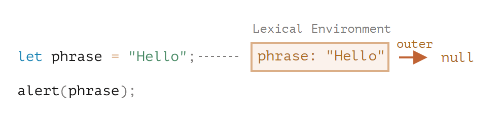

这就是所谓的与整个脚本相关联的 **全局** 词法环境。

在上面的图片中，矩形表示环境记录（变量存储），箭头表示外部引用。全局词法环境没有外部引用，所以箭头指向了 `null`。

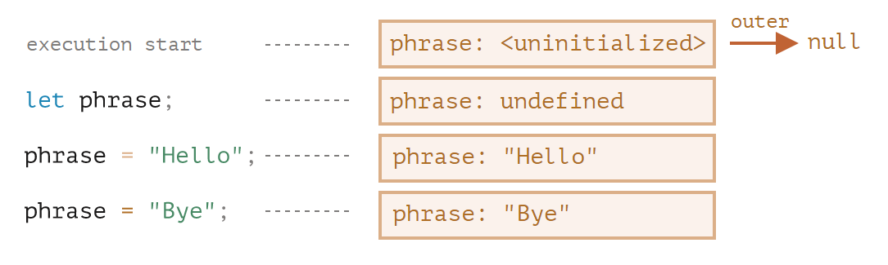右侧的矩形演示了执行过程中全局词法环境的变化：

1. 当脚本开始运行，词法环境预先填充了所有声明的变量。
   - 最初，它们处于“未初始化（Uninitialized）”状态。这是一种特殊的内部状态，这意味着引擎知道变量，但是在用 `let` 声明前，不能引用它。几乎就像变量不存在一样。
2. 然后 `let phrase` 定义出现了。它尚未被赋值，因此它的值为 `undefined`。从这一刻起，我们就可以使用变量了。
3. `phrase` 被赋予了一个值。
4. `phrase` 的值被修改。

* **函数声明**

  一个函数其实也是一个值，就像变量一样。**不同之处在于函数声明的初始化会被立即完成**

  添加一个函数时全局词法环境的初始状态：

  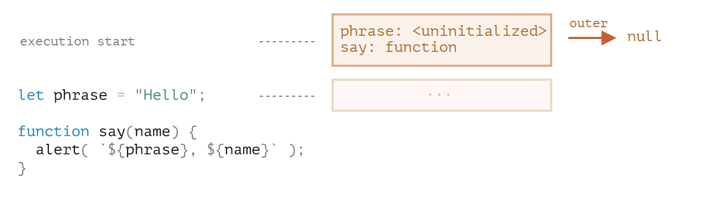

  正常来说，这种行为仅适用于函数声明，而不适用于我们将函数分配给变量的函数表达式，例如 `let say = function(name)...`

* **内部和外部的词法环境**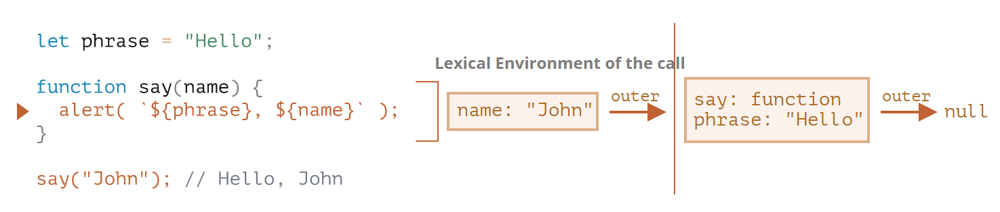

  在这个函数调用期间，我们有两个词法环境：内部一个（用于函数调用）和外部一个（全局）：

  - 内部词法环境与 `say` 的当前执行相对应。它具有一个单独的属性：`name`，函数的参数。我们调用的是 `say("John")`，所以 `name` 的值为 `"John"`。
  - 外部词法环境是全局词法环境。它具有 `phrase` 变量和函数本身。

  内部词法环境引用了 `outer`。

  **当代码要访问一个变量时 —— 首先会搜索内部词法环境，然后搜索外部环境，然后搜索更外部的环境，以此类推，直到全局词法环境。**

  如果在任何地方都找不到这个变量，那么在严格模式下就会报错（在非严格模式下，为了向下兼容，给未定义的变量赋值会创建一个全局变量）

* **返回函数**

  在每次 `makeCounter()` 调用的开始，都会创建一个新的词法环境对象，以存储该 `makeCounter` 运行时的变量。

  因此，我们有两层嵌套的词法环境，就像上面的示例一样：

  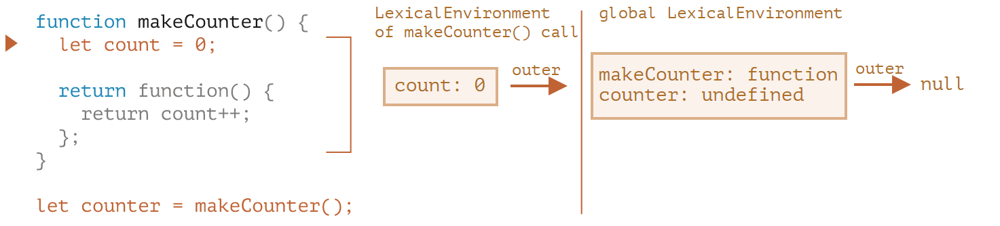不同的是，在执行 `makeCounter()` 的过程中创建了一个仅占一行的嵌套函数：`return count++`。我们尚未运行它，仅创建了它。

  所有函数都有名为 `[[Environment]]` 的隐藏属性，该属性保存了对创建该函数的词法环境的引用。`counter.[[Environment]]` 有对 `{count: 0}` 词法环境的引用。这就是函数记住它创建于何处的方式，与函数被在哪儿调用无关

  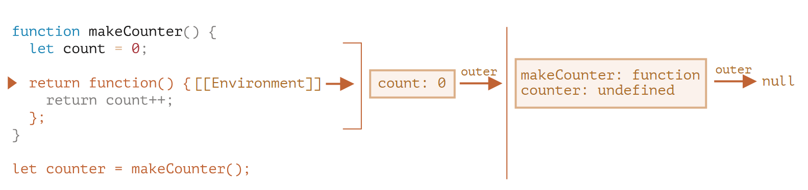当调用 `counter()` 时，会为该调用创建一个新的词法环境，并且其外部词法环境引用获取于 `counter.[[Environment]]`：

  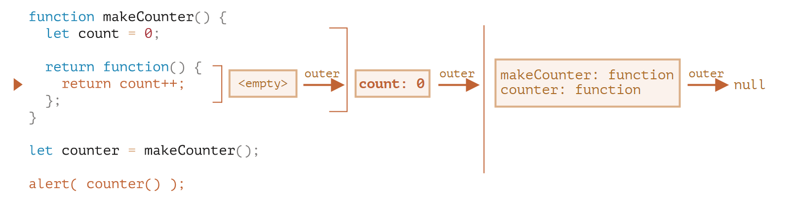

  当 `counter()` 中的代码查找 `count` 变量时，它首先搜索自己的词法环境（为空，因为那里没有局部变量），然后是外部 `makeCounter()` 的词法环境，并且在哪里找到就在哪里修改

  **在变量所在的词法环境中更新变量**

  执行后的状态：

  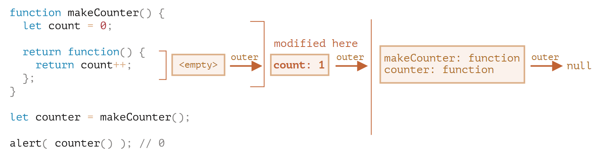

  如果我们调用 `counter()` 多次，`count` 变量将在同一位置增加到 `2`，`3` 等

**闭包**

[闭包](https://en.wikipedia.org/wiki/Closure_(computer_programming)) 是指一个函数可以**记住其外部变量并可以访问这些变量**。在某些编程语言中，这是不可能的，或者应该以一种特殊的方式编写函数来实现。但如上所述，在 JavaScript 中，所有函数都是天生闭包的（只有一个例外，将在 **"new Function" 语法**中讲到）

```markdown
**"new Function" 语法**
以下三种声明的含义相同：
new Function('a', 'b', 'return a + b'); // 基础语法
new Function('a,b', 'return a + b'); // 逗号分隔
new Function('a , b', 'return a + b'); // 逗号和空格分隔
使用 new Function 创建的函数，它的 [[Environment]] 指向**全局词法环境**，而不是函数所在的外部词法环境。因此，我们不能在 new Function 中直接使用外部变量。不过这样是好事，这有助于降低我们代码出错的可能。并且，从代码架构上讲，显式地使用参数传值是一种更好的方法，并且避免了与使用压缩程序而产生冲突的问题。
```

也就是说：JavaScript 中的函**数会自动通过隐藏的 `[[Environment]]` 属性记住创建它们的位置**，所以它们都可以访问外部变量。

在面试时，前端开发者通常会被问到“什么是闭包？”，正确的回答应该是闭包的定义，并解释清楚为什么 JavaScript 中的所有函数都是闭包的，以及可能的关于 `[[Environment]]` 属性和词法环境原理的技术细节。

**垃圾收集**

函数调用完成后，会将词法环境和其中的所有变量**从内存中删除**。因为现在**没有任何对它们的引用**了。与 JavaScript 中的任何其他对象一样，词法环境仅在可达时才会被保留在内存中

如果有一个嵌套的函数在函数结束后仍可达，则它将具有引用词法环境的 `[[Environment]]` 属性

例如：

```javascript
function f() {
  let value = 123;
  return function() {
    alert(value);
  }
}
let g = f(); // g.[[Environment]] 存储了对相应 f() 调用的词法环境的引用 （value可达）
```

如果多次调用 `f()`，并且返回的函数被保存，那么所有相应的词法环境对象也会保留在内存中。下面代码中有三个这样的函数：

```javascript
function f() {
  let value = Math.random();

  return function() { alert(value); };
}

// 数组中的 3 个函数，每个都与来自对应的 f() 的词法环境相关联
let arr = [f(), f(), f()];//各自都是不一样的环境！！！互不相干！
```

当词法环境对象变得不可达时，它就会死去（就像其他任何对象一样）。换句话说，它仅在**至少有一个嵌套函数引用它时才存在**。

在下面的代码中，嵌套函数被删除后，其封闭的词法环境（以及其中的 `value`）也会被从内存中删除：

```javascript
function f() {
  let value = 123;

  return function() {
    alert(value);
  }
}

let g = f(); // 当 g 函数存在时，该值会被保留在内存中

g = null; // ……现在内存被清理了
```

**实际开发中的优化**

理论上当函数可达时，它外部的所有变量也都将存在。

但在实际中，JavaScript 引擎会试图优化它。它们会分析变量的使用情况，如果从代码中可以明显看出有未使用的外部变量，那么就会将其删除。**一个重要的副作用是，此类变量在调试中将不可用。**

 我们可以看到的是一个同名的外部变量，而不是预期的变量：

```javascript
let value = "Surprise!";

function f() {
  let value = "the closest value";

  function g() {
    debugger; // 在 console 中：输入 alert(value); Surprise!
  }

  return g;
}

let g = f();
g();
```

**tips**: 当代码里面有let，不论在作用域哪个位置，词法环境都会创建一个undefined的变量，直到变量被赋值。 一个作用域不能重复let同一个变量。

**课后题**

1. 第二个 counter 会显示什么？`0,1` 或 `2,3` 还是其他？

```javascript
function makeCounter() {
  let count = 0;

  return function() {
    return count++;
  };
}

let counter = makeCounter();
let counter2 = makeCounter();

alert( counter() ); // 0
alert( counter() ); // 1

alert( counter2() ); // ?
alert( counter2() ); // ?
```

答案是：**0，1。**

函数 `counter` 和 `counter2` 是通过 `makeCounter` 的**不同调用创建**的。

因此，它们**具有独立的外部词法环境**，每一个都有自己的 `count`。

2. **嵌套函数在同一个词法环境中创建的时候，它们可以共享对同一个 count 变量的访问**：

```javascript
function Counter() {
  let count = 0;

  this.up = function() {
    return ++count;
  };

  this.down = function() {
    return --count;
  };
}
let counter =  Counter();

alert( counter.up() ); // 1
alert( counter.up() ); // 2
alert( counter.down() ); // 1
```

3. **闭包sum**

   编写一个像 `sum(a)(b) = a+b` 这样工作的 `sum` 函数。

   是的，就是这种通过双括号的方式（并不是错误）。

   举个例子：

   ```javascript
   sum(1)(2) = 3
   sum(5)(-1) = 4
   ```

   为了使得第二个括号有效，则第一个括号必须返回一个函数

   就像这样：

   ```javascript
   function sum(a) {
   
     return function(b) {
       return a + b; // 从外部词法环境获得 "a"
     };
   
   }
   
   alert( sum(1)(2) ); // 3
   alert( sum(5)(-1) ); // 4
   ```

4. **未初始化**

   下面这段代码的结果会是什么？

   ```javascript
   let x = 1;
   
   function func() {
     console.log(x); // ?
   
     let x = 2;
   }
   
   func();
   ```

   答案：**error**。

   ```javascript
   let x = 1;
   
   function func() {
     console.log(x); // ReferenceError: Cannot access 'x' before initialization
     let x = 2;//此处的let使得之前的x变为未初始化的状态，直到程序执行到此处的let语句
   }
   
   func();
   ```

   可以观察到“不存在”的变量和“未初始化”的变量之间的特殊差异

   从程序执行**进入代码块**（或函数）的那一刻起，变量就开始**进入“未初始化”状态**。它一直保持未初始化状态，直至程序执行到相应的 `let` 语句

5. **filter** (f) f为一个针对参数为数组的**函数**的每个参数返回true或false的**函数**

6. **函数大军**

   下列的代码创建了一个 `shooters` 数组。

   每个函数都应该输出其编号。但好像出了点问题……

   ```javascript
   function makeArmy() {
     let shooters = [];
   
     let i = 0;
     while (i < 10) {
       //let j=i;
       let shooter = function() { // 创建一个 shooter 函数，
         alert( i ); // 应该显示其编号 //j
       };
       shooters.push(shooter); // 将此 shooter 函数添加到数组中
       i++;
     }
   
     // ……返回 shooters 数组
     return shooters;
   }
   
   let army = makeArmy();
   
   // ……所有的 shooter 显示的都是 10，而不是它们的编号 0, 1, 2, 3...
   army[0](); // 编号为 0 的 shooter 显示的是 10
   army[1](); // 编号为 1 的 shooter 显示的是 10
   army[2](); // 10，其他的也是这样。
   ```

```
   
   为什么所有的 shooter 显示的都是同样的值？
   
   因为shooters[] = {10个shooter()},先被创建完，各自都有不同的词法环境，但是 **i** 却是外部环境，当i被调用时此时已经是10个函数都被创建后了，因此调用的i是10；
   
   要使得shooter()先将i存储到内部词法环境，此时i的值才不会变。
   
   因此 要在while内部将此时i的值复制一份副本为j，存到**内部词法环境**中

####  老旧的"var"

`var` 声明与 `let` 相似。大部分情况下，我们可以用 `let` 代替 `var` 或者 `var` 代替 `let`，都能达到预期的效果：

​```javascript
var message = "Hi";
alert(message); // Hi
```

但实际上 `var` 却是一头非常不同的，源自远古时代的怪兽。在现代脚本中一般不再使用它，但它仍然潜伏在旧脚本中。

* **var没有块级作用域**

  用 `var` 声明的变量，不是函数作用域就是全局作用域。它们在代码块外也是可见的

  举个例子：

  ```javascript
  if (true) {
    var test = true; // 使用 "var" 而不是 "let"
  }
  
  alert(test); // true，变量在 if 结束后仍存在
  ```

  由于 `var` 会忽略代码块，因此我们有了一个全局变量 `test`。

  如果我们在第二行使用 `let test` 而不是 `var test`，那么该变量将仅在 `if` 内部可见：

  ```javascript
  if (true) {
    let test = true; // 使用 "let"
  }
  
  alert(test); // ReferenceError: test is not defined
  ```

  对于循环也是这样的，`var` 声明的变量没有块级作用域也没有循环局部作用域：

  ```javascript
  for (var i = 0; i < 10; i++) {
    var one = 1;
    // ...
  }
  
  alert(i);   // 10，"i" 在循环结束后仍可见，它是一个全局变量
  alert(one); // 1，"one" 在循环结束后仍可见，它是一个全局变量
  ```

  如果一个代码块位于函数内部，那么 `var` 声明的变量的作用域将为函数作用域：

  ```javascript
  function sayHi() {
    if (true) {
      var phrase = "Hello";
    }
  
    alert(phrase); // 能正常工作
  }
  
  sayHi();
  alert(phrase); // ReferenceError: phrase is not defined
  ```

* **var允许重新声明**

  如果我们用 `let` 在同一作用域下将同一个变量声明两次，则会出现错误：

  ```javascript
  let user;
  let user; // SyntaxError: 'user' has already been declared
  ```

  使用 `var`，我们可以重复声明一个变量，不管多少次都行。如果我们对一个已经声明的变量使用 `var`，这条新的声明语句会被忽略：

  ```javascript
  var user = "Pete";
  
  var user = "John"; // 这个 "var" 无效（因为变量已经声明过了）
  // ……不会触发错误
  
  alert(user); // John
  ```

* **var声明的变量，可在其声明语句前被使用**

  当函数开始的时候，就会处理 `var` 声明（脚本启动对应全局变量）。

  换言之，`var` 声明的变量会在函数开头被定义，与它在代码中定义的位置无关（这里不考虑定义在嵌套函数中的情况）。

  那么看一下这段代码：

  ```javascript
  function sayHi() {
    phrase = "Hello";
  
    alert(phrase);
  
    var phrase;
  }
  sayHi();
  //或者
  function sayHi() {
    phrase = "Hello"; // (*)
    if (false) {
      var phrase;
    }
    alert(phrase);
  }
  sayHi();
  ```

  在上面的例子中，`if (false)` 分支永远都不会执行，但没关系，它里面的 `var` 在函数刚开始时就被处理了，所以在执行 `(*)` 那行代码时，变量是存在的。

  **声明会被提升，但是赋值不会。**

  我们最好用例子来说明：

  ```javascript
  function sayHi() {
    alert(phrase);
  
    var phrase = "Hello";
  }
  
  sayHi();
  //undefined
  ```

**“立即调用函数表达式”（immediately-invoked function expressions，IIFE）**

IIFE 看起来像这样：将var的函数变成块级作用域

```javascript
(function() {

  var message = "Hello";

  alert(message); // Hello

})();
```

这里，创建了一个函数表达式并立即调用。因此，代码立即执行并拥有了自己的私有变量。

函数表达式被括号 `(function {...})` 包裹起来

**除了使用括号，还有其他方式可以告诉 JavaScript 在这我们指的是函数表达式 (func()())+!**

**如今这些代码已经很少被编写了！**

**tip**s:分清楚**块级作用域**和**函数作用域**; 前者是{} 后者是function(){};前者var直接穿透，后者var不能穿透 （—jy）

#### 全局对象

​	全局对象提供**可在任何地方使用的变量和函数**。默认情况下，这些全局变量**内建于语言或环境**中。

在浏览器中，它的名字是 “window”，对 Node.js 而言，它的名字是 “global”，其它环境可能用的是别的名字。**全局对象有一个通用名称 `globalThis`**

在浏览器中，使用 `var`（而不是 `let/const`！）声明的全局函数和变量会成为全局对象的属性。

```javascript
var gVar = 5;

alert(window.gVar); // 5（成为了全局对象的属性）
```

如果一个值非常重要，以至于你想使它在全局范围内可用，那么可以直接将其作为属性写入：

```javascript
// 将当前用户信息全局化，以允许所有脚本访问它
window.currentUser = {
  name: "John"
};

// 代码中的另一个位置
alert(currentUser.name);  // John

// 或者，如果我们有一个名为 "currentUser" 的局部变量
// 从 window 显式地获取它（这是安全的！）
alert(window.currentUser.name); // John
```

* **polyfills**

  使用全局对象来测试对现代语言功能的支持，测试是否存在内建的 `Promise` 对象（在版本特别旧的浏览器中不存在）：

  ```javascript
  if (!window.Promise) {
    alert("Your browser is really old!");
  }
  ```

  如果没有（例如，我们使用的是旧版浏览器），那么我们可以创建 “polyfills”：添加环境不支持但在现代标准中存在的功能。

  ```javascript
  if (!window.Promise) {
    window.Promise = ... // 定制实现现代语言功能
  }
  ```

#### 函数对象 NFE

**在 JavaScript 中，函数的类型是对象**

* **属性”name“**

一个函数的名字可以通过属性 “name” 来访问：

```javascript
function sayHi() {
  alert("Hi");
}

alert(sayHi.name); // sayHi
```

* **属性“length”**

  内建属性 “length”，它返回函数入参的个数

  **rest** **参数不参与计数**

  属性 `length` 有时在操作其它函数的函数中用于做 [内省/运行时检查](https://zh.wikipedia.org/wiki/内省_(计算机科学))

* **自定义属性**

  我们也可以添加我们自己的属性。

  这里我们添加了 `counter` 属性，用来跟踪总的调用次数：

  ```javascript
  function sayHi() {
    alert("Hi");
  
    // 计算调用次数
    sayHi.counter++;
  }
  sayHi.counter = 0; // 初始值 定义在函数外面
  
  sayHi(); // Hi
  sayHi(); // Hi
  
  alert( `Called ${sayHi.counter} times` ); // Called 2 times
  ```

  **属性不是变量**

  被赋值给函数的属性，比如 `sayHi.counter = 0`，**不会** 在函数内定义一个局部变量 `counter`。换句话说，属性 `counter` 和变量 `let counter` 是毫不相关的两个东西。

  函数属性有时会用来替代闭包

* **命名函数表达式**

  命名函数表达式（NFE，Named Function Expression），指带有名字的函数表达式的术语

  关于名字 `func` 有两个特殊的地方，这就是添加它的原因：

  1. 它允许函数在内部引用自己。
  2. 它在函数外是不可见的。

  下面的函数 `sayHi` 会在没有入参 `who` 时，以 `"Guest"` 为入参调用自己：

  ```javascript
  let sayHi = function func(who) {
    if (who) {
      alert(`Hello, ${who}`);
    } else {
      func("Guest"); // 使用 func 再次调用函数自身
    }
  };
  sayHi(); // Hello, Guest
  // 但这不工作：
  func(); // Error, func is not defined（在函数外不可见）
  ```

  我们为什么使用 `func` 呢？为什么不直接使用 `sayHi` 进行嵌套调用？

  在大多数情况下我们可以这样做：

  ```javascript
  let sayHi = function(who) {
    if (who) {
      alert(`Hello, ${who}`);
    } else {
      sayHi("Guest");
    }
  };
  ```

  上面这段代码的问题在于 `sayHi` 的值可能会被函数外部的代码改变。如果该函数被赋值给另外一个变量（译注：也就是原变量被修改），那么函数就会开始报错：

  ```javascript
  let sayHi = function(who) {
    if (who) {
      alert(`Hello, ${who}`);
    } else {
      sayHi("Guest"); // Error: sayHi is not a function
    }
  };
  
  let welcome = sayHi;
  sayHi = null;
  
  welcome(); // Error，嵌套调用 sayHi 不再有效！
  ```

  发生这种情况是因为该函数从它的外部词法环境获取 `sayHi`。没有局部的 `sayHi` 了，所以使用外部变量。而当调用时，外部的 `sayHi` 是 `null`

  名字 `func` 是**函数局部域**的。它不是从外部获取的（而且它**对外部也是不可见**的）。规范确保它只会引用当前函数。

  **注意：这里只针对函数表达式，而不是函数声明**

* **课后题**

  1. 该解决方案在局部变量中使用 `count`，而进行加法操作的方法是直接写在 `counter` 中的。它们共享同一个外部词法环境，并且可以访问当前的 `count`。

  ```javascript
  function makeCounter() {
    let count = 0;
  
    function counter() {
      return count++;
    }
    counter.set = value => count = value;
    counter.decrease = () => count--;
    return counter;
  }
  
    let counter = makeCounter();
    
    alert( counter() ); // 0
    alert( counter() ); // 1
    
    counter.set(10); // set the new count
    
    alert( counter() ); // 10
    
    counter.decrease(); // decrease the count by 1
    
    alert( counter() ); // 10 (instead of 11)
  ```

  2. 为了使整个程序无论如何都能正常工作，`sum` 的结果必须是函数。

     这个函数必须将两次调用之间的当前值保存在内存中。

     根据这个题目，当函数被用于 `==` 比较时必须转换成数字。函数是对象，所以转换规则会按照 [对象 —— 原始值转换](https://zh.javascript.info/object-toprimitive) 章节所讲的进行，我们可以提供自己的方法来返回数字。

  代码如下：

  ```javascript
  function sum(a) {
  
    let currentSum = a;
  
    function f(b) {
      currentSum += b;
      return f;
    }
  
    f.toString = function() {
      return currentSum;
    };
  
    return f;
  }
  
  alert( sum(1)(2) ); // 3
  alert( sum(5)(-1)(2) ); // 6
  alert( sum(6)(-1)(-2)(-3) ); // 0
  alert( sum(0)(1)(2)(3)(4)(5) ); // 15
  ```

#### 调度：setTimeout和setInterval

有时我们并不想立即执行一个函数，而是等待特定一段时间之后再执行。这就是所谓的“计划调用“

目前有两种方式可以实现：

- `setTimeout` 允许我们将函数**推迟到一段时间间隔之后再执行**。
- `setInterval` 允许我们**重复运行一个函数，从一段时间间隔之后开始运行，之后以该时间间隔连续重复运行该函数**。

**SetTimeout**语法：

```javascript
let timerId = setTimeout(func|code, [delay], [arg1], [arg2], ...)
```

**注意func是对函数的引用，不带括号！**

带参数的情况：

```javascript
function sayHi(phrase, who) {
  alert( phrase + ', ' + who );
}

setTimeout(sayHi, 1000, "Hello", "John"); // Hello, John
```

可以使用箭头函数代替使用字符串，如下所示：

```javascript
setTimeout(() => alert('Hello'), 1000);
```

**clearTimeout取消调度**

`setTimeout` 在调用时会返回一个“定时器标识符（timer identifier）”，在我们的例子中是 `timerId`，我们可以使用它来取消执行。

取消调度的语法：

```javascript
let timerId = setTimeout(...);
clearTimeout(timerId);
```

**`setInterval`** 是每间隔给定的时间周期性执行。

想要阻止后续调用，我们需要调用 **`clearInterval(timerId)`**

* **嵌套的setTimeout**

  嵌套的 `setTimeout` 要比 `setInterval` 灵活得多。采用这种方式可以根据当前执行结果来调度下一次调用，因此下一次调用可以与当前这一次不同

**嵌套的 `setTimeout` 相较于 `setInterval` 能够更精确地设置两次执行之间的延时**，因为 `func` 的执行所花费的时间“消耗”了一部分间隔时间，后者是计时放入队列，不管主线程执行时间，前者是主线程执行完成时计时放入队列（因为嵌套）

* **零延时的setTimeout**

`setTimeout(func, 0)`，或者仅仅是 `setTimeout(func)`。

这样调度可以让 `func` 尽快执行。也就是说，**该函数被调度在当前脚本执行完成“之后”立即执行**。

例如，下面这段代码会先输出 “Hello”，然后立即输出 “World”：

```javascript
setTimeout(() => alert("World"));

alert("Hello");
```

**任何 `setTimeout` 都只会在当前代码执行完毕之后才会执行**，`setTimeout`这个函数，是经过指定时间后，把要执行的任务加入到Event Queue中，因此若当前代码执行时间大于setTimeout设置时间则会在当前代码执行完就执行setTimeout任务(因为等待时间已经到了，放进队列了)

* **课后题**

  ```js
  //嵌套函数
  function printNumbers1(from, to){
    setTimeout(function go(){
      document.write(from);
      if(from<to){
        setTimeout(go,1000);
      }
      from++;
    },1000);
  }
  printNumbers(1,4);
  //interval 可以用clearinterval来中断
  function printNumbers(from,to){
      let clearid = setInterval(()=>{
          document.write(from+"<br>");
          if(from==to)
          {
              clearInterval(clearid);
          }
          from++;
      },1000)
  }
  printNumbers(5,10);
  document.write("<br>");
  ```

  `setTimeout(fn,0)`的含义是，指定某个任务在主线程最早可得的空闲时间执行，意思就是不用再等多少秒了，只要主线程执行栈内的同步任务全部执行完成，栈为空就马上执行

  一旦**`setInterval`的回调函数`fn`执行时间超过了延迟时间`ms`，那么就完全看不出来有时间间隔了**

  但是用嵌套函数的setTimeout就可以解决这个问题，因为嵌套函数必须执行完才能执行下一个

#### 装饰器模式和转发，call/apply

* **透明缓存**

  代码和解释：

  ```javascript
  function slow(x) {
    // 这里可能会有重负载的 CPU 密集型工作
    alert(`Called with ${x}`);
    return x;
  }
  
  function cachingDecorator(func) {
    let cache = new Map();
  
    return function(x) {
      if (cache.has(x)) {    // 如果缓存中有对应的结果
        return cache.get(x); // 从缓存中读取结果
      }
  
      let result = func(x);  // 否则就调用 func
  
      cache.set(x, result);  // 然后将结果缓存（记住）下来
      return result;
    };
  }
  
  slow = cachingDecorator(slow);
  ```

  创建一个包装器（wrapper）函数，该函数增加了缓存功能

  - `cachingDecorator` 是可重用的。我们可以将它应用于另一个函数。
  - 缓存逻辑是独立的，它没有增加 `slow` 本身的复杂性（如果有的话）。
  - 如果需要，我们可以组合多个装饰器（其他装饰器将遵循同样的逻辑）

* **使用func.call设定上下文**

  上面提到的缓存装饰器不适用于对象方法。

  在下面的代码中，`worker.slow()` 在装饰后停止工作：

  ```javascript
  // 我们将对 worker.slow 的结果进行缓存
  let worker = {
    someMethod() {
      return 1;
    },
  
    slow(x) {
      // 可怕的 CPU 过载任务
      alert("Called with " + x);
      return x * this.someMethod(); // (*)
    }
  };
  
  // 和之前例子中的代码相同
  function cachingDecorator(func) {
    let cache = new Map();
    return function(x) {
      if (cache.has(x)) {
        return cache.get(x);
      }
      //console.log(this) 虽然传入的是worker.slow,但此时的this是worker 
      let result = func(x); // (**)
      //改为： let result = func.call(this,x);
      cache.set(x, result);
      return result;
    };
  }
  
  alert( worker.slow(1) ); // 原始方法有效
  
  worker.slow = cachingDecorator(worker.slow); // 现在对其进行缓存
  
  alert( worker.slow(2) ); // 蛤！Error: Cannot read property 'someMethod' of undefined
  ```

  原因是包装器将原始函数调用为 `(**)` 行中的 `func(x)`。并且，当这样调用时，函数将得到 `this = undefined`

  因此，包装器将调用传递给原始方法，但没有上下文 `this`

  有一个**特殊的内建函数方法** [func.call(context, …args)](https://developer.mozilla.org/zh/docs/Web/JavaScript/Reference/Global_Objects/Function/call)，它允许调用一个显式设置 `this` 的函数。

  语法如下：

  ```javascript
  func.call(context, arg1, arg2, ...)
  ```

  它运行 `func`，**提供的第一个参数作为 `this`，**后面的作为参数（arguments）。

  简单地说，这两个调用几乎相同：

  ```javascript
  func(1, 2, 3);
  func.call(obj, 1, 2, 3)
  ```

  在下面的代码中，我们在不同对象的上下文中调用 `sayHi`：`sayHi.call(user)` 运行 `sayHi` 并提供了 `this=user`，然后下一行设置 `this=admin`：

  ```javascript
  function sayHi() {
    alert(this.name);
  }
  
  let user = { name: "John" };
  let admin = { name: "Admin" };
  
  // 使用 call 将不同的对象传递为 "this"
  sayHi.call( user ); // John
  sayHi.call( admin ); // Admin
  ```

* **传递多个参数**

  现在让我们把 `cachingDecorator` 写得更加通用。到现在为止，它只能用于单参数函数。

  现在如何缓存多参数 `worker.slow` 方法呢？

  原生的map仅能将单个值作为key，有许多解决方案可以实现：

  1. 实现一个新的（或使用第三方的）类似 map 的更通用并且允许多个键的数据结构。
  2. 使用嵌套 map：`cache.set(min)` 将是一个存储（键值）对 `(max, result)` 的 `Map`。所以我们可以使用 `cache.get(min).get(max)` 来获取 `result`。
  3. 将两个值合并为一个。为了灵活性，我们可以允许为装饰器提供一个“哈希函数”，该函数知道如何将多个值合并为一个值。

  我们需要传入的不仅是 `x`，还需要传入 `func.call` 的所有参数。让我们回想一下，在 `function()` 中我们可以得到一个包含所有参数的伪数组（pseudo-array）`arguments`，那么 `func.call(this, x)` 应该被替换为 `func.call(this, ...arguments)`

  ```javascript
  let key = hash(arguments); // (*)
  let result = func.call(this, ...arguments); // (**)
  function hash(args) {
    return args[0] + ',' + args[1];
  }
  ```

  需要做的修改，其中hash还需要调整以允许任意数量的参数

  * 其中，args.join()是不行的，因为我们正在调用 `hash(arguments)`，`arguments` 对象既是可迭代对象又是类数组对象，但它并不是真正的数组；

  * 不过，有一种简单的方法可以使用数组的 join 方法：

    ```javascript
    function hash() {
      alert( [].join.call(arguments) ); // 1,2
    }
    
    hash(1, 2);
    ```

    这个技巧被称为 **方法借用（method borrowing）**

    是因为原生方法 `arr.join(glue)` 的内部算法非常简单，编写方式适用于任意类数组的this

* **func.apply**

  我们可以使用 `func.apply(this, arguments)` 代替 `func.call(this, ...arguments)`

  `call` 和 `apply` 之间唯一的语法区别是，`call` 期望一个参数列表，而 `apply` 期望一个包含这些参数的类数组对象

  因此，这两个调用几乎是等效的：

  ```javascript
  func.call(context, ...args);
  func.apply(context, args);
  ```

  只有一个关于 `args` 的细微的差别：

  - Spread 语法 `...` 允许将 **可迭代对象** `args` 作为列表传递给 `call`。
  - `apply` 只接受 **类数组** `args`

  对于即可迭代又是类数组的对象，例如一个真正的数组，我们使用 `call` 或 `apply` 均可，但是 `apply` 可能会更快，因为大多数 JavaScript 引擎在内部对其进行了优化

  将所有参数连同上下文一起传递给另一个函数被称为“呼叫转移（call forwarding）”。

  这是它的最简形式：

  ```javascript
  let wrapper = function() {
    return func.apply(this, arguments);
  };
  ```

  当外部代码调用这种包装器 `wrapper` 时，它与原始函数 `func` 的调用是无法区分的

* **装饰器和函数属性**

  通常，用装饰的函数替换一个函数或一个方法是安全的，除了一件小东西。如果原始函数有属性，例如 `func.calledCount` 或其他，则装饰后的函数将不再提供这些属性。因为这是装饰器。

  存在一种创建装饰器的方法，该装饰器可保留对函数属性的访问权限，但这需要使用特殊的 `Proxy` 对象来包装函数。我们将在后面的 [Proxy 和 Reflect](https://zh.javascript.info/proxy#proxy-apply) 中学习它

* **总结**

* **课后题**

  ```js
  function spy(func) {
      // your code  
      function wrapper(...args){
        wrapper.calls.push(args);
        return func.apply(this,args);
      }
      wrapper.calls = [];
      return wrapper;
  }
  function work(a, b) {
    alert( a + b ); // work 是一个任意的函数或方法
  }
  work = spy(work);
  
  work(1, 2); // 3
  work(4, 5); // 9
  
  for (let args of work.calls) {
    alert( 'call:' + args.join() ); // "call:1,2", "call:4,5"
  }
  ```

  ```js
  function f(x) {
    alert(x);
  }
  // create wrappers
  function delay(func,time){
    function wrappers(){
      setTimeout(()=>{
        return func.apply(this,arguments);
      },time);
    }
  //注意这里是如何使用箭头函数的。我们知道，箭头函数没有自己的 this 和 arguments，所以 f.apply(this, arguments) 从包装器中获取 this 和 arguments
     /*
     function delay(f, ms) {
        return function(...args) {
          let savedThis = this; // 将 this 存储到中间变量
          setTimeout(function() {
            f.apply(savedThis, args); // 在这儿使用它
          }, ms);
        };
  	}
     */
    return wrappers;
  }
  
  let f1000 = delay(f, 1000);
  let f1500 = delay(f, 1500);
  
  f1000("test"); // 在 1000ms 后显示 "test"
  f1500("test"); // 在 1500ms 后显示 "test"
  ```

  * **防抖函数 接收最后一次输入后间隔x秒执行**

  ```js
  let f = _.debounce(alert, 1000);
  
  f("a");
  setTimeout( () => f("b"), 200);
  setTimeout( () => f("c"), 500);//将获得最后一个调用的所有参数，其他调用的参数将被忽略
  ```

  ```js
  function debounce(func,ms){
      let timeid;
      let wrappers = function(){
          clearTimeout(timeid);
          timeid =setTimeout(()=>func.apply(this,arguments),ms);
      }
      return wrappers;
  }
  let f = debounce(alert,1000);
  f("a");
  setTimeout(()=>f("B"),200);
  //执行最后一个调用，其它调用参数将被忽略
  ```

  - `debounce` 会在“冷却（cooldown）”期后运行函数一次。适用于处理最终结果。
  - **`throttle` 运行函数的频率不会大于所给定的时间 `ms` 毫秒。适用于不应该经常进行的定期更新。**

  ```javascript
  function throttle(func, ms) {
  
    let isThrottled = false,
      savedArgs,
      savedThis;
  
    function wrapper() {
  
      if (isThrottled) { // (2)
        savedArgs = arguments;
        savedThis = this;
        return;
      }
      isThrottled = true;
  
      func.apply(this, arguments); // (1)
  
      setTimeout(function() {
        isThrottled = false; // (3)
        if (savedArgs) {
          wrapper.apply(savedThis, savedArgs);
          savedArgs = savedThis = null;
        }
      }, ms);
    }
  
    return wrapper;
  }
  ```

  调用 `throttle(func, ms)` 返回 `wrapper`。

  1. 在第一次调用期间，`wrapper` 只运行 `func` 并设置冷却状态（`isThrottled = true`）。
  2. 在这种状态下，所有调用都记忆在 `savedArgs/savedThis` 中。请注意，上下文和参数（arguments）同等重要，应该被记下来。我们同时需要他们以重现调用。
  3. ……然后经过 `ms` 毫秒后，触发 `setTimeout`。冷却状态被移除（`isThrottled = false`），如果我们忽略了调用，则将使用最后记忆的参数和上下文执行 `wrapper`。

  第 3 步运行的不是 `func`，而是 `wrapper`，因为我们不仅需要执行 `func`，还需要再次进入冷却状态并设置 timeout 以重置它。

#### 函数绑定

##### 丢失this

当将对象方法作为回调进行传递，例如传递给 `setTimeout`，这儿会存在一个常见的问题：“**丢失 `this`**”

 `setTimeout` 时 `this` 是如何丢失的：

```javascript
let user = {
  firstName: "John",
  sayHi() {
    alert(`Hello, ${this.firstName}!`);
  }
};
setTimeout(user.sayHi, 1000); // Hello, undefined!
```

浏览器中的 `setTimeout` 方法有些特殊：它为函数调用设定了 `this=window`（对于 Node.js，`this` 则会变为计时器（timer）对象，但在这儿并不重要）。所以对于 `this.firstName`，它其实试图获取的是 `window.firstName`，这个变量并不存在

* **方法一**：使用一个包装函数：

```javascript
let user = {
  firstName: "John",
  sayHi() {
    alert(`Hello, ${this.firstName}!`);
  }
};

setTimeout(function() {
  user.sayHi(); // Hello, John!
}, 1000);
//简洁写法：
setTimeout(() => user.sayHi(), 1000); // Hello, John!
//但sayHi()可能出现在1s内改变了的情况，比如：
// ……user 的值在不到 1 秒的时间内发生了改变
user = {
  sayHi() { alert("Another user in setTimeout!"); }
};
```

面对以上的情况，函数提供了一个**内建方法** [bind](https://developer.mozilla.org/zh/docs/Web/JavaScript/Reference/Global_Objects/Function/bind)，它可以**绑定 `this`**

* **方法二**：**bind**

`func.bind(context)` 的结果是一个特殊的类似于函数的“外来对象，可以像函数一样被调用，并且透明地（transparently）将调用传递给 `func` 并设定 `this=context`。基本的语法是：

```javascript
// 稍后将会有更复杂的语法
let boundFunc = func.bind(context);
```

换句话说，`boundFunc` 调用就像绑定了 `this` 的 `func`

举个例子，这里的 `funcUser` 将调用传递给了 `func` 同时 `this=user`：

```javascript
let user = {
  firstName: "John"
};

function func() {
  alert(this.firstName);
}

let funcUser = func.bind(user);
funcUser(); // John  注意要()
//这里的 func.bind(user) 作为 func 的“绑定的（bound）变体”，绑定了 this=user
```

对象方法：

```javascript
let user = {
  firstName: "John",
  sayHi() {
    alert(`${phrase}, ${this.firstName}!`);
  }
};

let sayHi = user.sayHi.bind(user); // (*)

// 可以在没有对象（译注：与对象分离）的情况下运行它
sayHi("Hello"); // Hello, John!

setTimeout(sayHi, 1000); // Hello, John!

// 即使 user 的值在不到 1 秒内发生了改变
// sayHi 还是会使用预先绑定（pre-bound）的值，该值是对旧的 user 对象的引用
user = {
  sayHi() { alert("Another user in setTimeout!"); }
};
```

我们能够看到参数（arguments）都被“原样”传递了，只是 `this` 被 `bind` 绑定了

**便捷方法：`bindAll`**

如果一个对象有很多方法，并且我们都打算将它们都传递出去，那么我们可以在一个循环中完成所有方法的绑定：

```javascript
for (let key in user) {
  if (typeof user[key] == 'function') {
    user[key] = user[key].bind(user);
  }
}
//JavaScript 库还提供了方便批量绑定的函数，例如 lodash 中的 _.bindAll(object, methodNames)
```

* **tips：**

  **1. bind**方法**参数列表可以分多次传入**，它改变this指向后**不会立即执行**，而是返回一个**永久改变this指向的函数**；**不能重绑定**

  **2. call **方法**必须一次性传入所有参数**，但是只是**临时改变一次this指向**，并**立即执行**。

##### 偏函数

我们不仅可以绑定 `this`，还可以绑定参数（arguments）

`bind` 的完整语法如下：

```javascript
let bound = func.bind(context, [arg1], [arg2], ...);
```

它允许将上下文绑定为 `this`，以及绑定函数的起始参数

使用 `bind` 在该函数基础上创建一个 `double` 函数：

```javascript
function mul(a, b) {
  return a * b;
}

let double = mul.bind(null, 2);
//请注意，这里我们实际上没有用到 this。但是 bind 需要它，所以我们必须传入 null 之类的东西
//将2绑定为起始函数
alert( double(3) ); // = mul(2, 3) = 6
alert( double(4) ); // = mul(2, 4) = 8
alert( double(5) ); // = mul(2, 5) = 10
```

对 `mul.bind(null, 2)` 的调用创建了一个新函数 `double`，它将调用传递到 `mul`，将 `null` 绑定为上下文，并将 `2` 绑定为第一个参数。并且，参数（arguments）均被“原样”传递

* **好处**:
  1. 我们可以创建一个具有可读性高的名字（`double`，`triple`）的独立函数。我们可以使用它，并且不必每次都提供一个参数，因为参数是被绑定了的。
  2. 当我们有一个非常通用的函数，并希望有一个通用型更低的该函数的变体时，偏函数会非常有用

##### 没有上下文情况的partial

仅绑定参数（arguments）的函数 `partial` 比较容易实现。

像这样：

```javascript
function partial(func, ...argsBound) {
  return function(...args) { // (*)
    return func.call(this, ...argsBound, ...args);
  }
}

// 用法：
let user = {
  firstName: "John",
  say(time, phrase) {
    alert(`[${time}] ${this.firstName}: ${phrase}!`);
  }
};

// 添加一个带有绑定时间的 partial 方法
user.sayNow = partial(user.say, new Date().getHours() + ':' + new Date().getMinutes());

user.sayNow("Hello");
// 类似于这样的一些内容：
// [10:00] John: Hello!
//此外，还有来自 lodash 库的现成的 _.partial 实现
```

`partial(func[, arg1, arg2...])` 调用的结果是一个包装器 `(*)`，它调用 `func` 并具有以下内容：

- 与它获得的函数具有相同的 `this`（对于 `user.sayNow` 调用来说，它是 `user`）
- 然后给它 `...argsBound` —— 来自于 `partial` 调用的参数（`"10:00"`）
- 然后给它 `...args` —— 给包装器的参数（`"Hello"`）

**课后题**

1. 函数的属性中有一个值。`bind` 之后它会改变吗？为什么，阐述一下？

   ```javascript
   function sayHi() {
     alert( this.name );
   }
   sayHi.test = 5;
   
   let bound = sayHi.bind({
     name: "John"
   });
   
   alert( bound.test ); // 输出将会是什么？为什么？
   ```

   答案：`undefined`。

   `bind` 的结果是另一个对象。它并没有 `test` 属性。

#### 深入理解箭头函数

箭头函数不仅仅是编写简洁代码的“捷径”。它还具有非常特殊且有用的特性。

JavaScript 充满了我们需要编写在其他地方执行的小函数的情况。

例如：

- `arr.forEach(func)` —— `forEach` 对每个数组元素都执行 `func`。
- `setTimeout(func)` —— `func` 由内建调度器执行。
- ……还有更多。

JavaScript 的精髓在于创建一个函数并将其传递到某个地方


**箭头函数没有 `this`。如果访问 `this`，则会从外部获取**

可以使用它在对象方法内部进行迭代：

```javascript
let group = {
  title: "Our Group",
  students: ["John", "Pete", "Alice"],

  showList() {
    this.students.forEach(
      student => alert(this.title + ': ' + student)
    );
  }
};
group.showList();
```

这里 `forEach` 中使用了箭头函数，所以其中的 `this.title` 其实和外部方法 `showList` 的完全一样。那就是：`group.title`。

如果我们使用正常的函数，则会出现错误：

```javascript
let group = {
  title: "Our Group",
  students: ["John", "Pete", "Alice"],

  showList() {
    this.students.forEach(function(student) {
      // Error: Cannot read property 'title' of undefined
      alert(this.title + ': ' + student);
    });
  }
};
group.showList();
```

**不能对箭头函数进行 `new` 操作**

不具有 `this` 自然也就意味着另一个限制：箭头函数不能用作构造器（constructor）。不能用 `new` 调用它们。

箭头函数 `=>` 没有创建任何绑定。箭头函数只是没有 `this`。`this` 的查找与常规变量的搜索方式完全相同：在外部词法环境中查找

**箭头函数也没有 `arguments` 变量**

当我们需要使用当前的 `this` 和 `arguments` 转发一个调用时，这对装饰器（decorators）来说非常有用

`defer(f, ms)` 获得了一个函数，并返回一个包装器，该包装器将调用延迟 `ms` 毫秒：

```javascript
function defer(f, ms) {
  return function() {
    setTimeout(() => f.apply(this, arguments), ms);
  };
}

function sayHi(who) {
  alert('Hello, ' + who);
}

let sayHiDeferred = defer(sayHi, 2000);
sayHiDeferred("John"); // 2 秒后显示：Hello, John
```

不用箭头函数的话，可以这么写：

```javascript
function defer(f, ms) {
  return function(...args) {
    let ctx = this;
    setTimeout(function() {
      return f.apply(ctx, args);
    }, ms);
  };
}
```

* 即是说，若使用箭头函数则this会指向外部对象，而不使用则要保存好外部对象，因此使用箭头函数的包装器会更加简洁。

**总结**

- 没有 `this`
- 没有 `arguments`
- 不能使用 `new` 进行调用
- 它们也没有 `super`


### 对象属性配置

#### 属性标志和属性描述符

* **属性标志**

  对象属性（properties），除 **`value`** 外，还有三个特殊的特性（attributes），也就是所谓的“标志”：

  - **`writable`** — 如果为 `true`，则值可以被修改，否则它是只可读的。
  - **`enumerable`** — 如果为 `true`，则会被在循环中列出，否则不会被列出。
  - **`configurable`** — 如果为 `true`，则此属性可以被删除，这些特性也可以被修改，否则不可以

  `Object.getOwnPropertyDescriptor`允许**查询有关属性**的 **完整** 信息。

  语法是：

  ```javascript
  let descriptor = Object.getOwnPropertyDescriptor(obj, propertyName);
  ```

  例如：

  ```javascript
  let user = {
    name: "John"
  };
  
  let descriptor = Object.getOwnPropertyDescriptor(user, 'name');
  
  alert( JSON.stringify(descriptor, null, 2 ) );
  /* 属性描述符：
  {
    "value": "John",
    "writable": true,
    "enumerable": true,
    "configurable": true
  }
  */
  ```

  **修改标志**，我们可以使用 [Object.defineProperty](https://developer.mozilla.org/en-US/docs/Web/JavaScript/Reference/Global_Objects/Object/defineProperty)。

  语法是：

  ```javascript
  Object.defineProperty(obj, propertyName, descriptor)
  ```

  * 如果该属性存在，`defineProperty` 会更新其标志。否则，它会使用给定的值和标志创建属性；在这种情况下，**如果没有提供标志，则会假定它是 `false`**

  创建了一个属性 `name`，该属性的所有标志都为 `false`：

  ```javascript
  let user = {};
  
  Object.defineProperty(user, "name", {
    value: "John"
  });
  
  let descriptor = Object.getOwnPropertyDescriptor(user, 'name');
  
  alert( JSON.stringify(descriptor, null, 2 ) );
  /*
  {
    "value": "John",
    "writable": false,
    "enumerable": false,
    "configurable": false
  }
   */
  ```

  * 通过**更改 `writable` 标志来把 `user.name` 设置为只读**（`user.name` 不能被重新赋值）：

  ```javascript
  let user = {
    name: "John"
  };
  
  Object.defineProperty(user, "name", {
    writable: false
  });
  
  user.name = "Pete"; // Error: Cannot assign to read only property 'name'
  ```

  现在没有人可以改变我们 `user` 的 `name`，除非它们应用自己的 `defineProperty` 来覆盖我们的 `user` 的 `name`。

  * 对象中内建的 `toString` 是不可枚举的，它不会显示在 `for..in` 中。但是如果我们添加我们自己的 `toString`，那么默认情况下它将显示在 `for..in` 中，如下所示：

  ```javascript
  let user = {
    name: "John",
    toString() {
      return this.name;
    }
  };
  
  // 默认情况下，我们的两个属性都会被列出：
  for (let key in user) alert(key); // name, toString
  ```

  如果我们不喜欢它，那么我们可以**设置 `enumerable:false`**。之后它就**不会出现在 `for..in` 循环**中了，就像内建的 `toString` 一样：

  * **不可配置的属性不能被删除**，它的**特性**（attribute）不能被修改。

  例如，`Math.PI` 是只读的、不可枚举和不可配置的：

  ```javascript
  let descriptor = Object.getOwnPropertyDescriptor(Math, 'PI');
  
  alert( JSON.stringify(descriptor, null, 2 ) );
  /*
  {
    "value": 3.141592653589793,
    "writable": false,
    "enumerable": false,
    "configurable": false
  }
  */
  ```

  因此，开发人员无法修改 `Math.PI` 的值或覆盖它。

  ```javascript
  Math.PI = 3; // Error，因为其 writable: false
  
  // 删除 Math.PI 也不会起作用
  ```

  我们也无法将 `Math.PI` 改为 `writable`：

  ```javascript
  // Error，因为 configurable: false
  Object.defineProperty(Math, "PI", { writable: true });
  ```

  **请注意：`configurable: false` 防止更改和删除属性标志，但是允许更改对象的值**

  **唯一可行的特性更改：writable true → false**

  对于更改标志，有一个小例外。

  对于不可配置的属性，我们可以将 `writable: true` 更改为 `false`，从而防止其值被修改（以添加另一层保护）。但无法反向行之

  * 有一个方法 [Object.defineProperties(obj, descriptors)](https://developer.mozilla.org/en-US/docs/Web/JavaScript/Reference/Global_Objects/Object/defineProperties)，允许一次定义多个属性。

  语法是：

  ```javascript
  Object.defineProperties(obj, {
    prop1: descriptor1,
    prop2: descriptor2
    // ...
  });
  ```

  * 要一次获取所有属性描述符，我们可以使用 [Object.getOwnPropertyDescriptors(obj)](https://developer.mozilla.org/en-US/docs/Web/JavaScript/Reference/Global_Objects/Object/getOwnPropertyDescriptors) 方法。

  它与 `Object.defineProperties` **一起可以用作克隆对象的“标志感知”**方式：

  ```javascript
  let clone = Object.defineProperties({}, Object.getOwnPropertyDescriptors(obj));
  ```

  通常，当我们克隆一个对象时，像这样：

  ```javascript
  for (let key in user) {
    clone[key] = user[key]
  }
  ```

  **使用赋值的方式来复制属性不能复制标志**。所以如果我们想要一个“更好”的克隆，那么 `Object.defineProperties` 是首选。

  另一个区别是 **`for..in` 会忽略 symbol 类型的和不可枚举的属性**，但是 **`Object.getOwnPropertyDescriptors` 返回包含 symbol 类型的和不可枚举的属性在内的 所有 属性描述符**。

  

  * 属性描述符在单个属性的级别上工作。还有一些限制访问 **整个** 对象的方法（不常用）

#### 属性的getter和setter

有两种对象属性：1. **数据属性** 2. **访问器属性** 用于获取和设置值的函数

* **getter和setter**

  访问器属性由 “getter” 和 “setter” 方法表示。在对象字面量中，它们用 `get` 和 `set` 表示：

  ```javascript
  let obj = {
    get propName() {
      // 当读取 obj.propName 时，getter 起作用
    },
  
    set propName(value) {
      // 当执行 obj.propName = value 操作时，setter 起作用
    }
  };
  ```

  从外表看，访问器属性看起来就像一个普通属性。这就是访问器属性的设计思想。我们不以函数的方式 **调用** `user.fullName`，我们正常 **读取** 它：getter 在幕后运行

  注意**setter不可缺少**：

  ```javascript
  let user = {
    name: "John",
    surname: "Smith",
  
    get fullName() {
      return `${this.name} ${this.surname}`;
    },
  
    set fullName(value) {
      [this.name, this.surname] = value.split(" ");
    }
  };
  
  // set fullName 将以给定值执行
  user.fullName = "Alice Cooper";
  
  alert(user.name); // Alice
  alert(user.surname); // Cooper
  ```

* **访问器描述符**

  访问器描述符可能有：

  - **`get`** —— 一个没有参数的函数，在读取属性时工作，
  - **`set`** —— 带有一个参数的函数，当属性被设置时调用，
  - **`enumerable`** —— 与数据属性的相同，
  - **`configurable`** —— 与数据属性的相同

  要使用 `defineProperty` 创建一个 `fullName` 访问器，我们可以使用 `get` 和 `set` 来传递描述符：

  ```javascript
  let user = {
    name: "John",
    surname: "Smith"
  };
  
  Object.defineProperty(user, 'fullName', {
    get() {
      return `${this.name} ${this.surname}`;
    },
  
    set(value) {
      [this.name, this.surname] = value.split(" ");
    }
  });
  
  alert(user.fullName); // John Smith
  
  for(let key in user) alert(key); // name, surname
  ```

  一个属性要么是访问器（具有 `get/set` 方法），要么是数据属性（具有 `value`），但**不能两者都是**

* getter/setter 可以用作“真实”属性值的包装器，以便对它们**进行更多的控制**

  如果我们想禁止太短的 `user` 的 name，我们可以创建一个 setter `name`，并将值存储在一个单独的属性 `_name` 中：

  ```javascript
  let user = {
    get name() {
      return this._name;
    },
  
    set name(value) {
      if (value.length < 4) {
        alert("Name is too short, need at least 4 characters");
        return;
      }
      this._name = value;
    }
  };
  
  user.name = "Pete";
  alert(user.name); // Pete
  
  user.name = ""; // Name 太短了……
  ```

  所以，name 被存储在 `_name` 属性中，并通过 getter 和 setter 进行访问。

  name 被存储在 `_name` 属性中，并通过 getter 和 setter 进行访问。

  从技术上讲，外部代码可以使用 `user._name` 直接访问 name。但是，这儿有一个众所周知的约定，即以下划线 `"_"` 开头的属性是内部属性，不应该从对象外部进行访问

* 访问器的一大用途是，它们允许随时**通过使用 getter 和 setter 替换“正常的”数据属性**，来控制和调整这些属性的行为：

  ```javascript
  function User(name, birthday) {
    this.name = name;
    this.birthday = birthday;
  
    // 年龄是根据当前日期和生日计算得出的
    Object.defineProperty(this, "age", {
      get() {
        let todayYear = new Date().getFullYear();
        return todayYear - this.birthday.getFullYear();
      }
    });
  }
  
  let john = new User("John", new Date(1992, 6, 1));
  
  alert( john.birthday ); // birthday 是可访问的
  alert( john.age );      // ……age 也是可访问的
  ```

### 原型，继承

**当访问一个`对象`的某个属性时，会先在这个对象本身属性上查找，如果没有找到，则会通过它的`__proto__`隐式属性，找到它的`构造函数`的`原型对象`，如果还没有找到就会再在其`构造函数`的`prototype`的`__proto__`中查找，这样一层一层向上查找就会形成一个链式结构，我们称为`原型链`**

https://juejin.cn/post/6984678359275929637

在编程中，我们经常会想获取并扩展一些东西。

例如，我们有一个 `user` 对象及其属性和方法，并希望将 `admin` 和 `guest` 作为基于 `user` 稍加修改的变体。我们想重用 `user` 中的内容，而不是复制/重新实现它的方法，而只是在其之上构建一个新的对象。

**原型继承（Prototypal inheritance）** 这个语言特性能够帮助我们实现这一需求

在 JavaScript 中，对象有一个特殊的隐藏属性 `[[Prototype]]`（如规范中所命名的），它**要么为 `null`，要么就是对另一个对象的引用**。该对象被称为**“原型”**

**属性 `[[Prototype]]` 是内部的而且是隐藏的，**但是这儿有很多设置它的方式。

其中之一就是使用特殊的名字 `__proto__`，就像这样：

```javascript
let animal = {
  eats: true
};
let rabbit = {
  jumps: true
};

rabbit.__proto__ = animal; // 设置 rabbit.[[Prototype]] = animal
```

现在，如果我们从 `rabbit` 中读取一个它没有的属性，JavaScript 会自动从 `animal` 中获取。例如：

```javascript
let animal = {
  eats: true
};
let rabbit = {
  jumps: true
};

rabbit.__proto__ = animal; // (*)

// 现在这两个属性我们都能在 rabbit 中找到：
alert( rabbit.eats ); // true (**)
alert( rabbit.jumps ); // true
```

这里的 `(*)` 行将 `animal` 设置为 `rabbit` 的原型。

当 `alert` 试图读取 `rabbit.eats` `(**)` 时，因为它不存在于 `rabbit` 中，所以 JavaScript 会顺着 `[[Prototype]]` 引用，在 `animal` 中查找（自下而上）

如果 `animal` 有许多有用的属性和方法，那么它们将自动地变为在 `rabbit` 中可用。这种属性被称为“继承”。

* **原型仅用于读取属性。**

  **对于写入/删除操作可以直接在对象上进行**。

  在下面的示例中，我们将为 `rabbit` 分配自己的 `walk`：

  ```javascript
  let animal = {
    eats: true,
    walk() {
      /* rabbit 不会使用此方法 */
    }
  };
  
  let rabbit = {
    __proto__: animal
  };
  
  rabbit.walk = function() {
    alert("Rabbit! Bounce-bounce!");
  };
  
  rabbit.walk(); // Rabbit! Bounce-bounce!
  ```

* **原型链可以很长**：

```javascript
let animal = {
  eats: true,
  walk() {
    alert("Animal walk");
  }
};

let rabbit = {
  jumps: true,
  __proto__: animal
};

let longEar = {
  earLength: 10,
  __proto__: rabbit
};

// walk 是通过原型链获得的
longEar.walk(); // Animal walk
alert(longEar.jumps); // true（从 rabbit）
```

这里只有两个限制：

1. 引用不能形成闭环。如果我们试图在一个闭环中分配 `__proto__`，JavaScript 会抛出错误。
2. `__proto__` 的值可以是对象，也可以是 `null`。而其他的类型都会被忽略。

* **只能有一个 `[[Prototype]]`。一个对象不能从其他两个对象获得继承。**

`__proto__` 与内部的 `[[Prototype]]` **不一样**。`__proto__` 是 `[[Prototype]]` 的 getter/setter

`__proto__` 属性有点过时了。它的存在是出于历史的原因，现代编程语言建议我们应该使用函数 getPrototypeOf`Object.getPrototypeOf/Object.setPrototypeOf` 来取代 `__proto__` 去 get/set 原型

* 访问器（accessor）属性是一个例外，因为分配（assignment）操作是由 setter 函数处理的。因此，写入此类属性实际上与调用函数相同

  下面这段代码中的 `admin.fullName` 能够正常运行：

  ```javascript
  let user = {
    name: "John",
    surname: "Smith",
  
    set fullName(value) {
      [this.name, this.surname] = value.split(" ");
    },
  
    get fullName() {
      return `${this.name} ${this.surname}`;
    }
  };
  
  let admin = {
    __proto__: user,
    isAdmin: true
  };
  
  alert(admin.fullName); // John Smith (*)
  
  // setter triggers!
  admin.fullName = "Alice Cooper"; // (**)
  
  alert(admin.fullName); // Alice Cooper，admin 的内容被修改了
  alert(user.fullName);  // John Smith，user 的内容被保护了
  ```

* **`this` 根本不受原型的影响**。

  **无论在哪里找到方法：在一个对象还是在原型中。在一个方法调用中，`this` 始终是点符号 `.` 前面的对象**

  在 `rabbit` 对象上设置 `this.isSleeping`：

  ```javascript
  // animal 有一些方法
  let animal = {
    walk() {
      if (!this.isSleeping) {
        alert(`I walk`);
      }
    },
    sleep() {
      this.isSleeping = true;
    }
  };
  
  let rabbit = {
    name: "White Rabbit",
    __proto__: animal
  };
  
  // 修改 rabbit.isSleeping
  rabbit.sleep();
  
  alert(rabbit.isSleeping); // true
  alert(animal.isSleeping); // undefined（原型中没有此属性）	
  ```

  继承对象方法是共享的，但对象状态不是。

* **`for..in` 循环也会迭代继承的属性。**

  例如：

  ```javascript
  let animal = {
    eats: true
  };
  
  let rabbit = {
    jumps: true,
    __proto__: animal
  };
  
  // Object.keys 只返回自己的 key
  alert(Object.keys(rabbit)); // jumps
  
  // for..in 会遍历自己以及继承的键
  for(let prop in rabbit) alert(prop); // jumps，然后是 eats
  //有一个内建方法obj.hasOwnProperty(key)：如果 `obj` 具有自己的（非继承的）名为 `key` 的属性，则返回 `true`。因此，我们可以过滤掉继承的属性
  for(let prop in rabbit) {
    let isOwn = rabbit.hasOwnProperty(prop);
  
    if (isOwn) {
      alert(`Our: ${prop}`); // Our: jumps
    } else {
      alert(`Inherited: ${prop}`); // Inherited: eats
    }
  }
  ```

  `Object.prototype` 的其他属性，`hasOwnProperty` 有 `enumerable:false` 标志。并且 `for..in` 只会列出可枚举的属性。这就是为什么它和其余的 `Object.prototype` 属性都未被列出

  **几乎所有其他键/值获取方法都忽略继承的属性**

  几乎所有其他键/值获取方法，例如 `Object.keys` 和 `Object.values` 等，都会忽略继承的属性。

  它们只会对对象自身进行操作。**不考虑** 继承自原型的属性

**总结**

- 在 JavaScript 中，所有的对象都有一个隐藏的 `[[Prototype]]` 属性，它要么是另一个对象，要么就是 `null`。
- 我们可以使用 `obj.__proto__` 访问它（历史遗留下来的 getter/setter，这儿还有其他方法，很快我们就会讲到）。
- 通过 `[[Prototype]]` 引用的对象被称为“原型”。
- 如果我们想要读取 `obj` 的一个属性或者调用一个方法，并且它不存在，那么 JavaScript 就会尝试在原型中查找它。
- 写/删除操作直接在对象上进行，它们不使用原型（假设它是数据属性，不是 setter）。
- 如果我们调用 `obj.method()`，而且 `method` 是从原型中获取的，`this` 仍然会引用 `obj`。因此，方法始终与当前对象一起使用，即使方法是继承的。
- `for..in` 循环在其自身和继承的属性上进行迭代。所有其他的键/值获取方法仅对对象本身起作用

#### F.prototype

唯一可靠的方法是本章中会介绍的构造函数的 `"prototype"` 属性.

这里的 `F.prototype` 指的是 `F` 的一个名为 `"prototype"` 的常规属性

例子：

```javascript
let animal = {
  eats: true
};

function Rabbit(name) {
  this.name = name;
}

Rabbit.prototype = animal;

let rabbit = new Rabbit("White Rabbit"); //  rabbit.__proto__ == animal

alert( rabbit.eats ); // true
```

设置 `Rabbit.prototype = animal` 的字面意思是：“当创建了一个 `new Rabbit` 时，把它的 `[[Prototype]]` 赋值为 `animal`”

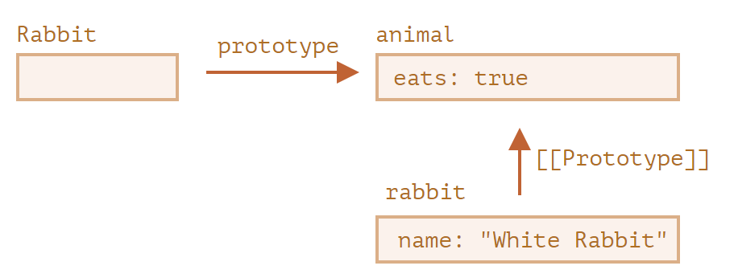

* **`F.prototype` 仅用在 `new F` 时**

`F.prototype` 属性仅在 `new F` 被调用时使用，它为新对象的 `[[Prototype]]` 赋值。如果在创建之后，`F.prototype` 属性有了变化（`F.prototype = <another object>`），那么通过 `new F` 创建的新对象也将随之拥有新的对象作为 `[[Prototype]]`，但已经存在的对象将保持旧有的值。

* 每个函数都有 `"prototype"` 属性。

  默认的 `"prototype"` 是一个只有属性 `constructor` 的对象，属性 `constructor` 指向函数自身

  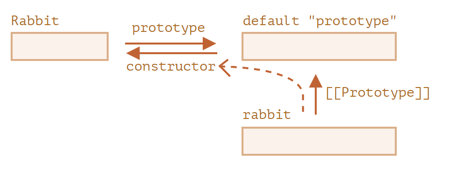

  ```javascript
  function Rabbit() {}
  
  /* 默认的 prototype
  Rabbit.prototype = { constructor: Rabbit };
  */
  ```

  我们可以使用 `constructor` 属性来创建一个新对象，该对象使用与现有对象相同的构造器。

  像这样：

  ```javascript
  function Rabbit(name) {
    this.name = name;
    alert(name);
  }
  
  let rabbit = new Rabbit("White Rabbit");
  
  let rabbit2 = new rabbit.constructor("Black Rabbit");
  ```

**JavaScript 自身并不能确保正确的 `"constructor"` 函数值**

如果我们将整个默认 prototype 替换掉，那么其中就不会有 `"constructor"`

例如：

```javascript
function Rabbit() {}
Rabbit.prototype = {
  jumps: true
};

let rabbit = new Rabbit();
alert(rabbit.constructor === Rabbit); // false

//为了确保正确的 "constructor"，我们可以选择添加/删除属性到默认 "prototype"，而不是将其整个覆盖
Rabbit.prototype.jumps = true
// 默认的 Rabbit.prototype.constructor 被保留了下来
//也可以手动重新创建 constructor 属性：
Rabbit.prototype = {
  jumps: true,
  constructor: Rabbit
};
```

**总结**

- `F.prototype` 属性（不要把它与 `[[Prototype]]` 弄混了）在 `new F` 被调用时为新对象的 `[[Prototype]]` 赋值。

- `F.prototype` 的值要么是一个对象，要么就是 `null`：其他值都不起作用。

- `"prototype"` 属性仅当设置在一个构造函数上，并通过 `new` 调用时，才具有这种特殊的影响。

  在常规对象上，`prototype` 没什么特别的：

  ```javascript
  let user = {
    name: "John",
    prototype: "Bla-bla" // 这里只是普通的属性
  };
  ```

- 默认情况下，所有函数都有 `F.prototype = {constructor：F}`，所以我们可以通过访问它的 `"constructor"` 属性来获取一个对象的构造器。

- 可以使用 `constructor` 属性来创建一个新对象，该对象使用与现有对象相同的构造器 new obj .constructor() 使用obj的对象的构造器

**课后题**

对象通过引用被赋值。来自 `Rabbit.prototype` 的对象并没有被赋值，它仍然是被 `Rabbit.prototype` 和 `rabbit` 的 `[[Prototype]]` 引用的单个对象。

所以当我们通过一个引用更改其内容时，它对其他引用也是可见的

```javascript
function Rabbit() {}
Rabbit.prototype = {
  eats: true
};

let rabbit = new Rabbit();

Rabbit.prototype.eats = false;
alert( rabbit.eats ); //  false

//
delete rabbit.eats;
alert( rabbit.eats ); //  true rabbit 对象并没有 eats 属性。所以这个操作不会有任何影响
//
delete Rabbit.prototype.eats;
alert( rabbit.eats ); //  undefined
```


```javascript
function User(name) {
  this.name = name;
}

let user = new User('John');
let user2 = new user.constructor('Pete');

alert( user2.name ); // Pete (worked!)
```

它起作用了，因为 `User.prototype.constructor == User`。

……但是如果有人，重写了 `User.prototype`，并忘记可重新创建 `constructor` 以引用 `User`，那么上面这段代码就会运行失败

#### 原生的原型

`obj = {}` 和 `obj = new Object()` 是一个意思

其中 `Object` 就是一个内建的对象构造函数，其自身的 `prototype` 指向一个带有 `toString` 和其他方法的一个巨大的对象

当 `new Object()` 被调用（或一个字面量对象 `{...}` 被创建），按照前面章节中我们学习过的规则，这个对象的 `[[Prototype]]` 属性被设置为 `Object.prototype`

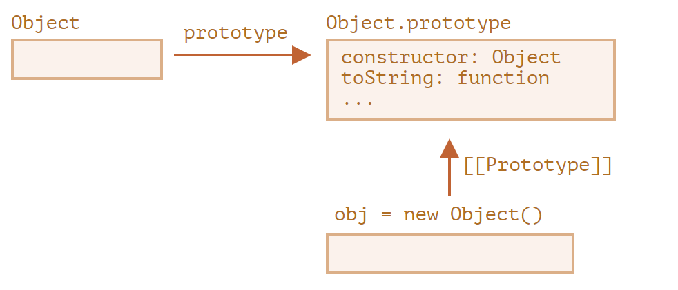

之后当 `obj.toString()` 被调用时，这个方法是从 `Object.prototype` 中获取的

* **内建原型**

  数组、函数、数字...

  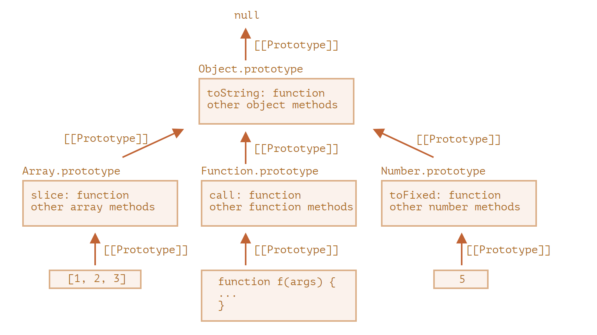

  最复杂的事情发生在字符串、数字和布尔值上。它们并不是对象。但是如果我们试图访问它们的属性，那么临时包装器对象将会通过内建的构造器 `String`、`Number` 和 `Boolean` 被创建。它们提供给我们操作字符串、数字和布尔值的方法然后消失。这些对象的方法也驻留在它们的 prototype 中，可以通过 `String.prototype`、`Number.prototype` 和 `Boolean.prototype` 进行获取

  **值** `null` **和** `undefined` **没有对象包装器**

* **更改原生原型**

  原生的原型是可以被修改的。例如，我们向 `String.prototype` 中添加一个方法，这个方法将对所有的字符串都是可用的。在开发的过程中，我们可能会想要一些新的内建方法，并且想把它们添加到原生原型中。但这通常是一个很不好的想法。

  **原型是全局的，所以很容易造成冲突。如果有两个库都添加了 `String.prototype.show` 方法，那么其中的一个方法将被另一个覆盖。**

* **在现代编程中，只有一种情况下允许修改原生原型。那就是 polyfilling。**

  Polyfilling 是一个术语，表示某个方法在 JavaScript 规范中已存在，但是特定的 JavaScript 引擎尚不支持该方法，那么我们可以通过手动实现它，并用以填充内建原型。

  例如：

  ```javascript
  if (!String.prototype.repeat) { // 如果这儿没有这个方法
    // 那就在 prototype 中添加它
  
    String.prototype.repeat = function(n) {
      // 重复传入的字符串 n 次
  
      // 实际上，实现代码比这个要复杂一些（完整的方法可以在规范中找到）
      // 但即使是不够完美的 polyfill 也常常被认为是足够好的
      return new Array(n + 1).join(this);
    };
  }
  
  alert( "La".repeat(3) ); // LaLaLa
  ```

* **从原型中借用**

  如果我们要创建类数组对象，则可能需要向其中复制一些 `Array` 方法。

  例如：

  ```javascript
  let obj = {
    0: "Hello",
    1: "world!",
    length: 2,
  };
  
  obj.join = Array.prototype.join;
  //内建的方法 join 的内部算法只关心正确的索引和 length 属性。它不会检查这个对象是否是真正的数组
  alert( obj.join(',') ); // Hello,world!
  ```

  * 另一种方式是通过将 `obj.__proto__` 设置为 `Array.prototype`，这样 `Array` 中的所有方法都自动地可以在 `obj` 中使用了

    但是如果 `obj` 已经从另一个对象进行了继承，那么这种方法就不可行了（译注：因为这样会覆盖掉已有的继承。此处 `obj` 其实已经从 `Object` 进行了继承，但是 `Array` 也继承自 `Object`，所以此处的方法借用不会影响 `obj` 对原有继承的继承，因为 `obj` 通过原型链依旧继承了 `Object`）

**总结**

- 所有的内建对象都遵循相同的模式（pattern）：
  - 方法都存储在 prototype 中（`Array.prototype`、`Object.prototype`、`Date.prototype` 等）。
  - 对象本身只存储数据（数组元素、对象属性、日期）。
- 原始数据类型也将方法存储在包装器对象的 prototype 中：`Number.prototype`、`String.prototype` 和 `Boolean.prototype`。只有 `undefined` 和 `null` 没有包装器对象。
- 内建原型可以被修改或被用新的方法填充。但是不建议更改它们。唯一允许的情况可能是，当我们添加一个还没有被 JavaScript 引擎支持，但已经被加入 JavaScript 规范的新标准时，才可能允许这样做。

**课后题**

1. 在所有函数的原型中添加 `defer(ms)` 方法

   ```js
   Function.prototype.defer = function(ms) {
     setTimeout(this, ms);
   };
   
   function f() {
     alert("Hello!");
   }
   
   f.defer(1000); // 1 秒后显示 "Hello!"
   ```

2. 请注意，参数应该被传给原始函数。 用包装器返回函数

   ```javascript
   Function.prototype.defer = function(ms) {
     let f = this;//注意保存外部的this，此处的this才是函数f
     return function(...args) {
       //调用f，配合rest解开的arguments，因此用f.apply()
       setTimeout(() => f.apply(this, args), ms);
     }
   };
   // check it
   function f(a, b) {
     alert( a + b );
   }
   f.defer(1000)(1, 2); // 1 秒后显示 3
   ```

#### 原型方法，没有__ proto __的对象

使用 `obj.__proto__` 设置或读取原型被认为已经过时且不推荐使用（deprecated）了（已经被移至 JavaScript 规范的附录 B，意味着仅适用于浏览器）。

现代的获取/设置原形的方法有：

- [Object.getPrototypeOf(obj)](https://developer.mozilla.org/zh/docs/Web/JavaScript/Reference/Global_Objects/Object/getPrototypeOf) —— 返回对象 `obj` 的 `[[Prototype]]`。
- [Object.setPrototypeOf(obj, proto)](https://developer.mozilla.org/zh/docs/Web/JavaScript/Reference/Global_Objects/Object/setPrototypeOf) —— 将对象 `obj` 的 `[[Prototype]]` 设置为 `proto`

- [Object.create(proto, [descriptors\])](https://developer.mozilla.org/zh/docs/Web/JavaScript/Reference/Global_Objects/Object/create) —— 利用给定的 `proto` 作为 `[[Prototype]]` 和可选的属性描述来创建一个空对象。

例如：

```javascript
let animal = {
  eats: true
};

// 创建一个以 animal 为原型的新对象
let rabbit = Object.create(animal); 
// 与 {__proto__: animal} 相同

alert(rabbit.eats); // true

alert(Object.getPrototypeOf(rabbit) === animal); // true

Object.setPrototypeOf(rabbit, {}); // 将 rabbit 的原型修改为 {}
```

`Object.create` 方法更强大，因为它有一个可选的第二参数：属性描述器

可以在此处为新对象提供额外的属性，就像这样：

```javascript
let animal = {
  eats: true
};

let rabbit = Object.create(animal, {
  jumps: {
    value: true
  }
});

alert(rabbit.jumps); // true
```

可以使用 `Object.create` 来实现比复制 `for..in` 循环中的属性更强大的对象克隆方式：

```javascript
let clone = Object.create(
  Object.getPrototypeOf(obj),
  Object.getOwnPropertyDescriptors(obj)
);
```

此调用可以对 `obj` 进行真正准确地拷贝，包括所有的属性：可枚举和不可枚举的，数据属性和 setters/getters —— 包括所有内容，并带有正确的 `[[Prototype]]`

**更改原型是一个非常缓慢的操作，因为它破坏了对象属性访问操作的内部优化。请不要修改已存在的对象的 `[[Prototype]]`**

`__proto__` 不是对象的属性，而是 `Object.prototype` 的访问器属性

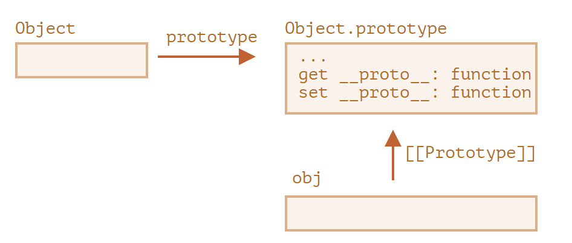

**总结**：

- 要使用给定的原型创建对象，使用：

  - 字面量语法：`{ __proto__: ... }`，允许指定多个属性
  - 或 [Object.create(proto, [descriptors\])](https://developer.mozilla.org/zh/docs/Web/JavaScript/Reference/Global_Objects/Object/create)，允许指定属性描述符。

  `Object.create` 提供了一种简单的方式来浅拷贝对象及其所有属性描述符（descriptors）。

  ```javascript
  let clone = Object.create(Object.getPrototypeOf(obj), Object.getOwnPropertyDescriptors(obj));
  ```

- 设置和访问原型的现代方法有：

  - [Object.getPrototypeOf(obj)](https://developer.mozilla.org/zh/docs/Web/JavaScript/Reference/Global_Objects/Object/getPrototypeOf) —— 返回对象 `obj` 的 `[[Prototype]]`（与 `__proto__` 的 getter 相同）。
  - [Object.setPrototypeOf(obj, proto)](https://developer.mozilla.org/zh/docs/Web/JavaScript/Reference/Global_Objects/Object/setPrototypeOf) —— 将对象 `obj` 的 `[[Prototype]]` 设置为 `proto`（与 `__proto__` 的 setter 相同）。

- 不推荐使用内建的的 `__proto__` getter/setter 获取/设置原型，它现在在 ECMA 规范的附录 B 中。

- 我们还介绍了使用 `Object.create(null)` 或 `{__proto__: null}` 创建的无原型的对象。

  这些对象被用作字典，以存储任意（可能是用户生成的）键。

  通常，对象会从 `Object.prototype` 继承内建的方法和 `__proto__` getter/setter，会占用相应的键，且可能会导致副作用。原型为 `null` 时，对象才真正是空的

**课后题**

为了使 `toString` 不可枚举，我们使用一个属性描述器来定义它。`Object.create` 语法允许我们为一个对象提供属性描述器作为第二参数。

```javascript
let dictionary = Object.create(null, {
  toString: { // 定义 toString 属性
    value() { // value 是一个 function
      return Object.keys(this).join();
    }
  }
});
/*第二种方法
let dictionary = Object.create(null);

// 你的添加 dictionary.toString 方法的代码
Object.defineProperty(dictionary,"toString",{
    value(){ return Object.keys(this).join();}
});
*/

dictionary.apple = "Apple";
dictionary.__proto__ = "test";

// apple 和 __proto__ 在循环中
for(let key in dictionary) {
  alert(key); // "apple"，然后是 "__proto__"
}

// 通过 toString 处理获得的以逗号分隔的属性列表
alert(dictionary); // "apple,__proto__"
```

### 类

#### class基本语法

在 JavaScript 中，类是一种函数。

**类的方法之间没有逗号**

```javascript
class User {
  constructor(name) { this.name = name; }
  sayHi() { alert(this.name); }
}

// class 是一个函数
alert(typeof User); // function

// ...或者，更确切地说，是 constructor 方法
alert(User === User.prototype.constructor); // true

// 方法在 User.prototype 中，例如：
alert(User.prototype.sayHi); // sayHi 方法的代码

// 在原型中实际上有两个方法
alert(Object.getOwnPropertyNames(User.prototype)); // constructor, sayHi
```

* class与原型之间存在着重大差异：

  1. 首先，通过 `class` 创建的函数具有特殊的内部属性标记 `[[IsClassConstructor]]: true`。因此，它与手动创建并不完全相同。

     编程语言会在许多地方检查该属性。例如，与普通函数不同，必须使用 `new` 来调用它：

     ```javascript
     class User {
       constructor() {}
     }
     
     alert(typeof User); // function
     User(); // Error: Class constructor User cannot be invoked without 'new'
     ```

  2. 类方法不可枚举。 类定义将 `"prototype"` 中的所有方法的 `enumerable` 标志设置为 `false`。

     这很好，因为如果我们对一个对象调用 `for..in` 方法，我们通常不希望 class 方法出现。

  3. 类总是使用 `use strict`。 在类构造中的所有代码都将自动进入严格模式

* **类表达式**

  像函数一样，类可以在另外一个表达式中被定义，被传递，被返回，被赋值

  如果类表达式有名字，那么该名字仅在类内部可见：

  ```javascript
  // “命名类表达式（Named Class Expression）”
  // (规范中没有这样的术语，但是它和命名函数表达式类似)
  let User = class MyClass {
      //使用中括号 [...] 的计算方法名称
     ['say' + 'Hi']() {
      alert(MyClass); // MyClass 这个名字仅在类内部可见
    }
    //getter 和 setter
    constructor(name) {
      // 调用 setter
      this.name = name;
    }
  
    get name() {
      return this._name;
    } 
    set name(value) {
      if (value.length < 4) {
        alert("Name is too short.");
        return;
      }
      this._name = value;
    }
  };
  new User().sayHi(); // 正常运行，显示 MyClass 中定义的内容
  alert(MyClass); // error，MyClass 在外部不可见
  
  
  //甚至可以动态地“按需”创建类，就像这样：
  function makeClass(phrase) {
    // 声明一个类并返回它
    return class {
      sayHi() {
        alert(phrase);
      }
    };
  }
  // 创建一个新的类
  let User = makeClass("Hello");
  new User().sayHi(); // Hello
  ```

* **类字段**

  在 `class User` 中添加一个 `name` 属性：

  ```javascript
  class User {
    name = "John";
    sayHi() {
      alert(`Hello, ${this.name}!`);
    }
  }
  new User().sayHi(); // Hello, John!
  ```

  类字段重要的不同之处在于，它们会在每个独立对象中被设好，而不是设在 `User.prototype`：

  ```javascript
  class User {
    name = "John";
  }
  let user = new User();
  alert(user.name); // John
  alert(User.prototype.name); // undefined
  ```

* **使用类字段制作绑定方法**

  此代码将显示 `undefined`：

  ```javascript
  class Button {
    constructor(value) {
      this.value = value;
    }
  
    click() {
      alert(this.value);
    }
  }
  
  let button = new Button("hello");
  setTimeout(button.click, 1000); // undefined
  //因为在setTimeout里调用的this是window
  ```

  有两种可以修复它的方式：

  1. 传递一个包装函数，例如 `setTimeout(() => button.click(), 1000)`。
  2. 将方法绑定到对象，例如在 constructor 中。

  类字段提供了另一种非常优雅的语法：

  ```javascript
  class Button {
    constructor(value) {
      this.value = value;
    }
    click = () => {
      alert(this.value);
    }
  }
  
  let button = new Button("hello");
  setTimeout(button.click, 1000); // hello
  ```

  类字段 `click = () => {...}` 是基于每一个对象被创建的，在这里对于每一个 `Button` 对象都有一个独立的方法，在内部都有一个指向此对象的 `this`。我们可以把 `button.click` 传递到任何地方，而且 `this` 的值总是正确的。在浏览器环境中，它对于进行事件监听尤为有用

**总结**

基本的类语法看起来像这样：

```javascript
class MyClass {
  prop = value; // 属性

  constructor(...) { // 构造器
    // ...
  }

  method(...) {} // method

  get something(...) {} // getter 方法
  set something(...) {} // setter 方法

  [Symbol.iterator]() {} // 有计算名称（computed name）的方法（此处为 symbol）
  // ...
}
```

技术上来说，`MyClass` 是一个函数（我们提供作为 `constructor` 的那个），而 methods、getters 和 settors 都被写入了 `MyClass.prototype`

#### 类继承

继承自 `Animal` 的 `class Rabbit`：

```javascript
class Rabbit extends Animal {
  hide() {
    alert(`${this.name} hides!`);
  }
}

let rabbit = new Rabbit("White Rabbit");

rabbit.run(5); // White Rabbit runs with speed 5.
rabbit.hide(); // White Rabbit hides!
```

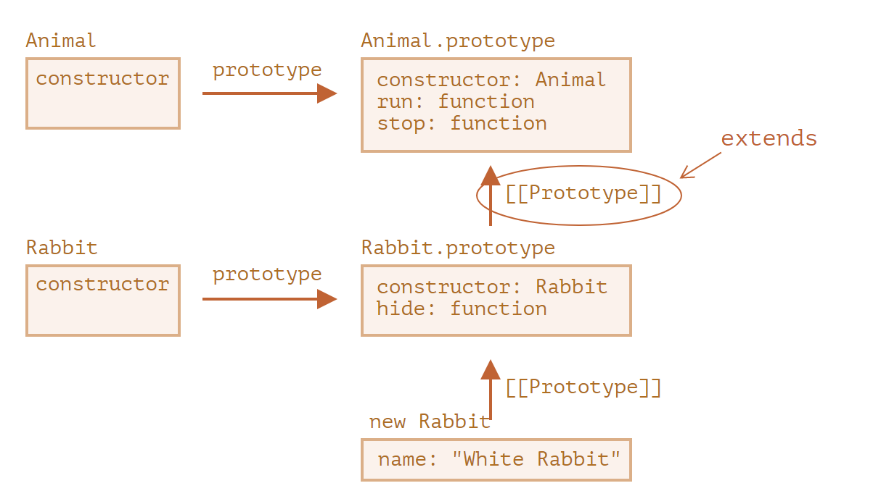

**在** `extends` **后允许任意表达式**

一个生成父类的函数调用：

```javascript
function f(phrase) {
  return class {
    sayHi() { alert(phrase); }
  };
}

class User extends f("Hello") {}

new User().sayHi(); // Hello
```

* **重写方法**

  默认情况下，所有未在 `class Rabbit` 中指定的方法均从 `class Animal` 中直接获取，若我们在`Rabbit` 中指定了我们自己的方法，例如 `stop()`，那么将会使用它。

  然而通常，我们不希望完全替换父类的方法，而是希望在父类方法的基础上进行调整或扩展其功能。我们在我们的方法中做一些事儿，但是在它之前或之后或在过程中会调用父类方法。

  Class 为此提供了 `"super"` 关键字。

  - 执行 `super.method(...)` 来调用一个父类方法。
  - 执行 `super(...)` 来调用一个父类 constructor（只能在我们的 constructor 中）

  **箭头函数没有** `super`

  如果被访问，它会从外部函数获取。例如：

  ```javascript
  class Rabbit extends Animal {
    stop() {
      setTimeout(() => super.stop(), 1000); // 1 秒后调用父类的 stop
    }
     setTimeout(function() { super.stop() }, 1000);// 意料之外的 super，因为func有super，所以会出错
  }
  ```

* **重写constructor**

  **继承类的 constructor 必须调用 `super(...)`，并且 (!) 一定要在使用 `this` 之前调用**

  像下面这样：

  ```javascript
  class Animal {
  
    constructor(name) {
      this.speed = 0;
      this.name = name;
    }
  
    // ...
  }
  
  class Rabbit extends Animal {
  
    constructor(name, earLength) {
      super(name);
      this.earLength = earLength;
    }
  
    // ...
  }
  
  // 现在可以了
  let rabbit = new Rabbit("White Rabbit", 10);
  alert(rabbit.name); // White Rabbit
  alert(rabbit.earLength); // 10
  ```

  通过使用方法或者 getter/setter 替代类字段，来修复类字段问题

* **深入：内部探究[[HomeObject]] (略)**

* 对于对象而言，方法必须确切指定为 `method()`，而不是 `"method: function()"`

  使用非方法（non-method）语法，未设置 `[[HomeObject]]` 属性，并且继承无效：

  ```javascript
  let animal = {
    eat: function() { // 这里是故意这样写的，而不是 eat() {...
      // ...
    }
  };
  let rabbit = {
    __proto__: animal,
    eat: function() {
      super.eat();
    }
  };
  rabbit.eat();  // 错误调用 super（因为这里没有 [[HomeObject]]）
  ```

**总结**

* 想要扩展一个类：

  ```
  class Child extends Parent
  ```

  ：

  - 这意味着 `Child.prototype.__proto__` 将是 `Parent.prototype`，所以方法会被继承。

* 重写一个 constructor：

  - 在使用 `this` 之前，我们必须在 `Child` 的 constructor 中将父 constructor 调用为 `super()`。

* 重写一个方法：

  - 我们可以在一个 `Child` 方法中使用 `super.method()` 来调用 `Parent` 方法。

* 内部：

  - 方法在内部的 `[[HomeObject]]` 属性中记住了它们的类/对象。这就是 `super` 如何解析父方法的。
  - 因此，将一个带有 `super` 的方法从一个对象复制到另一个对象是不安全的。

补充：

- 箭头函数没有自己的 `this` 或 `super`，所以它们能融入到就近的上下文中，像透明似的。


#### 静态属性和静态方法

我们有对象 `Article`，并且需要一个方法来比较它们。

通常的解决方案就是添加 `Article.compare` 静态方法：

```javascript
class Article {
  constructor(title, date) {
    this.title = title;
    this.date = date;
  }

  static compare(articleA, articleB) {
    return articleA.date - articleB.date;
  }
}

// 用法
let articles = [
  new Article("HTML", new Date(2019, 1, 1)),
  new Article("CSS", new Date(2019, 0, 1)),
  new Article("JavaScript", new Date(2019, 11, 1))
];

articles.sort(Article.compare);
alert( articles[0].title ); // CSS

//创建类的一个静态方法来实现“工厂”方法。比如说，我们需要通过多种方式来创建一篇文章：
//1.通过用给定的参数来创建（title，date 等）。 可以通过 constructor 来实现
//2.使用今天的日期来创建一个空的文章。
static createTodays() {
    // 记住 this = Article
    return new this("Today's digest", new Date());
  }
}
let article = Article.createTodays();
alert( article.title ); // Today's digest
```

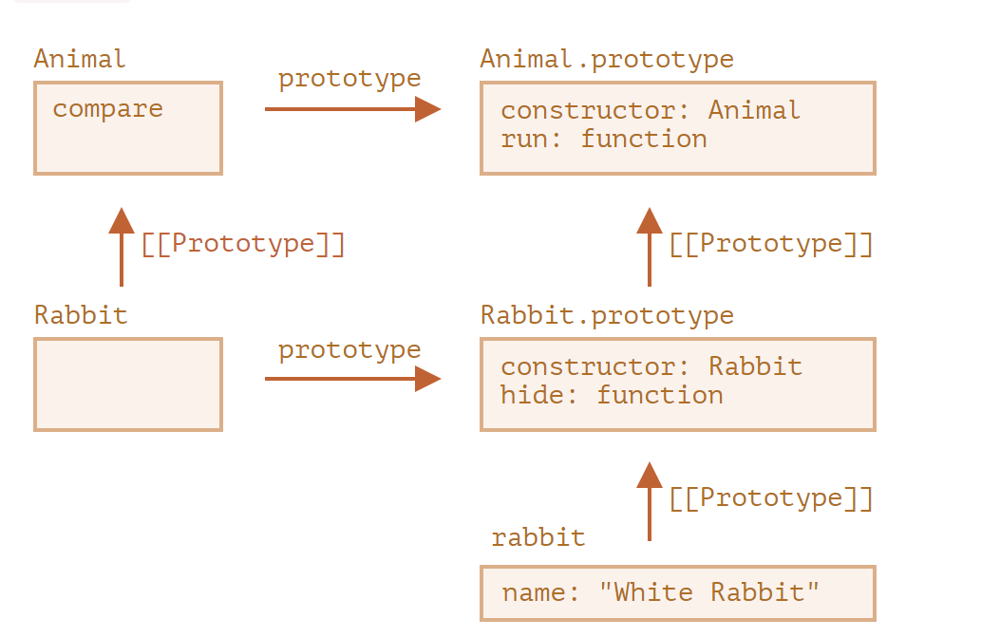

`Rabbit extends Animal` 创建了**两个 `[[Prototype]]` 引用**：

1. `Rabbit` 函数原型继承自 `Animal` 函数。
2. `Rabbit.prototype` 原型继承自 `Animal.prototype`

**静态方法可以在类上调用，而不是在单个对象上**

**静态属性和方法是可被继承的**

例如，下面这段代码中的 `Animal.compare` 和 `Animal.planet` 是可被继承的，可以通过 `Rabbit.compare` 和 `Rabbit.planet` 来访问：

```javascript
class Animal {
  static planet = "Earth";
  constructor(name, speed) {
    this.speed = speed;
    this.name = name;
  }
  run(speed = 0) {
    this.speed += speed;
    alert(`${this.name} runs with speed ${this.speed}.`);
  }
  static compare(animalA, animalB) {
    return animalA.speed - animalB.speed;
  }

}
// 继承于 Animal
class Rabbit extends Animal {
  hide() {
    alert(`${this.name} hides!`);
  }
}

let rabbits = [
  new Rabbit("White Rabbit", 10),
  new Rabbit("Black Rabbit", 5)
];
rabbits.sort(Rabbit.compare);
rabbits[0].run(); // Black Rabbit runs with speed 5.
alert(Rabbit.planet); // Earth
```

* **课后题**

extends Object与否 有什么区别？

| class Rabbit                              | class Rabbit extends Object         |
| :---------------------------------------- | :---------------------------------- |
| –                                         | 需要在 constructor 中调用 `super()` |
| `Rabbit.__proto__ === Function.prototype` | `Rabbit.__proto__ === Object`       |

#### 私有的和受保护的属性和方法

在 JavaScript 中，有两种类型的对象字段（属性和方法）：

- 公共的：可从任何地方访问。它们构成了外部接口。到目前为止，我们只使用了公共的属性和方法。
- 私有的：只能从类的内部访问。这些用于内部接口

**受保护的属性通常以下划线 `_` 作为前缀**

我们通过setter 和getter来访问内部属性

属性将被命名为 `_waterAmount`：

```javascript
class CoffeeMachine {
  _waterAmount = 0;
  set waterAmount(value) {
    if (value < 0) {
      value = 0;
    }
    this._waterAmount = value;
  }
  get waterAmount() {
    return this._waterAmount;
  }
  constructor(power) {
    this._power = power;
  }
}
// 创建咖啡机
let coffeeMachine = new CoffeeMachine(100);
// 加水
coffeeMachine.waterAmount = -10; // _waterAmount 将变为 0，而不是 -10
```

只设置 getter，而不设置 setter，这样内部属性就变为只读。

**getter/setter 函数**也可以为自定义函数,像这样

```js
  setWaterAmount(value) {
    if (value < 0) value = 0;
    this._waterAmount = value;
  }
  getWaterAmount() {
    return this._waterAmount;
  }
```

**受保护的字段是自然可被继承的**

在语言级别，**`#` 是该字段为私有的特殊标志**。我们无法从外部或从继承的类中访问它。

私有字段与公共字段不会发生冲突。我们可以同时拥有私有的 `#waterAmount` 和公共的 `waterAmount` 字段

**私有字段不能通过 this[name] 访问**

这样我们就不用担心继承时会获取和修改到内部属性了。

#### 扩展内建类

内建的类，例如 `Array`，`Map` 等也都是可以扩展的

继承自原生 `Array` 的类 `PowerArray`：

```javascript
// 给 PowerArray 新增了一个方法（可以增加更多）
class PowerArray extends Array {
  isEmpty() {
    return this.length === 0;
  }
}

let arr = new PowerArray(1, 2, 5, 10, 50);
alert(arr.isEmpty()); // false

let filteredArr = arr.filter(item => item >= 10);
alert(filteredArr); // 10, 50
alert(filteredArr.isEmpty()); // false
```

我们可以给这个类添加一个特殊的静态 getter `Symbol.species`。如果存在，则应返回 JavaScript 在内部用来在 `map` 和 `filter` 等方法中创建新实体的 `constructor`。

如果我们希望像 `map` 或 `filter` 这样的内建方法返回常规数组，我们可以在 `Symbol.species` 中返回 `Array`

* **内建类没有静态方法继承**

  内建对象有它们自己的静态方法，例如 `Object.keys`，`Array.isArray` 等。

  如我们所知道的，原生的类互相扩展。例如，`Array` 扩展自 `Object`

  内建类却是一个例外。它们相互间不继承静态方法。

  例如，`Array` 和 `Date` 都继承自 `Object`，所以它们的实例都有来自 `Object.prototype` 的方法。但 `Array.[[Prototype]]` 并不指向 `Object`，所以它们没有例如 `Array.keys()`（或 `Date.keys()`）这些静态方法

  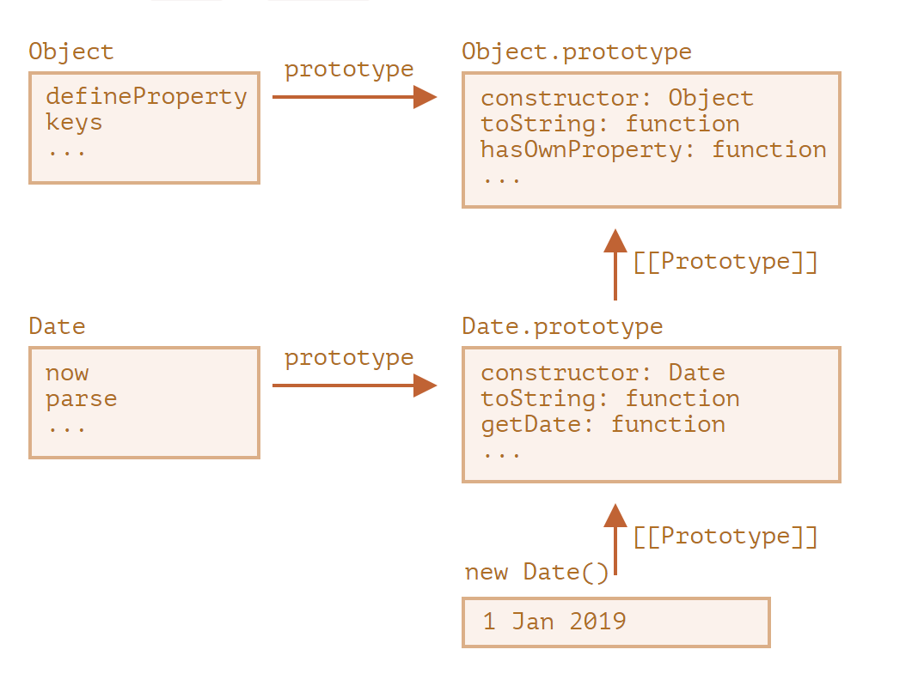

`Date` 和 `Object` 之间没有连结。它们是独立的，只有 `Date.prototype` 继承自 `Object.prototype`，仅此而已

#### instanceof

如果 `obj` 隶属于 `Class` 类（或 `Class` 类的衍生类），则返回 `true`

`obj instanceof Class` 算法的执行过程大致如下：

如果 `objA` 处在 `objB` 的原型链中，则返回 `true`。所以，**可以将 `obj instanceof Class` 检查改为 `Class.prototype.isPrototypeOf(obj)`**

1. 如果这儿有静态方法 `Symbol.hasInstance`，那就直接调用这个方法：

   例如：

   ```javascript
   // 设置 instanceOf 检查
   // 并假设具有 canEat 属性的都是 animal
   class Animal {
     static [Symbol.hasInstance](obj) {
       if (obj.canEat) return true;
     }
   }
   
   let obj = { canEat: true };
   
   alert(obj instanceof Animal); // true：Animal[Symbol.hasInstance](obj) 被调用
   ```

2. 大多数 class 没有 `Symbol.hasInstance`。在这种情况下，标准的逻辑是：使用 `obj instanceOf Class` 检查 `Class.prototype` 是否等于 `obj` 的原型链中的原型之一。

   换句话说就是，一个接一个地比较：

   ```javascript
   obj.__proto__ === Class.prototype?
   obj.__proto__.__proto__ === Class.prototype?
   obj.__proto__.__proto__.__proto__ === Class.prototype?
   ...
   // 如果任意一个的答案为 true，则返回 true
   // 否则，如果我们已经检查到了原型链的尾端，则返回 false
   ```

#### 使用 Object.prototype.toString 方法来揭示类型

大家都知道，一个普通对象被转化为字符串时为 `[object Object]`：

```javascript
let obj = {};

alert(obj); // [object Object]
alert(obj.toString()); // 同上

// 方便起见，将 toString 方法复制到一个变量中
let objectToString = Object.prototype.toString;
// 它是什么类型的？
let arr = [];
alert( objectToString.call(arr) ); // [object Array]
```

**课后题**

在下面的代码中，为什么 `instanceof` 会返回 `true`？我们可以明显看到，`a` 并不是通过 `B()` 创建的。

```javascript
function A() {}
function B() {}

A.prototype = B.prototype = {};
let a = new A();
alert( a instanceof B ); // true
//等价于B.prototype.isPrototypeOf(a)
```

#### Mixin模式

mixin 是一个包含可被其他类使用而无需继承的方法的类。

换句话说，*mixin* 提供了实现特定行为的方法，但是我们不单独使用它，而是使用它来将这些行为添加到其他类中

Mixin 可以在自己内部使用继承。

例如，这里的 `sayHiMixin` 继承自 `sayMixin`：

```javascript
let sayMixin = {
  say(phrase) {
    alert(phrase);
  }
};

let sayHiMixin = {
  __proto__: sayMixin, // (或者，我们可以在这儿使用 Object.setPrototypeOf 来设置原型)

  sayHi() {
    // 调用父类方法
    super.say(`Hello ${this.name}`); // (*)
  },
  sayBye() {
    super.say(`Bye ${this.name}`); // (*)
  }
};

class User {
  constructor(name) {
    this.name = name;
  }
}

// 拷贝方法
Object.assign(User.prototype, sayHiMixin);

// 现在 User 可以打招呼了
new User("Dude").sayHi(); // Hello Dude!
```

请注意，在 `sayHiMixin` 内部对父类方法 `super.say()` 的调用（在标有 `(*)` 的行）会在 mixin 的原型中查找方法，而不是在 class 中查找。

这是示意图（请参见图中右侧部分）：

这是因为方法 `sayHi` 和 `sayBye` 最初是在 `sayHiMixin` 中创建的。因此，即使复制了它们，但是它们的 `[[HomeObject]]` 内部属性仍引用的是 `sayHiMixin`

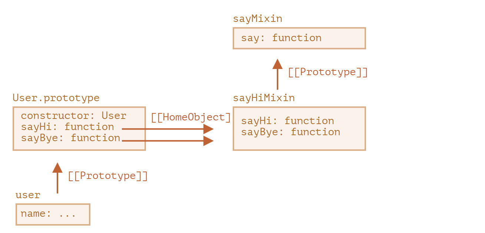

* **EventMixin**

构造一个 mixin，使我们能够轻松地将与事件相关的函数添加到任意 class/object 中

代码：

```javascript
let eventMixin = {
  /**
   * 订阅事件，用法：
   *  menu.on('select', function(item) { ... }
  */
  on(eventName, handler) {
    if (!this._eventHandlers) this._eventHandlers = {};
    if (!this._eventHandlers[eventName]) {
      this._eventHandlers[eventName] = [];
    }
    this._eventHandlers[eventName].push(handler);
  },

  /**
   * 取消订阅，用法：
   *  menu.off('select', handler)
   */
  off(eventName, handler) {
    let handlers = this._eventHandlers?.[eventName];
    if (!handlers) return;
    for (let i = 0; i < handlers.length; i++) {
      if (handlers[i] === handler) {
        handlers.splice(i--, 1);
      }
    }
  },

  /**
   * 生成具有给定名称和数据的事件
   *  this.trigger('select', data1, data2);
   */
  trigger(eventName, ...args) {
    if (!this._eventHandlers?.[eventName]) {
      return; // 该事件名称没有对应的事件处理程序（handler）
    }

    // 调用事件处理程序（handler）
    this._eventHandlers[eventName].forEach(handler => handler.apply(this, args));
  }
};
```

1. `.on(eventName, handler)` — 指定函数 `handler` 以在具有对应名称的事件发生时运行。从技术上讲，这儿有一个用于存储每个事件名称对应的处理程序（handler）的 `_eventHandlers` 属性，在这儿该属性就会将刚刚指定的这个 `handler` 添加到列表中。
2. `.off(eventName, handler)` — 从处理程序列表中删除指定的函数。
3. `.trigger(eventName, ...args)` — 生成事件：所有 `_eventHandlers[eventName]` 中的事件处理程序（handler）都被调用，并且 `...args` 会被作为参数传递给它们

用法：

```javascript
// 创建一个 class
class Menu {
  choose(value) {
    this.trigger("select", value);
  }
}
// 添加带有事件相关方法的 mixin
Object.assign(Menu.prototype, eventMixin);

let menu = new Menu();

// 添加一个事件处理程序（handler），在被选择时被调用：
menu.on("select", value => alert(`Value selected: ${value}`));

// 触发事件 => 运行上述的事件处理程序（handler）并显示：
// 被选中的值：123
menu.choose("123");
```

现在，如果我们希望任何代码对菜单选择作出反应，我们可以使用 `menu.on(...)` 进行监听。

使用 `eventMixin` 可以轻松地将此类行为添加到我们想要的多个类中，并且不会影响继承链

**总结**

*Mixin* —— 是一个通用的面向对象编程术语：一个包含其他类的方法的类。

一些其它编程语言允许多重继承。JavaScript 不支持多重继承，但是可以通过将方法拷贝到原型中来实现 mixin。

我们可以使用 mixin 作为一种通过添加多种行为（例如上文中所提到的事件处理）来扩充类的方法。

如果 Mixins 意外覆盖了现有类的方法，那么它们可能会成为一个冲突点。因此，通常应该仔细考虑 mixin 的命名方法，以最大程度地降低发生这种冲突的可能性


### 错误处理

* `try...catch` **仅对运行时的 error 有效**

* **`try...catch` 同步执行**

如果在“计划的（scheduled）”代码中发生异常，例如在 `setTimeout` 中，则 `try...catch` 不会捕获到异常：

```javascript
try {
  setTimeout(function() {
    noSuchVariable; // 脚本将在这里停止运行
  }, 1000);
} catch (err) {
  alert( "不工作" );
}
```

因为 `try...catch` 包裹了计划要执行的函数，该函数本身要稍后才执行，这时引擎已经离开了 `try...catch` 结构。

为了捕获到计划的（scheduled）函数中的异常，那么 `try...catch` 必须在这个函数内：

```javascript
setTimeout(function() {
  try {
    noSuchVariable; // try...catch 处理 error 了！
  } catch {
    alert( "error 被在这里捕获了！" );
  }
}, 1000);
```

* **Error对象**

* **可选的“catch”绑定**

  如果我们不需要 error 的详细信息，`catch` 也可以忽略它

* 当拿到的数据出了问题，那么访问者永远都不会知道原因（除非他们打开开发者控制台）。代码执行失败却没有提示信息，这真的是很糟糕的用户体验。

  让我们用 `try...catch` 来处理这个 error：

  ```javascript
  let json = "{ bad json }";
  
  try {
  
    let user = JSON.parse(json); // <-- 当出现 error 时...
    alert( user.name ); // 不工作
  
  } catch (err) {
    // ...执行会跳转到这里并继续执行
    alert( "很抱歉，数据有错误，我们会尝试再请求一次。" );
    alert( err.name );
    alert( err.message );
  }
  ```

* **抛出error "throw"操作符**

  JavaScript 中有很多内建的标准 error 的构造器：`Error`，`SyntaxError`，`ReferenceError`，`TypeError` 等。我们也可以使用它们来创建 error 对象

  抛出这个 error。

  ```javascript
  let json = '{ "age": 30 }'; // 不完整的数据
  
  try {
    let user = JSON.parse(json); // <-- 没有 error
    if (!user.name) {
      throw new SyntaxError("数据不全：没有 name"); // (*)
    }
    alert( user.name );
  } catch(err) {
    alert( "JSON Error: " + err.message ); // JSON Error: 数据不全：没有 name
  }
  ```

  **再次抛出或给上一级接到** 其中可以用instanceof来判断错误的类型，用if else来选择 或者在外部catch

* **变量和 `try...catch...finally` 中的局部变量**

  请注意，上面代码中的 `result` 和 `diff` 变量都是在 `try...catch` **之前** 声明的。

  否则，如果我们使用 `let` 在 `try` 块中声明变量，那么该变量将只在 `try` 块中可见

  `finally` 子句适用于 `try...catch` 的 **任何** 出口。这包括显式的 `return`。

  在下面这个例子中，在 `try` 中有一个 `return`。在这种情况下，`finally` 会在控制转向外部代码前被执行。

  ```javascript
  function func() {
    try {
      return 1;
    } catch (err) {
      /* ... */
    } finally {
      alert( 'finally' );
    }
  }
  
  alert( func() ); // 先执行 finally 中的 alert，然后执行这个 alert
  ```

#### 自定义Error

- 我们可以正常地从 `Error` 和其他内建的 error 类中进行继承，。我们只需要注意 `name` 属性以及不要忘了调用 `super`。
- 我们可以使用 `instanceof` 来检查特定的 error。但有时我们有来自第三方库的 error 对象，并且在这儿没有简单的方法来获取它的类。那么可以将 `name` 属性用于这一类的检查。
- 包装异常是一项广泛应用的技术：用于处理低级别异常并创建高级别 error 而不是各种低级别 error 的函数。在上面的示例中，低级别异常有时会成为该对象的属性，例如 `err.cause`，但这不是严格要求的


### Promise，async/await

#### 回调

函数 `loadScript(src)`，该函数使用给定的 `src` 加载脚本：

```javascript
function loadScript(src) {
  // 创建一个 <script> 标签，并将其附加到页面
  // 这将使得具有给定 src 的脚本开始加载，并在加载完成后运行
  let script = document.createElement('script');
  script.src = src;
  document.head.append(script);
}
```

它将一个新的、带有给定 `src` 的、动态创建的标签 `<script src="…">` 插入到文档中。浏览器将自动开始加载它，并在加载完成后执行它。

我们可以像这样使用这个函数：

```javascript
// 在给定路径下加载并执行脚本
loadScript('/my/script.js');
```

脚本是“异步”调用的，因为它从现在开始加载，但是在这个加载函数执行完成后才运行。

如果在 `loadScript(…)` 下面有任何其他代码，它们不会等到脚本加载完成才执行。

```javascript
loadScript('/my/script.js');
// loadScript 下面的代码
// 不会等到脚本加载完成才执行
// ...
loadScript('/my/script.js'); // 这个脚本有 "function newFunction() {…}"

newFunction(); // 没有这个函数！
```

`loadScript(…)` 调用后立即执行此操作，这将不会有效。

我们希望了解脚本何时加载完成，以使用其中的新函数和变量。

让我们添加一个 `callback` 函数作为 `loadScript` 的第二个参数，该函数应在脚本加载完成时执行：

```javascript
function loadScript(src, callback) {
  let script = document.createElement('script');
  script.src = src;

  script.onload = () => callback(script);
	//onload 通常会在脚本加载和执行完成后执行一个函数。
  document.head.append(script);
}

//如果我们想调用该脚本中的新函数，我们应该将其写在回调函数中：
loadScript('/my/script.js', function() {
  // 在脚本加载完成后，回调函数才会执行
  newFunction(); // 现在它工作了
  ...
});
```

第二个参数是一个函数（通常是匿名函数），该函数会在行为（action）完成时运行。

这是一个带有真实脚本的可运行的示例：

```javascript
function loadScript(src, callback) {
  let script = document.createElement('script');
  script.src = src;
  script.onload = () => callback(script);
  document.head.append(script);
}

loadScript('https://cdnjs.cloudflare.com/ajax/libs/lodash.js/3.2.0/lodash.js', script => {
  alert(`酷，脚本 ${script.src} 加载完成`);
  alert( _ ); // _ 是所加载的脚本中声明的一个函数
});
```

* **在回调中回调**

  

  ```javascript
  loadScript('/my/script.js', function(script) {
  
    loadScript('/my/script2.js', function(script) {
  
      loadScript('/my/script3.js', function(script) {
        // ...加载完所有脚本后继续
      });
  
    });
  
  });
  ```

  因此，每一个新行为（action）都在回调内部。这对于几个行为来说还好，但对于许多行为来说就不好了，所以我们很快就会看到其他变体。

* **处理error**

  用法：

  ```javascript
  function loadScript(src, callback) {
    let script = document.createElement('script');
    script.src = src;
  
    script.onload = () => callback(null, script);
    script.onerror = () => callback(new Error(`Script load error for ${src}`));
  
    document.head.append(script);
  }
  
  loadScript('/my/script.js', function(error, script) {
    if (error) {
      // 处理 error
    } else {
      // 脚本加载成功
    }
  });
  ```

  //简单来说就是把函数作为参数传给 主函数，这样主函数在执行时就可以调用作为参数的函数，这个函数可以在执行时回调主函数。

  1. `callback` 的第一个参数是为 error 而保留的。一旦出现 error，`callback(err)` 就会被调用。
  2. 第二个参数（和下一个参数，如果需要的话）用于成功的结果。此时 `callback(null, result1, result2…)` 就会被调用。

  因此，单一的 `callback` 函数可以同时具有报告 error 和传递返回结果的作用。

* **回调地狱/厄运金字塔**

  名为 `step*` 的函数都是一次性使用的，创建它们就是为了避免“厄运金字塔”。没有人会在行为链之外重用它们。因此，这里的命名空间有点混乱

  ```js
  loadScript('1.js', step1);
  
  function step1(error, script) {
    if (error) {
      handleError(error);
    } else {
      // ...
      loadScript('2.js', step2);
    }
  }
  
  function step2(error, script) {
    if (error) {
      handleError(error);
    } else {
      // ...
      loadScript('3.js', step3);
    }
  }
  
  function step3(error, script) {
    if (error) {
      handleError(error);
    } else {
      // ...加载完所有脚本后继续 (*)
    }
  }
  ```


#### Promise

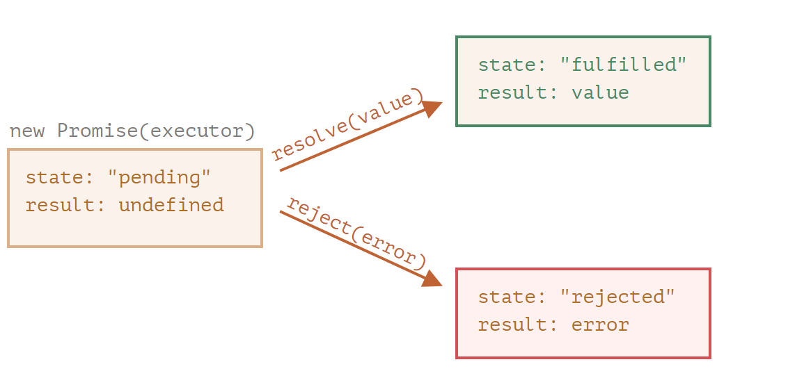

Promise 对象的构造器（constructor）语法如下：

```javascript
let promise = new Promise(function(resolve, reject) {
  // executor（生产者代码，“歌手”）
});
```

总而言之，executor 应该执行一项工作（通常是需要花费一些时间的事儿），然后调用 `resolve` 或 `reject` 来改变对应的 promise 对象的状态

**只能有一个结果或一个 error**

executor **只能调用一个 `resolve` 或一个 `reject`**。任何状态的更改都是最终的。

**所有其他的再对 `resolve` 和 `reject` 的调用都会被忽略**：

```javascript
let promise = new Promise(function(resolve, reject) {
  resolve("done");

  reject(new Error("…")); // 被忽略
  setTimeout(() => resolve("…")); // 被忽略
});
```

`resolve/reject` 只需要一个参数（或不包含任何参数），并且将忽略额外的参数

如果什么东西出了问题，executor 应该调用 `reject`。这可以使用任何类型的参数来完成（就像 `resolve` 一样）。但建议使用 `Error` 对象（或继承自 `Error` 的对象）。这样做的理由很快就会显而易见

**resolve/reject 可以立即进行**

实际上，executor 通常是异步执行某些操作，并在一段时间后调用 `resolve/reject`，但这不是必须的。我们还可以立即调用 `resolve` 或 `reject`，就像这样：

```javascript
let promise = new Promise(function(resolve, reject) {
  // 不花时间去做这项工作
  resolve(123); // 立即给出结果：123
});
```

* **消费者：then catch**

Promise 对象充当的是 executor（“生产者代码”或“歌手”）和消费函数（“粉丝”）之间的连接，后者将接收结果或 error。可以通过使用 `.then` 和 `.catch` 方法注册消费函数

**then**

`.then` 的第一个参数是一个函数，该函数将在 promise resolved 且接收到结果后执行。

`.then` 的第二个参数也是一个函数，该函数将在 promise rejected 且接收到 error 信息后执行

如果我们只对成功完成的情况感兴趣，那么我们可以只为 `.then` 提供一个函数参数：

```javascript
let promise = new Promise(resolve => {
  setTimeout(() => resolve("done!"), 1000);
});

promise.then(alert); // 1 秒后显示 "done!"
```

**catch**

如果我们只对 error 感兴趣，那么我们可以使用 `null` 作为第一个参数：`.then(null, errorHandlingFunction)`。或者我们也可以使用 `.catch(errorHandlingFunction)`

**finally**

1. `finally` 处理程序（handler）没有参数。在 `finally` 中，我们不知道 promise 是否成功。没关系，因为我们的任务通常是执行“常规”的完成程序（finalizing procedures）。

   请看上面的例子：如你所见，`finally` 处理程序没有参数，promise 的结果由下一个处理程序处理。

2. `finally` 处理程序将结果或 error “传递”给下一个合适的处理程序。

   例如，在这结果被从 `finally` 传递给了 `then`：

   ```javascript
   new Promise((resolve, reject) => {
     setTimeout(() => resolve("value"), 2000)
   })
     .finally(() => alert("Promise ready")) // 先触发
     .then(result => alert(result)); // <-- .then 显示 "value"
   ```

   - `finally` 处理程序没有得到前一个处理程序的结果（它没有参数）。而这个结果被传递给了下一个合适的处理程序。
   - 如果 `finally` 处理程序返回了一些内容，那么这些内容会被忽略。
   - 当 `finally` 抛出 error 时，执行将转到最近的 error 的处理程序

有时候，当我们向一个 promise 添加处理程序时，它可能已经 settled 了。

在这种情况下，这些处理程序会**立即执行**：

```javascript
// 下面这 promise 在被创建后立即变为 resolved 状态
let promise = new Promise(resolve => resolve("done!"));
promise.then(alert); // done!（现在显示）
```

**例子**：

基于回调函数的变体loadScripts：

```javascript
function loadScript(src, callback) {
  let script = document.createElement('script');
  script.src = src;

  script.onload = () => callback(null, script);
  script.onerror = () => callback(new Error(`Script load error for ${src}`));

  document.head.append(script);
}
```

**promise 重写它 **

将创建并返回一个在加载完成时 resolve 的 promise 对象。外部代码可以使用 `.then` 向其添加处理程序（订阅函数）：

```javascript
function loadScript(src) {
  return new Promise(function(resolve, reject) {
    let script = document.createElement('script');
    script.src = src;

    script.onload = () => resolve(script);
    script.onerror = () => reject(new Error(`Script load error for ${src}`));

    document.head.append(script);
  });
}

let promise = loadScript("https://cdnjs.cloudflare.com/ajax/libs/lodash.js/4.17.11/lodash.js");

promise.then(
  script => alert(`${script.src} is loaded!`),
  error => alert(`Error: ${error.message}`)
);

promise.then(script => alert('Another handler...'));
```

* **对比**

| promise                                                                                                                 | callback                                                                                                                                             |
| :---------------------------------------------------------------------------------------------------------------------- | :--------------------------------------------------------------------------------------------------------------------------------------------------- |
| promise 允许我们按照自然顺序进行编码。首先，我们运行 `loadScript` 和 `.then` 来处理结果。                               | 在调用 `loadScript(script, callback)` 时，我们必须有一个 `callback` 函数可供使用。换句话说，在调用 `loadScript` **之前**，我们必须知道如何处理结果。 |
| 我们可以根据需要，在 promise 上多次调用 `.then`。每次调用，我们都会在“订阅列表”中添加一个新的“粉丝”，一个新的订阅函数。 | 只能有一个回调。                                                                                                                                     |

**课后题**

```js
function delay(ms) {
    //return new Promist(function(resolve,reject){});
    return new Promise(resolve=>setTimeout(resolve,ms));//注意resolve没有括号
    //由于不需要reject，因此也可以使用箭头函数返回函数,参数是resolve
    //return new Promise(resolve => setTimeout(resolve, ms));
//此处用delay包装new Promise，也可以不包装，直接new primise.then  
}
  delay(3000).then(() => document.write('runs after 3 seconds'));
```

#### Promist链

我们有一系列的异步任务要一个接一个地执行 —— 例如，加载脚本。我们如何写出更好的代码呢

看起来就像这样：

```javascript
new Promise(function(resolve, reject) {

  setTimeout(() => resolve(1), 1000); // (*)

}).then(function(result) { // (**)

  alert(result); // 1
  return result * 2;

}).then(function(result) { // (***)

  alert(result); // 2
  return result * 2;

}).then(function(result) {

  alert(result); // 4
  return result * 2;

});
```

它的想法是通过 `.then` 处理程序（handler）链进行传递 result

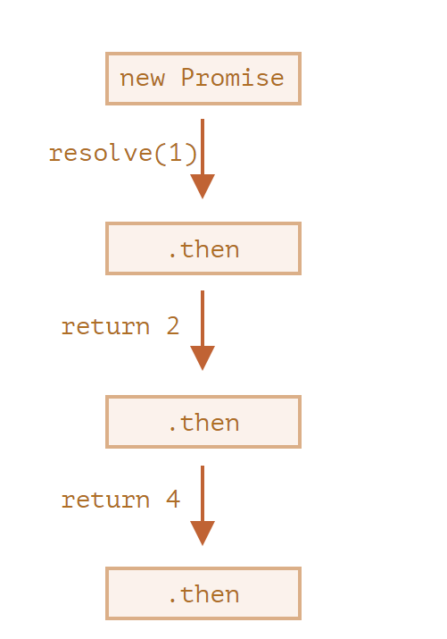

**新手常犯的一个经典错误：从技术上讲，我们也可以将多个 `.then` 添加到一个 promise 上。但这并不是 promise 链（chaining）。**

例如：

```javascript
let promise = new Promise(function(resolve, reject) {
  setTimeout(() => resolve(1), 1000);
});

promise.then(function(result) {
  alert(result); // 1
  return result * 2;
});

promise.then(function(result) {
  alert(result); // 1
  return result * 2;
});

promise.then(function(result) {
  alert(result); // 1
  return result * 2;
});
```

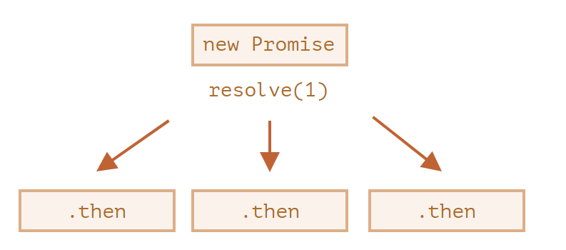

* **返回Promise**

  `.then(handler)` 中所使用的处理程序（handler）可以创建并返回一个 promise。

  **在这种情况下，其他的处理程序将等待它 settled 后再获得其结果**

  例如：

  ```javascript
  new Promise(function(resolve, reject) {
    setTimeout(() => resolve(1), 1000);
  }).then(function(result) {
    alert(result); // 1
    return new Promise((resolve, reject) => { // (*)
      setTimeout(() => resolve(result * 2), 1000);
    });
  }).then(function(result) { // (**)
    alert(result); // 2
    return new Promise((resolve, reject) => {
      setTimeout(() => resolve(result * 2), 1000);
    });
  }).then(function(result) {
    alert(result); // 4
  });
  ```

用箭头函数来写代码，让其变得简短一些：

```javascript
loadScript("/article/promise-chaining/one.js")
  .then(script => loadScript("/article/promise-chaining/two.js"))
  .then(script => loadScript("/article/promise-chaining/three.js"))
  .then(script => {
    // 脚本加载完成，我们可以在这儿使用脚本中声明的函数
    one();
    two();
    three();
  });
//我们可以向链中添加更多的异步行为。请注意，代码仍然是“扁平”的 —— 它向下增长，而不是向右。这里没有“厄运金字塔”的迹象。
```

* **Thenables** 这个特性允许我们将自定义的对象与 promise 链集成在一起，而不必继承自 `Promise` ??略

**fetch**

在前端编程中，promise 通常被用于网络请求

基本语法很简单：

```javascript
let promise = fetch(url);
```

执行这条语句，向 `url` 发出网络请求并返回一个 promise。当远程服务器返回 header（是在 **全部响应加载完成前**）时，该 promise 使用一个 `response` 对象来进行 resolve。

为了读取完整的响应，我们应该调用 `response.text()` 方法：当全部文字内容从远程服务器下载完成后，它会返回一个 promise，该 promise 以刚刚下载完成的这个文本作为 result 进行 resolve

下面这段代码向 `user.json` 发送请求，并从服务器加载该文本：

```javascript
fetch('/article/promise-chaining/user.json')
  // 当远程服务器响应时，下面的 .then 开始执行
  .then(function(response) {
    // 当 user.json 加载完成时，response.text() 会返回一个新的 promise
    // 该 promise 以加载的 user.json 为 result 进行 resolve
    return response.text();
  })
  .then(function(text) {
    // ……这是远程文件的内容
    alert(text); // {"name": "iliakan", "isAdmin": true}
  });
```

从 `fetch` 返回的 `response` 对象还包含 `response.json()` 方法，该方法可以读取远程数据并将其解析为 JSON。在我们的例子中，这更加方便，所以我们用这个方法吧。

为了简洁，我们还将使用箭头函数：

```javascript
// 同上，但使用 response.json() 将远程内容解析为 JSON
fetch('/article/promise-chaining/user.json')
  .then(response => response.json())
  .then(user => alert(user.name)); // iliakan，获取到了用户名
```

现在，让我们用加载好的用户信息搞点事情。

例如，我们可以再向 GitHub 发送一个请求，加载用户个人资料并显示头像：

```javascript
// 发送一个对 user.json 的请求
fetch('/article/promise-chaining/user.json')
  // 将其加载为 JSON
  .then(response => response.json())
  // 发送一个到 GitHub 的请求
  .then(user => fetch(`https://api.github.com/users/${user.name}`))
  // 将响应加载为 JSON
  .then(response => response.json())
  // 显示头像图片（githubUser.avatar_url）3 秒（也可以加上动画效果）
  .then(githubUser => {
    let img = document.createElement('img');
    img.src = githubUser.avatar_url;
    img.className = "promise-avatar-example";
    document.body.append(img);

    setTimeout(() => img.remove(), 3000); // (*)
  });
```

请看 `(*)` 行：我们如何能在头像显示结束并被移除 **之后** 做点什么？例如，我们想显示一个用于编辑该用户或者其他内容的表单。就目前而言，是做不到的。

为了使链可扩展，我们需要返回一个在头像显示结束时进行 resolve 的 promise。

就像这样：

```javascript
fetch('/article/promise-chaining/user.json')
  .then(response => response.json())
  .then(user => fetch(`https://api.github.com/users/${user.name}`))
  .then(response => response.json())
  .then(githubUser => new Promise(function(resolve, reject) { // (*)
    let img = document.createElement('img');
    img.src = githubUser.avatar_url;
    img.className = "promise-avatar-example";
    document.body.append(img);

    setTimeout(() => {
      img.remove();
      resolve(githubUser); // (**)
    }, 3000);
  }))
  // 3 秒后触发
  .then(githubUser => alert(`Finished showing ${githubUser.name}`));
```

也就是说，第 `(*)` 行的 `.then` 处理程序现在返回一个 `new Promise`，只有在 `setTimeout` 中的 `resolve(githubUser)` `(**)` 被调用后才会变为 settled。链中的下一个 `.then` 将一直等待这一时刻的到来。

作为一个好的做法，异步行为应该始终返回一个 promise。这样就可以使得之后我们计划后续的行为成为可能。即使我们现在不打算对链进行扩展，但我们之后可能会需要。

最后，我们可以将代码拆分为可重用的函数：

```javascript
function loadJson(url) {
  return fetch(url)
    .then(response => response.json());
}

function loadGithubUser(name) {
  return loadJson(`https://api.github.com/users/${name}`);
}

function showAvatar(githubUser) {
  return new Promise(function(resolve, reject) {
    let img = document.createElement('img');
    img.src = githubUser.avatar_url;
    img.className = "promise-avatar-example";
    document.body.append(img);

    setTimeout(() => {
      img.remove();
      resolve(githubUser);
    }, 3000);
  });
}

// 使用它们：
loadJson('/article/promise-chaining/user.json')
  .then(user => loadGithubUser(user.name))
  .then(showAvatar)
  .then(githubUser => alert(`Finished showing ${githubUser.name}`));
  // ...
```

**总结**

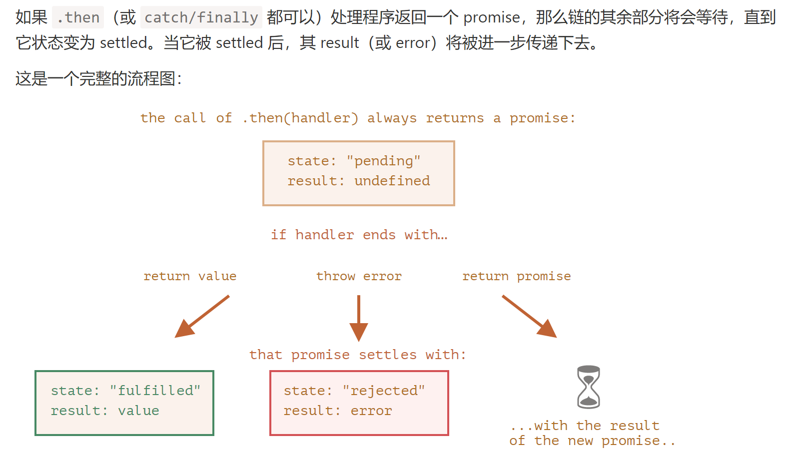

* **课后题**

  这两个代码片段是否相等？换句话说，对于任何处理程序（handler），它们在任何情况下的行为都相同吗？

  ```javascript
  promise.then(f1).catch(f2);
  ```

  对比：

  ```javascript
  promise.then(f1, f2);
  ```

  不同之处在于，如果 `f1` 中出现 error，那么在这儿它会被 `.catch` 处理

  这是因为 error 是沿着链传递的，而在第二段代码中，`f1` 下面没有链。

  换句话说，`.then` 将 result/error 传递给下一个 `.then/.catch`。所以在第一个例子中，在下面有一个 `catch`，而在第二个例子中并没有 `catch`，所以 error 未被处理

### Generator，高级 iteration


### 模块

