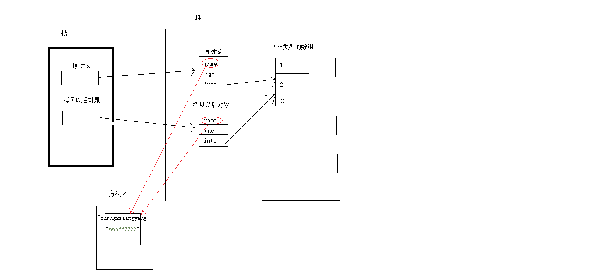
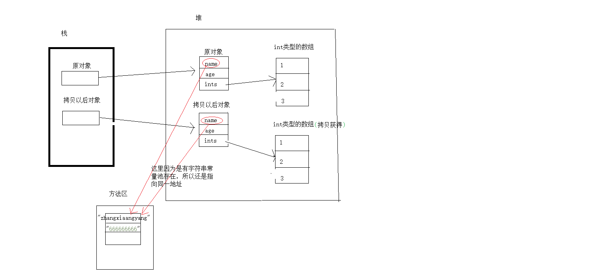

# 前言：

前面我[前一篇文章](/blogs/java/tips/this.md)中谈到了clone（浅拷贝），另外关于克隆网上也有很多的写过这方面的问题。
我在这里记录一下我遇到的问题和使用clone的方法。

# 知识点一：什么是浅拷贝？

	我们这里说的浅拷贝是指我们拷贝出来的对象*内部的引用类型变量和*原来对象内部引用类型变量是同一引用（指向同一对象）。
	但是我们拷贝出来的对象和新对象不是同一对象。
	简单来说，新（拷贝产生）、旧（元对象）对象不同，但是内部如果有引用类型的变量，新、旧对象引用的都是同一引用。

# 知识点二：什么是深拷贝？

    深拷贝：全部拷贝原对象的内容，*包括内存的引用类型也进行拷贝

# 知识点三、java拷贝（clone）的前提：

    1.首先我们需要知道Object类中一个clone()的方法，并且是protected关键字修饰的本地方法(使用native关键字修饰)，我们完成克隆需要重写该方法。
    注意：按照惯例重写的时候一个要将protected修饰符修改为public，这是JDK所推荐的做法，但是我测试了一下，
    复写的时候不修改为public也是能够完成拷贝的。但是还是推荐写成public。

    2.我们重写的clone方法一个要实现Cloneable接口。虽然这个接口并没有什么方法，但是必须实现该标志接口。
    如果不实现将会在运行期间抛出：CloneNotSupportedException异常

    3.Object中本地clone()方法，默认是浅拷贝
# 浅拷贝案例
    public class Person implements Cloneable{
    private String name;
    private int age;
    private int[] ints;

    public int[] getInts() {
        return ints;
    }

    public Person(String name, int age, int[] ints) {
        this.name = name;
        this.age = age;
        this.ints = ints;
    }

    public void setInts(int[] ints) {
        this.ints = ints;
    }

    public String getName() {
        return name;
    }

    public void setName(String name) {
        this.name = name;
    }

    public int getAge() {
        return age;
    }

    public void setAge(int age) {
        this.age = age;
    }

    public Person(String name, int age) {
        this.name = name;
        this.age = age;
    }

    /**
     *  默认实现
     * */
    @Override
    public Object clone() throws CloneNotSupportedException {

        return  super.clone();
    }
    }

# 深拷贝案例（clone()内代码有不同）
--- 
    public class Person implements Cloneable{
        private String name;
        private int age;
        private int[] ints;

        public int[] getInts() {
            return ints;
        }

        public Person(String name, int age, int[] ints) {
            this.name = name;
            this.age = age;
            this.ints = ints;
        }

        public void setInts(int[] ints) {
            this.ints = ints;
        }

        public String getName() {
            return name;
        }

        public void setName(String name) {
            this.name = name;
        }

        public int getAge() {
            return age;
        }

        public void setAge(int age) {
            this.age = age;
        }

        public Person(String name, int age) {
            this.name = name;
            this.age = age;
        }

        /**
        *  深拷贝
        * */
        @Override
        public Object clone() throws CloneNotSupportedException {
            Person person = new Person(name,age);
            int[] ints = new int[this.ints.length];
            System.arraycopy(this.ints,0,ints,0,ints.length);
            person.setInts(ints);

            return  person;
        }
    }
---

# 总结（说人话系列）
- 浅拷贝时只拷贝了对象，但内部数据类型还是引用原来的类。**覆写Object clone(){return super.clone()}**
- 深拷贝时不只拷贝了对象，还拷贝了内部数据类型。**覆写Object clone(){new相应的数据类型[this.ints.length]arraycopy...和对象 return person}**
- 注意： 
    1.一定要实现Cloneable接口
    2.复写clone()方法，注意：默认是浅拷贝，这里需要将引用类型进行深拷贝处理
    3.特殊：String类虽然是引用类型，但是是final类，同时也有字符串常量池的存在，不必进行处理
  
&nbsp;&nbsp;&nbsp;&nbsp;&nbsp;&nbsp;&nbsp;&nbsp;&nbsp;&nbsp;转载自csdn文章 [原文大佬博客](https://blog.csdn.net/xinghuo0007/article/details/78896726)