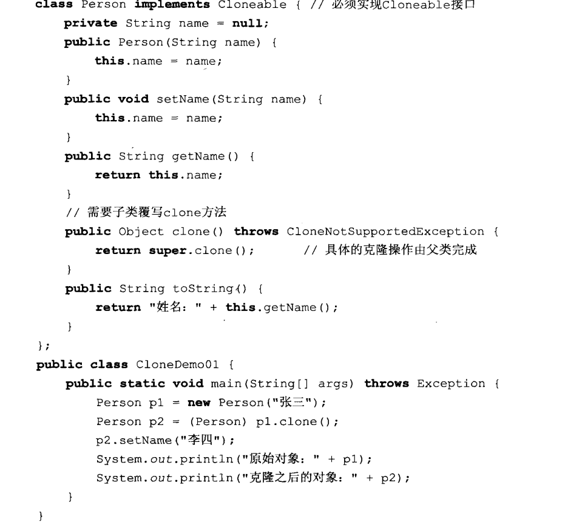

- 在C语言中，我们通过**指针**来实现将函数中的值带出去，实现在函数方法中修改外面的值。**而在java中没有指针，Java在处理基本数据类型（例如int、char、double等）时，都是采用按值传递（传递的是输入参数的复制）的方式执行，除此之外的其他类型都是按引用传递（传递的是对象的一个引用）的方式执行。** 因此，如果在java中如果要需在方法内修改类中的值：
- 第一种方法是：把类传进方法来，再通过类调用值进行修改。如：fun(Demo d1){d1.temp=20;}
- 第二种方法是：通过在方法内使用this.temp=20;直接修改类中的值。 
而这两种方法其实都是通过传入类实例的引用来对类中的属性进行修改。而在这里加一下clone()的用处。如果要实现复制一个类，我们可能会直接 Demo d2 = new Demo(); d2=d1;而这样做的后果呢，会导致我们需引用d2修改时，d1也同样被修改。**因为我们此时的=只是对于d1的引用传递。**但是通过clone()则能实现对Demo()的复制。clone()使用时需要调用接口Cloneable，且需要在子类对Object clone()方法进行覆写 return super.clone()。然后在main中调用时，向下将返回的Object.clone()向下转型。
---
