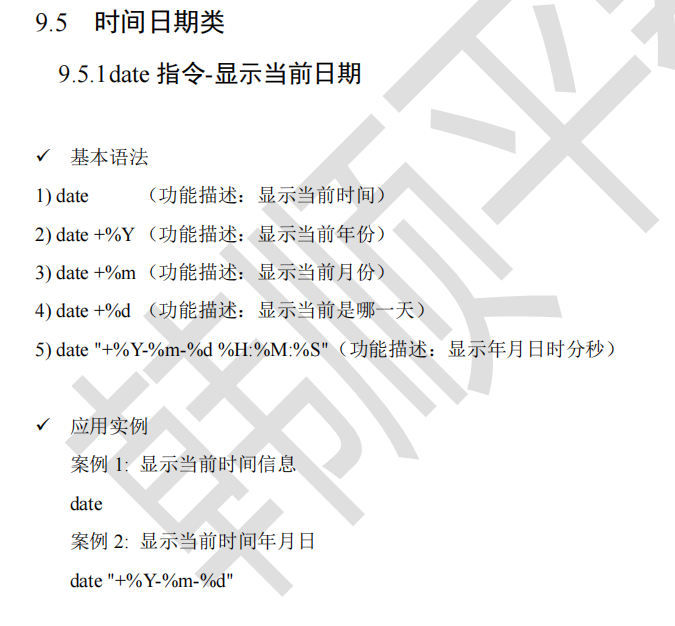
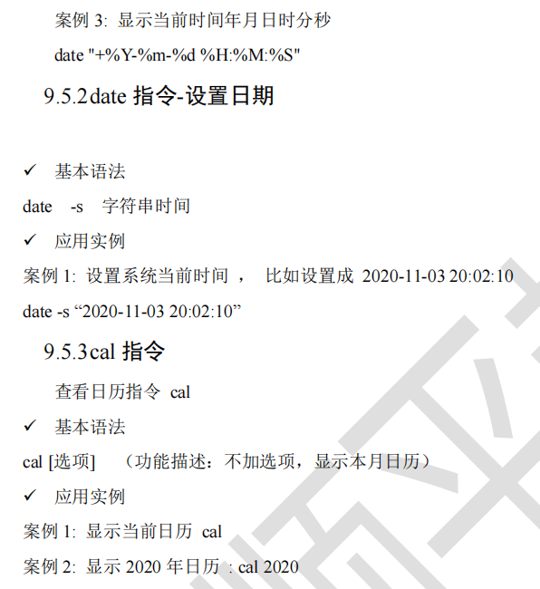
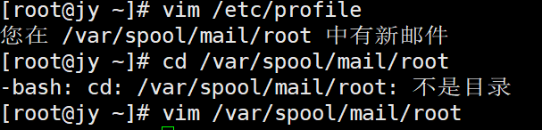
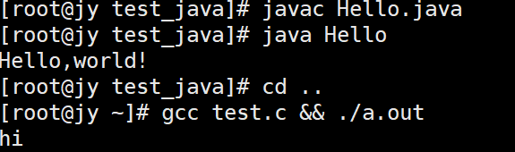

# Linux

虚拟机(文件)

克隆 （拷贝）   可迁移或删除

快照 （返回快照A B C）

* 安装gcc

  yum -y install gcc gcc-c++ kernel-devel

  / wget 加包的地址

  vi test.c

  i

  exc

   gcc test.c && ./a.out

* 安装图形界面系统

   yum -y groupinstall "X Window System"

  （安装GNOME）

  yum -y groupinstall "GNOME Desktop"

  (设置默认启动图形界面程序)

  systemctl set-default graphical.target

  reboot(重启虚拟机)

* 输入 su root 命令 （切换到root账号）

   pwd显示当前目录

   ls显示目录列表 ls -l s*显示s开头的列表 ;

   ls -a 列出所有文件包括隐藏文件(.开头）

*  vmtools（在虚拟机未打开centos前点）  需要有gcc

  cd vm +tab 自动补全

  tar -zxvf xx.tar.gz 直接解压

  安装 ./vm +tab打开即可

* 共享文件夹  （Windows和centos之间）（虚拟机与主机互通）

  centos设置 选项 启用 添加文件

  在虚拟机的主文件夹的计算机中的mnt文件内

  * 注意 ：实际开发中 虚拟机不在同一主机中 需要远程方式 Xftp

* Linux目录结构(皆文件)

  /根目录

  /bin  (binary)

  /sbin (super user) 存放系统管理员使用的系统管理程序

  /home 存放普通用户的主目录

  /root  系统管理员的主目录

  /lib 系统开机所需最基本的动态连接共享库  （类似Windows的ddl文件

  /boot Linux启动的核心相关文件 

  /lost +found 一般情况为空 非法关机时存放文件

  /etc 系统管理所需的配置文件和子目录 (eg:mysql my.comf)

  /usr 默认安装的文件存放 类似于 Windows的program files

  /proc 【不能动】 系统内存的映射 访问其来获取系统信息

  /srv 【不能动】service

  /sys【不能动】 2.6内核的文件系统 

  /tmp 存放临时文件

  /dev 设备管理器 将硬件以文件存储

  /media 自动识别硬件设备后 挂载到这个目录

  /mnt 为了让用户临时挂载别的文件系统 将外部存储挂载到mnt sd:/myshare

  /opt 给主机额外安装软件存放的目录

  /var 存放log等不断扩充的东西

  /selinux 安全子系统

### 远程操作

* Xshell （终端切换至远程的Linux ）命令的操作

* Xftp（文件传输和接收）

  Linux终端 ifconfig查看ip

  在Windows的cmd中ping ip查看连接

### Vim

* Vim中的操作 (一般模式下)

  ctrl+s锁定 ctrl+q恢复
  
  u撤销 ctrl+r取消撤销
  
  yy拷贝当前行 （2yy拷贝两行） P粘贴
  
  dd 同理
  
  G最开头 gg最末未
  
  /单词 回车跳到对应行  n跳到下一个
  
  :set nu显示行数
  
  20+shift+g 跳到20行
  
  * 非正常关闭 ctrl+z时
  
  gf 重新回到vim编辑界面
  
  rm -rf .文件名.swp删除占用的文件(非正常关闭会产生swp)
  
  
  
* Linux关机重启 登录注销

   （可在Xshell中执行）  

   关机 (shutdown -h now)（halt）

   重启(shutdown -r now或（输入1，表示一分钟）)（reboot）

   sync（保存到磁盘）(正常关机重启会默认先执行这一步) 
   
   su (用户名)root 切换用户	logout返回上一个用户（无，则退出终端）(仅在无界面时有效)（bash: logout: 不是登录shell: 使用 `exit'）

### 用户管理

* 用户管理

   useradd 用户名 (添加用户) 成功后自动创建与用户同名的home目录

   useradd -d /home/自定义 用户名 (创建自定义目录名的用户

   （无组时 默认用户名为组）

   

   passwd 用户名 输入密码

   

   userdel 用户名(仅删除用户，不含目录) 

   userdel -r 用户名 (删除用户及其目录)*

   * 查询用户  

     id 用户名

   * 切换用户

     su - 用户名（权限高到低无需密码）

   * whoami返回当前用户名

     who am i返回登录时用户名+登录时间+端口

* 用户组

   分开设置权限 对共性的统一管理

   * groupadd 组名

     useradd -g 组名 用户名 （添加用户到指定组中）

     usermod -g 组名 用户名  (修改用户所在组)

   * groupdel 组名

/etc/passwd 文件 ：保留用户配置文件

用户名:口令:用户标识号:组标识号:(注释性描述):主目录:登录shell

/etc/shadow 文件：口令配置文件

登录名:加密口令:最后一次修改时间:最小时间间隔:最大时间间隔:警告时间:不活动时间:失效时间:标志

/etc/group 文件：组的配置文件

组名:口令:组标识号:组内用户列表

**(系统文件 通过vim和cat打开)** 

### 运行级别

* 运行级别

  0：关机

  1：单用户（找回丢失密码）

  2：多用户无网络 X

  3：多用户有网路 √  multi-user.target

  4：系统未保留给用户 X 

  5：图形界面 √ graphical.target

  6：系统重启

  常用3和5 可指定默认运行级别

init [0123456]切换不同运行级别

systemctl get-default 查询默认运行级别

systemctl set-default 设置默认运行级别

graphical.target

multi-user.target

* 找回root密码

  1.启动系统 e 进入编辑界面 

  2.找Linux16所在行数后(utf-8后) 输入 init=/bin/sh 再输入ctrl+x进入单用户模式

  3.在光标闪烁位置输入 mount -o remount,rw/ 回车

  4.输入passwd 回车 ；输入密码 再次确认

  5. 输入 touch /.autorelabel 回车


## 指令

* 帮助指令

  * man命令 （eg: man ls）(linux中选项可以组合 eg:ls -al/root )

    汉化版man为[cman](https://www.cnblogs.com/yanans/p/11990603.html)教程

    info是man指令的详细内容

  * help指令(help命令只能显示shell内部的命令帮助信息，外部命令用man)

    * whatis man查看信息 同man man

* 文件目录类

  * pwd指令（显示当前绝对路径）

  * ls指令 

  * cd指令（相对路径或绝对路径） cd ~回到家目录 cd ..回到上一级

  * mkdir指令 

    创建空目录 mkdir -p /home/animal/tiger 一次性创建多级目录

  * rmdir指令 

    * rmdir 删除空目录
    * rm -rf删除非空    rm -rf /*

  * touch指令   

    创建空文件

  * cp指令 

    cp 原文件 新目录/

    -r递归复制整个文件夹   cp -r /home/bbb /opt

    * 强制覆盖\cp不提示

  * rm指令 删除指令

    * -r 递归删除整个 -f强制不提示

  * mv指令  移动文件/目录或重命名（相对路径(重命名) 绝对路径(移动)）

    * mv Hello.java /root/new.java移动并重命名

  * cat指令 只能查看不能修改(不同于vim)  

    * cat -n (显示行号) 文件
    * |more 管道命令  （显示一部分）

  * more指令 过滤器

    * space翻页 。enter下一行 。q离开 。
    * ctrl+f下滚动一屏。ctrl+B返回上一屏
    * =输出当前行号  :f 输出文件名和当前行行号

  * less指令 （比more更加强大）支持各种显示终端；动态加载 效率高

    * /字串：向下查找
    * ?字串：向上查找 
    * n向下 N向上

  * echo指令  输出内容到控制台

    * 实例： 输出环境变量 $PATH 输出hello,world
    * 重定向：echo "hello" > /home/Hello.java (*  >覆写 >> 追加)

  * head指令 

    * 显示前10行内容

    * -n 5 前五行

  * tail指令 

    * 同理

    * -f 实时监控 

  * （ >和>>指令   >覆写 >> 追加) 实现另类的拷贝 （搬运文件内容

    * ls -l >文件
    * ls -al >文件
    * cat 文件1 > 文件2（文件1覆盖到文件2）
    * echo “内容” >>文件(追加)

  * ln指令 软链接 （符号链接）类似快捷方式

    * ln -s [原文件或目录] [软链接名]
    * （当使用pwd查看时仍看到的是软链接所在目录）
    * ls -l 可查看 指向

  * history指令

    * history 10 显示最近10条

    * !编号 执行相应指令

  * date和cal类

  

  

    

    

  * find指令

    * ​	最近访问时间	access time （-atime）

      ​	最近更改时间	modify time （-mtime）

      ​	最近状态改动时间 	change time（-ctime）

      其中 -atime (+-)n 表示天数 

      n表示n天前的一天 内

      +n表示n天前

      -n表示在n天之内

    * 按用户 -user（eg:find /opt -user nobody）

    * 按文件名 -name（eg:find /home -name hello.txt)

    * 按文件大小 -size（find / -size +200M) 

      找到后可用ls -l 显示 再用ls -lh转换为内存

  * locate指令 查询速度快 无需遍历整个系统（基于数据库

    * *第一次运行前用updatedb指令创建locate数据库

  * which指令

    * which ls查看某指令在哪个目录下

  * grep指令和管道符号|

    * grep过滤查找 （返回所在行）

      -i 忽略字母大小写

      -n显示匹配行号

      （eg: cat Hello.java grep -n "Hello"

      ​		  grep -n "Hello" Hello.java

      ​	）

    * |表示前一个命令结果交给下一个命令处理

  * gzip/gunzip指令  （前者压缩文件；后者解压文件）

  * zip/unzip指令  （前者压缩文件夹；后者解压文件夹）

    * zip: -r 递归压缩 (zip -r [压缩后文件夹目录] [原文件夹目录])

      eg:(zip -r myhome.zip /home/ )

    * unzip: -d 指定解压后存放的目录(zip -r [解压后文件夹目录] [原文件夹目录])

      eg:（unzip -d /opt/tmp /home/myhome.zip）
  
  * tar指令
  
    * tar【选项】xxx.tar.gz（目录或文件）
  
    * -c产生打包文件 -v显示详细信息 -f指定压缩后文件名 -z打包同时压缩 -x解包.tar文件
  
    * 压缩zcvf 
  
      （tar -zcvf pc.tar.gz[定义包名] /home/cat.txt[要压缩的文件夹或文件]） 
  
    * 解压zxvf
  
      （tar -zxvf  pc.tar.gz【要解压的文件】-C(转到指定目录) /opt/tmp2）


### 组管理和权限管理

* 组的介绍

  * 所有者 所在组 其它组 改变用户所在组

    * 所有者 chown修改文件所有者

      ```linux
      chown runoob:runoobgroup file1.txt
      chown root /var/run/httpd.pid
      chown -R runoob:runoobgroup *(当前目录与子目录)
      chown :512 /home/runoob
      ```

    * 文件目录  查看 ls-ahl a隐藏文件 h转为内存表示方式 l列出(ll同ls -l)

    * 修改文件/目录所在组

      chgrp 组名 文件名 

      在root中(eg: groupadd fruit touch a.txt  chgrp fruit a.txt)

    * 其他组(用户所在组外的组) 改变所在组 

      usermod -g 新组名 用户名

      usermod -f 目录名 用户名 改变该用户登录的初始目录（权限范围）

* 权限的基本介绍

  * drwxr-xr-x. 20 root root        3.3K 10月  5 13:01 .

    * 前0-9位作用: 

      第0 位

      -表示文件 d表示目录 b表示块设备(如硬盘)

      c表示字符设备(鼠标等) l表示链接

      **rwx 读写执行 **

      第1-3位（针对所有者）User

      第4-6位 （针对同用户组）Group

      第7-9位 （针对其他用户）Other

    * rwx权限

      在文件中 w指可修改文件内容(不可删除，需有目录w权限) 

      在目录中 r指可将目录列出；w指可目录内创建+删除+重命名目录 ；x指可进入目录

      其中权限可用数字表示r=4 w=2 x=1 因此r+w+x=7 

    * 其他说明 

      20 文件:硬连接数 目录：子目录数

      root 用户

      root 组

      3.3k 文件大小(字节)

      10月  5 13:01 最后修改日期

      . 文件名

  * 修改权限 chmod chown chgrp 目录(-r)

    * chmod u=rwx,g=rx,o=x 文件/目录名 (= + -增加减少)

      chmod o+w 文件/目录名

      u所有者 g所在组 o其他组 a所有人

    * 第二种方式

      chmod u=rwx,g=rx,o=x 文件目录名

      chmod 751 文件目录名

  **总结**

  chgrp针对文件所在组

  chown针对文件所有者，组

  chmod针对文件权限

  usermod -g针对用户所在组

  groupadd useradd 

### crond 任务调度（周期）

* 指令 crontab 

  * 两种方式：

    * 定时调用脚本shell （如 完成对mysql备份）

      * 案例一（写一个存时间的脚本）

        1.vim /home/my.sh 写入 date >> /home/mycal

        2.给my.sh增加执行权限

        3.crontab -e 增加 */1 * * * * /home/my.sh

      * 案例二 (数据库备份)

        指令为 ： mysqldump -u root -p密码(jymysql) db1(数据库) > /home/db.bak

        1.crontab -e

        2.0 2 * * * mysqldump -u root -pjymysql db1 > /home/db.bak

    * 定时调用简单任务 (单条指令：ls -l /etc/ > /tmp/to.txt)

  * -e 编辑任务调度

    */1 * * * * date >> /tmp/mydate

  * -r 终止任务调度

  * -l 列出当前有哪些任务调度
  
  * sevice crond restart 重启任务调度
  
    
  
    

### at定时任务（一次性）

* ps -ef | grep atd 查看当前进程中的atd是否在运行

* 每隔60s执行任务队列

* at[选项] [时间]

  * 时间定义方法:
    * hh:mm
    * midnight noon teatime(16:00)
    * 12pm
    * mm/dd/yy (04:00 2021-10-1)
    * now+时间
    * today tomorrow 
    
  * 指令
  
    atq=at -l 列出任务
  
    atrm=at -d 删除任务
  
    -m完成后给用户发邮件
  
     -v显示任务被执行时间 -V显示版本信息
  
     -f<文件>从指定文件读入任务
  
     -q<队列>使用指定队列
  
     -t<时间参数>以时间参数形式提交运行的任务
  
  * 操作时
  
    Ctrl+backspace 退格
  
    Ctrl+C中止
  
    Ctrl+D结束
  
  （无法查看任务内容？）

p91 -107

### Shell

命令行解释器 为用户提供向Linux内核发送请求以便运行界面系统级程序

1. vim hello.sh

2. ```shell
   #!/bin/bash
   命令行
   ```

3. chmod 使其带有可执行权限

4. 执行方式：
   1.   ./hello.sh
   2.   /root/shcode/hello.sh（绝对路径）
   3. （sh hello.sh 不需执行权限也可执行）

* Shell变量

  * 系统变量和用户自定义变量

    * 系统变量

      $HOME $PWD $SHELL $USER

      set显示当前shell中所有变量

  * 基本语法及快速入门

    * 1. 定义变量 变量名=值（注意：=后无空格）

      2. 撤销变量 unset 变量

      3. 声明静态变量 readonly变量（注意：不能unset）

      ```shell
      #!/bin/bash
      #案例1：定义变量A（无空格）
      A=100
      #输出变量前要加$
      echo $A
      echo "A=$A"
      #案例2：撤销A
      unset A
      echo "A=$A"
      #案例3：声明静态变量B=2，不能unset
      readonly B=2
      # unset B
      echo "B=$B"
      ```

    * shell定义变量 

      1. 由字母数字下划线组成 一般大写；不能以数字开头
      2. 等于号两侧无空格

    * 将**命令**返回值赋给变量

      1. A=`date`反引号
      2. A=$(date)等价于反引号

    * 设置环境变量

      1. 基本语法

         export 变量名=变量值（将shell变量输出为环境变量/全局变量）

         source配置文件（让修改后的配置信息立即生效）

         echo $变量名（查询环境变量的值）

      2. 快速入门

         1. 在/etc/profile中定义TPOMCAT_HOME环境变量
         2. 查看TOMCAT_HOME的值
         3. 在另一个shell程序中使用TOMCAT_HOME

         ```shell
         export TOMCAT_HOME=/opt/tomcat
         source /etc/profile
         echo $TOMCAT_HOME
         ```

      3. Shell脚本的多行注释

         ```shell
         :<<!
         echo "Hello"
         !
         ```

    * 位置参数变量

      ./myshell.sh 100 200 (传参)

      1. 基本语法

         $n(n为数字 $0代表本身 $1-$9代表1-9个参数) 10以上需要用 ${10}

         $* (表示命令行中所有参数（看成一个整体）)

         $@ (表示命令行中所有参数（把每个参数区分对待）)

         $# (所有参数的个数)

      2. 位置参数变量

         ```shell
         #!/bin/bash
         echo "0=$0 1=$1 2=$2"
         echo "所有参数=$*"
         echo "$@"
         echo "参数的个数=$#"
         ```

         输出结果

         ```
         0=./var.sh 1=10 2=20
         所有参数=10 20
         10 20
         参数的个数=2
         ```

    * 预定义变量

      $$ 当前进程号

      $! 后台运行的最后一个进程号

      $? 最后一次执行命令的返回状态 0为正确 非0不正确

      eg:

      ```shell
      #!/bin/bash
      echo "当前执行的进程id=$$"
      #以后台的方式执行一个脚本，并获取他的进程号
      /root/shcode/myshell.sh &
      echo "最后一个后台方式运行的进程id=$!"
      echo "执行的结构是=$?"
      ```

    * 运算符

      三种方式（注意expr运算符间要有空格）

      ```shell
      echo "$((1+1))"
      echo "$[2+2]"
      expr 3 \* 3
      #expr乘号应该为\*
      ```

      ``等价于$()

    * 条件判断

      [ condition ]（**注意条件判断式 [ ] 左右有空格**）

      #非空返回true 可用$?验证(0为true >1为false)

      ```shell
      #!/bin/bash
      #案例1 比较字符串 =
      if [ "ok" = "ok" ]
      then
              echo "equal"
      fi
      #案例2 比较数字 -gt -lt -eq (可合并) -ne  
      if [ 23 -le 32 ]
      then
              echo "大于"
      fi
      #案例3 判断文件权限 -r -w -x 判断文件存在-f(常规文件) -e(文件存在) -d(目录)
      if [ -f /root/shcode/a.txt ]
      then
              echo "存在"
      fi
      #案例4 [  ]空为假 非空为真
      if [ jy ]
      then
              echo "HH" 
      fi
      ```

    * 多分支

      1. if 和elif和else

      ```shell
      #!/bin/bash
      if [ $1 -ge 60 ]
      then
              echo "及格"
      :<<!
      elif [ $1 -lt 60 ]
      then
              echo "不及格"
      fi
      !
      else
              echo "不及格"
      fi
      ```

      （有if才要用then，else不用）

       	2. case

      ```shell
      #!/bin/bash
      #案例1 三重case情况
      case $1 in 
      "1")
      echo "周一"
      ;;
      "2")
      echo "周二"
      ;;
      *)
      echo "other"
      ;;
      esac
      ```

  * 循环

    1. for  in

    ```shell
    #!/bin/bash
    #案例1 打印命令行输入的参数（看出$@ 和 $*的区别）
    #注意$*把输入的参数当作一个整体，因此只输出一次
    for i in "$*"
    do
            echo "num is $i"
    done
    #使用$@把输入的参数分别对待 有几个参数 输出几句
    for j in "$@"
    do
            echo "nownum is $j"
    done
    ```

    输出

    ```
    num is 1 2 3 4 5
    nownum is 1
    nownum is 2
    nownum is 3
    nownum is 4
    nownum is 5
    ```

    2. for()  （注意$[]）（for的><同c）

       ```shell
       #案例2 for 从1加到100
       SUM=0
       for (( i=1 ; i<=100 ; i++ ))
       do
               SUM=$[$SUM+$i]
       done
       echo "SUM=$SUM"
       ```

    3. while [  ]

       ```shell
       while [ $i -le $1 ]
       do
       i=$[$i+1] (注意i++要这么) 
       done
       ```

* read读取控制台输入

  read [选项] (参数)

  ```shell
  #!/bin/bash
  #案例1 /-p 指定读取值时的提示符
  read -p "请输入一个NUM1=" NUM1
  echo "你输入的NUM1=$NUM1"
  #案例2 /t 限制等待时间
  read -t 10 -p "请输入一个NUM2=" NUM2
  echo "你输入的NUM2=$NUM2"
  ```

* 函数

  * 系统函数

    basename 返回完整路径最后/的部分 获取文件名

    basename /home/aaa/test.txt （可加 .txt 返回test）返回test.txt

    dirname函数

    dirname /home/aaa/test.txt  返回 /home/aaa

  * 自定义函数

    [ function ] funname[()]

    {

    ​		Action;

    ​		[return int;]

    }

    调用 funname [值]

    ```shell
    #!/bin/bash
    #案例1 计算输入的两个参数的和 getSum
    function getSum(){
    	SUM=$[$n1+$n2]
    	echo "和为=$SUM"
    }
    #输入两个值
    read -p "请输入一个值n1=" n1
    read -p "请输入一个值n2=" n2
    #调用函数
    getSum $n1 $n2
    ```


* 数据库备份案例
  * 备份命令格式：mysqldump -h主机名  -P端口 -u用户名 -p密码 --database 数据库名 > 文件名.sql 
  * 备份压缩：mysqldump -h主机名  -P端口 -u用户名 -p密码 --database 数据库名 | gzip  > 文件名.sql.gz
  * 备份同个库多个表：mysqldump -h主机名  -P端口 -u用户名 -p密码 --database 数据库名   表1   表2 ....   > 文件名.sql
  * 同时备份多个库：mysqldump -h主机名  -P端口 -u用户名 -p密码   --databases  数据库名1  数据库名2   数据库名3  > 文件名.sql 

  ```mysql
  mysqldump -uroot -pjymysql --host=localhost -q -R --databases db1 | gzip > /data/backup/db/1.sql.gz
  ```

  实例：

  ```shell
  #!/bin/bash
  #备份目录
  BACKUP=/data/backup/db
  #当前时间
  DATETIME=$(date +%Y-%m-%d_%H%M%S)
  echo $DATETIME
  #数据库地址
  HOST=localhost
  DB_USER=root
  DB_PW=jymysql
  DATABASE=db1
  #备份创建目录（如不存在，则创建）
  [ ! -d "${BACKUP}/${DATETIME}" ] && mkdir -p "${BACKUP}/${DATETIME}"
  
  #备份数据库
  mysqldump -u${DB_USER} -p${DB_PW} -h${HOST} -q -R ${DATABASE} | gzip >${BACKUP}/${DATETIME}/$DATETIME.sql.gz
  
  #将文件处理成tar.gz
  cd ${BACKUP}
  tar -zcvf $DATETIME.tar.gz ${DATETIME}
  #将目录删除
  rm -rf ${DATETIME}
  find ${BACKUP} -atime +10 -name "*.tar.gz" -exec rm -rf{} \;
  echo "备份数据库${DATABASE} 成功！"
  ```

  


### 磁盘进程分区

p58-p81


### 安装篇

* rpm包的管理

  * rpm -qa|grep xx（可查询当前已安装的文件）

    firefox-78.14.0-1.el7.centos.x86_64

    ​			78.14.0-1版本号 el7.centos.x86_64适合的操作系统 （如i686、i386则表示32位			系统，noarch表示通用）
    
  * rpm -qi 软件包名 查询软件包信息；
  
    rpm -ql软件包名 查询包中文件
  
    rpm -qf 文件全路径
  
    rpm -ivh RPM包全路径名称 i=install v=verbose提示 h=hash进度条
  
    rpm -e RPM包 删除软件包

* yum shell前端软件包管理器     基于RPM包管理

  yum (-y) install 

* Tomcat

  ```
  （用yum安装后路径会在/var/lib；还要安装webapps和）
  systemctl start tomcat
  systemctl status tomcat
  systemctl restart tomcat
  systemctl stop tomcat
  打开防火墙
  firewall-cmd --permanent --add-port=8080/tcp
  firewall-cmd --reload
  firewall-cmd --query-port=8080/tcp
  通过ip:8080即可查看到tomcat网址
  cd /var/lib/webapps 编写html文件 
  通过ip:8080/html查看文件
  ```

  

* Java


```
下载后用Xftp传到Linux
解压 tar 
在/etc/profile中配置环境变量 
jdk8
```

* 运行java和gcc




p82-89


### 番外

#### 在Linux上安装MySQL

(此处安装的是Redhat版本)

```linux
wget https://dev.mysql.com/get/mysql80-community-release-el7-1.noarch.rpm
rpm -Uvh mysql57-community-release-el7-9.noarch.rpm
vi /etc/yum.repos.d/mysql-community.repo(可选择把默认的8.0版本换成5.7 把enabled=0改成1)
yum -y install mysql-community-server 
# 安装完成
```

* MySQL改密码

  ```mysql
  systemctl status mysqld
  systemctl start mysqld
  grep 'temporary password' /var/log/mysqld.log(查看临时密码)
  登陆 mysql -uroot -p 粘贴
  
  #方法一 在MySQL中
  show variables like "%validate%";
  set global validate_password_length=6(自己set)
  
  #方法二
  #在 /etc/my.cnf中的最后加上在两行
  plugin-load=validate_password.so
  validate-password=OFF
  ...
  
  systemctl restart mysqld
  systemctl status mysqld
  alter user 'root'@'localhost' identified by '新密码';
  ```

