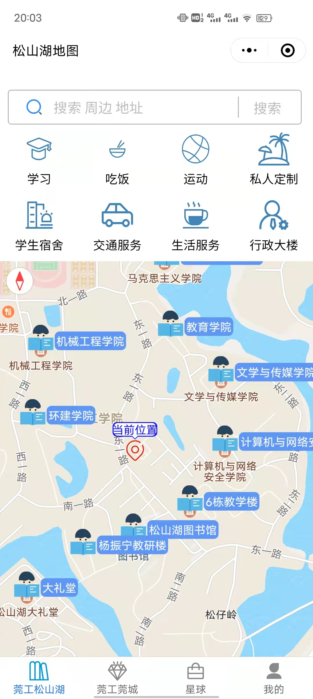
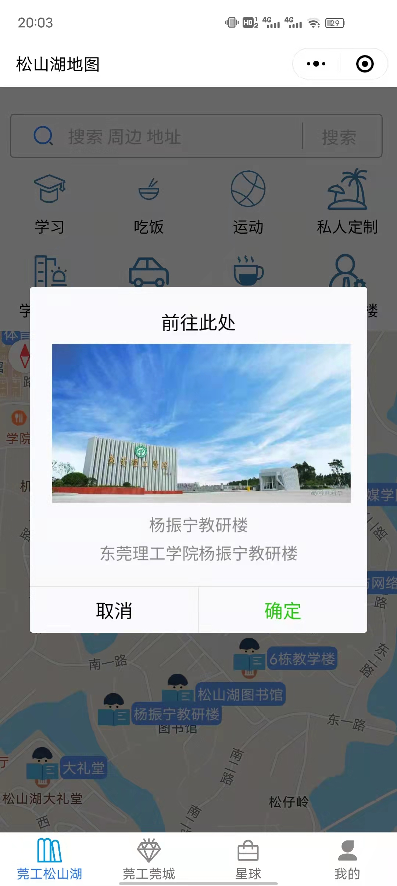
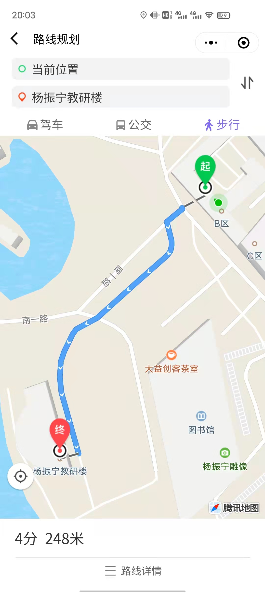
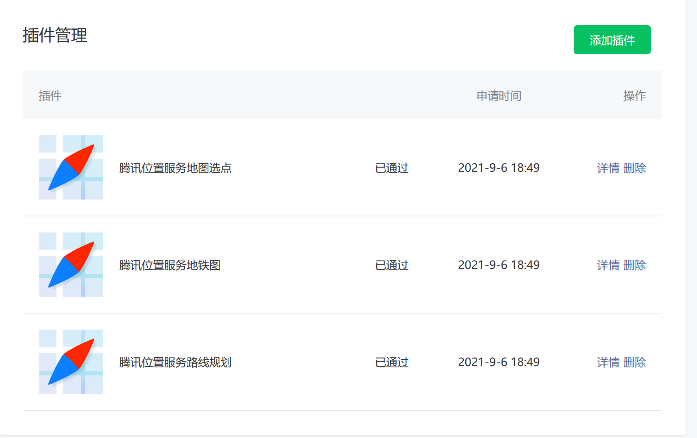
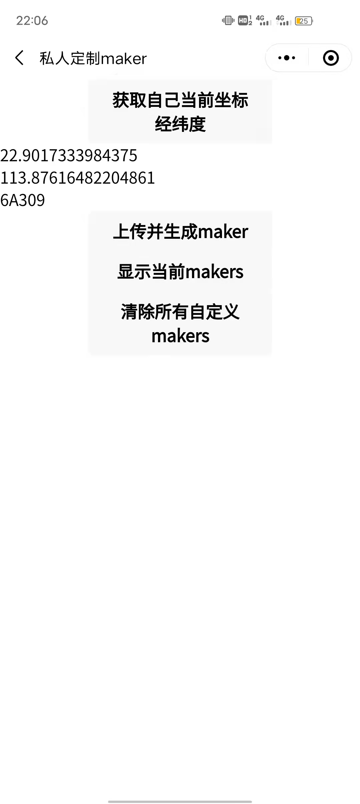
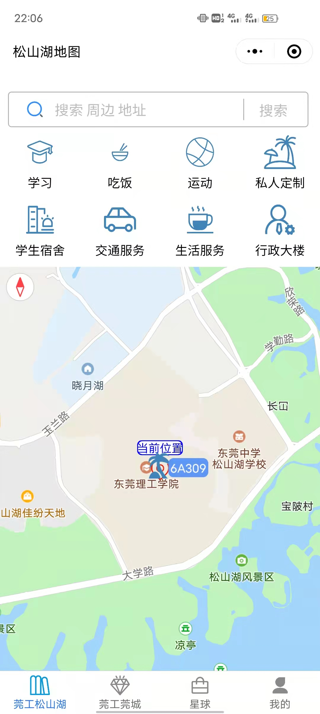

# 				自定义地图

## 一、展示

||

||

## 二、操作

* 引入腾讯地图API  引入插件  

## 三、展望

后续将会更新**私人定制maker** (设置自己当前所处坐标和图片自定义maker) 
运用**云开发**储存数据和图片 

 
终于成功把坐标传上去了，但是现在仍有几个问题需要解决！

1. 云开发的数据库免费的只能每天500条，不过对于现在的说还是够的
2. 页面需要优化，太丑了
3. 数据上传后需要刷新才能显示，（由于是tabbar所以无法上传后跳转刷新）得想想办法让它自动刷新。
4. 调用云函数清除数据无针对性

上传了第1.0.3版本
更新如下
1. 分享给好友功能
2. 使用wx.createMapContext('myMap',this),中的getCenterLocation，moveToLocation，includePoints（多个图标用for循环push到一个[]），使得点击显示的所有图标都能显示到屏幕中且处于居中位置
3. 上传多了一些坐标（吐槽一句，感觉腾讯地图的坐标点比高德地图少好多，行政楼都找不到）
4. 完善了搜索功能（后续考虑要不要添加搜索提示功能，不过这样的话排版感觉需要改一改，太挤了）；优化了搜索范围（搜索范围限制在东莞理工学院）
发现搜索功能在手机端用不了的原因：
我的天，终于找到原因了，之前在小程序开发工具中一直点的是不校验域名，所以在电脑端是可以的，但是在手机端是不行的，所以我把腾讯地图的域名加在微信小程序平台后就可以了。