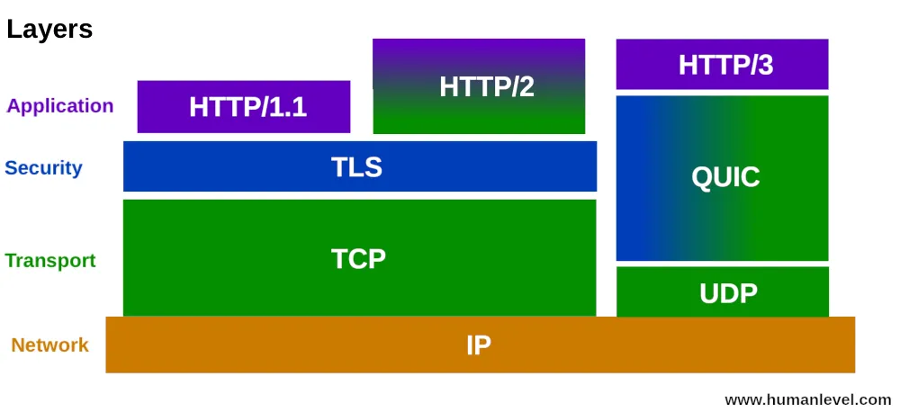

- **HTTP/1.0**
  HTTP/1.0 的出现可以说是颠覆性的，它里面涵盖的一些标准我们目前还仍在使用。例如 HTTP header，协议号的概念等。
  HTTP 1.0 协议头里可以设置 Connection:Keep-Alive。在 header 里设置 Keep-Alive 可以在一定时间内复用连接，具体复用时间的长短可以由服务器控制，一般在 15s 左右。
  HTTP/1.0 请求方法只有三个：GET、POST、HEAD
  缺点：不支持持久性连接，每次请求响应后，都需要断开连接，这样效率很差。

- **HTTP/1.1**
  这个标准是互联网上使用最频繁的一个标准，基于文本传输，HTTP/1.1 解决了之前不支持持久性连接的缺陷：Connection 的默认值就是 Keep-Alive，如果要关闭连接复用需要显式的设置 Connection:Close。
  HTTP1.1 中新增的请求方法：PUT、DELETE、OPTIONS、CONNECT、TRACE
  HTTP1.1 支持只发送 header 信息（不带任何 body 信息），如果服务器认为客户端有权限请求服务器，则返回 100，客户端接收到 100 才开始把请求 body 发送到服务器；如果返回 401，客户端就可以不用发送请求 body 了节约了带宽。
  HTTP/1.1 还增加了缓存和控制模块，例如 Entity tag，If-Unmodified-Since, If-Match, If-None-Match 等更多可供选择的缓存头来控制缓存策略。
  缺点：它解决了一部分连接性能问题，它的效率仍不是很高。而且 HTTP 还有一个队头阻塞问题：假如有五个请求被同时发出，如果第一个请求没有处理完成，就会导致后续的请求也无法得到处理。

- **HTTP/2.0**
  HTTP2.0 使用了多路复用的技术，做到同一个连接并发处理多个请求，而且并发请求的数量比 HTTP1.1 大了好几个数量级。本身 HTTP1.1 也可以多建立几个 TCP 连接，来支持处理更多并发的请求，但是创建 TCP 连接本身也是有开销的。
  HTTP/2.0 基于流传输，解决队头阻塞的问题是采用了 stream 和分帧的方式。
  HTTP/2.0 会将一个 TCP 连接切分成为多个 stream，每个 stream 都有自己的 stream id，这个 stream 可以是客户端发往服务端，也可以是服务端发往客户端。
  HTTP/2.0 还能够将要传输的信息拆分为帧，并对它们进行二进制格式编码。也就是说，HTTP/2.0 会将 Header 头和 Data 数据分别进行拆分，而且拆分之后的二进制格式位于多个 stream 中。
  HTTP/2.0 通过这两种机制，将多个请求分到了不同的 stream 中，然后将请求进行分帧，进行二进制传输，每个 stream 可以不用保证顺序**乱序**发送，到达客户端后，客户端会根据每个 stream 进行**重组**，而且可以根据**优先级**来优先处理哪个 stream。

- **HTTP/3.0**
  HTTP3 基于 UDP 协议重新定义了连接，在 QUIC 层实现了无序、并发字节流的传输，解决了队头阻塞问题（包括基于 QPACK 解决了动态表的队头阻塞）；
  HTTP3 重新定义了 TLS 协议加密 QUIC 头部的方式，既提高了网络攻击成本，又降低了建立连接的速度（仅需 1 个 RTT 就可以同时完成建链与密钥协商）；
  HTTP3 将 Packet、QUIC Frame、HTTP3 Frame 分离，实现了连接迁移功能，降低了 5G 环境下高速移动设备的连接维护成本。
  问题：

- 对比三个版本的 HTTP 图
  （图片源自网络）

  [quic 参考文章](https://developer.aliyun.com/article/888447)
  [http3](https://zhuanlan.zhihu.com/p/431672713)
