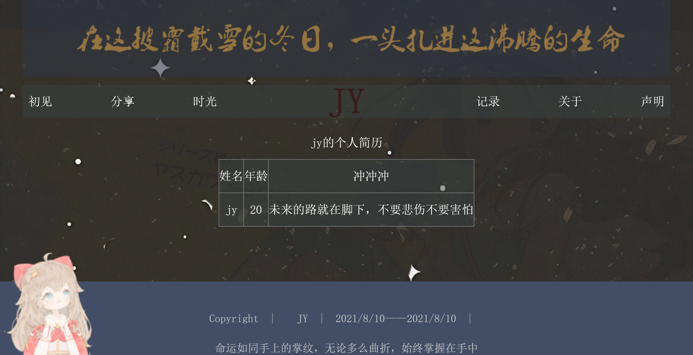

# &nbsp;终于，终于liive2d我准备把他告一段落了！
- &nbsp;&nbsp;从最开始是看[樾哥的博客](http://garen-wang.cn/)，自己去尝试把代码放在自己的html网页上，成功了；那我想到了，模型其实代码量挺少的，我是不是可也直接从别人的模型搬下这部分代码呢？<br>
于是我不断找模型，找例子，直接在别人的网页上模型的找js文件，json文件和html代码或cdn链接来copy下来，实现搬运.<br>
像这样(这个嘉然巨可爱!= =)从一位[大佬的博客](https://nocilol.me/archives/lab/add-dynamic-poster-girl-with-live2d-to-your-blog-02/)白嫖的doge<br>

- &nbsp;&nbsp;好景不长，实现了在html上的使用后，我遇到了一个很大的问题。我写的博客是用的vuepress，而vuepress是通过配置文件以及md和vue的文件来渲染成html网页的。虽说我可以先build成html，然后再在html代码上改，但是我发现我每次dev的时候都会删掉我改的html再重新生成，这就很草了。不行，还是要在根源上添加live2d的代码。<br>
尝试了一下，发现好难。于是我开始看别人的vuepress是怎么用live2d模型的，然后我发现有一个我目前这个主题的[看板娘插件](https://vuepress-theme-reco.recoluan.com/views/plugins/kanbanniang.html),这个插件也蛮容易用的，按照他的文档操作就行，但是我不知道要怎么改成自己想要的模型，而且我看到它的模型是moc而不是moc3，所以我决定另寻他法。
- &nbsp;中间我还找到了[这个大佬](https://blog.csdn.net/weixin_40451409/article/details/105231001)，直接把各个文件合起来，只需要在head或body加入这一串代码
```js
    <script src='https://cdn.jsdelivr.net/gh/stevenjoezhang/live2d-widget@latest/autoload.js' ></script>
```
就可生成一个live2d模型.
- &nbsp;&nbsp;于是乎我搜索怎么在vue上使用看板娘,看到了[这篇](https://blog.csdn.net/weixin_45089791/article/details/104693807)，我抱着试一试的心态，毕竟我vue组件在这上面怎么用都不怎么熟悉，还没开始学）。首先我连怎么在vuepress上调用js文件都不懂，后来它告诉我说要放在配置文件的config.js的head里面，按它这种格式，最后还是改成功了。不过我发现如果完全按上面的代码还是会报错，它会出现这个错误！然后我查了一下，它说init要放在mothod里面才行，然后我开始自己瞎改，然后就改好了，也不报错了。
这个时候我发现我用它这种方法生成的模型只能在电脑上面显示，这样我怎么在别人面前zb呢(毕竟大多数人正常都使用手机比较多)，而html的代码要怎么在vuepress上用呢？
- &nbsp;&nbsp;这时我想到了我前面不是实现过在vue上使用吗？（前面那个例子它是不用html，只用到了js），于是我开始尝试，我发现canvas在vue上需要转一下形式，用mouthd 来表达，然后就是style部分，最后就大功告成！个屁！还是失败了[抓狂]希望有会的帅哥可以教教我，谢谢！